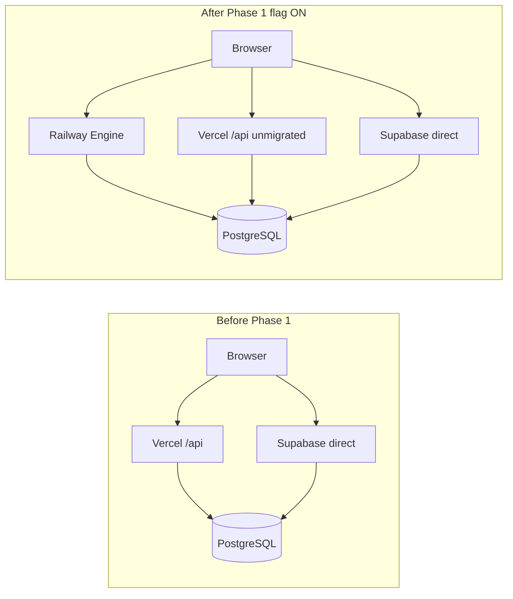
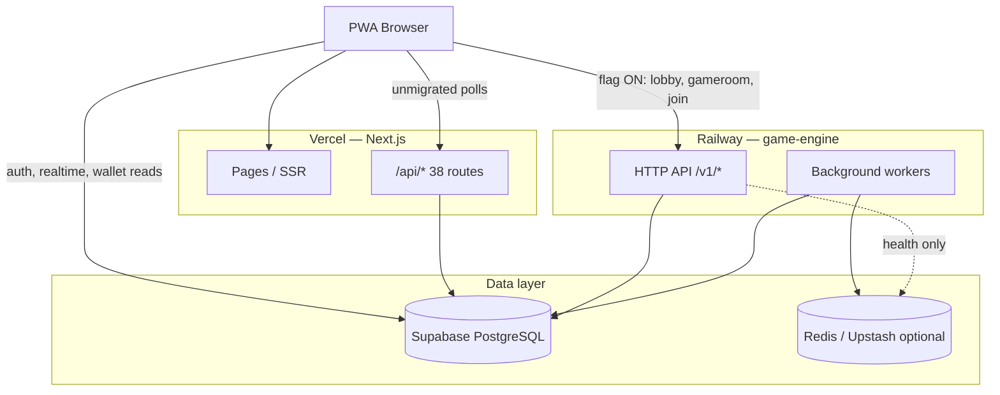
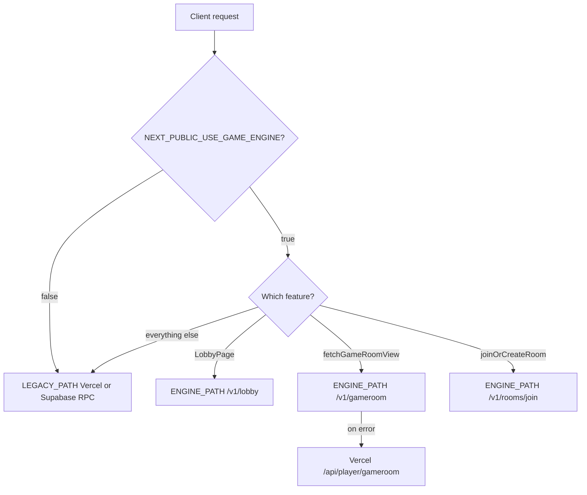
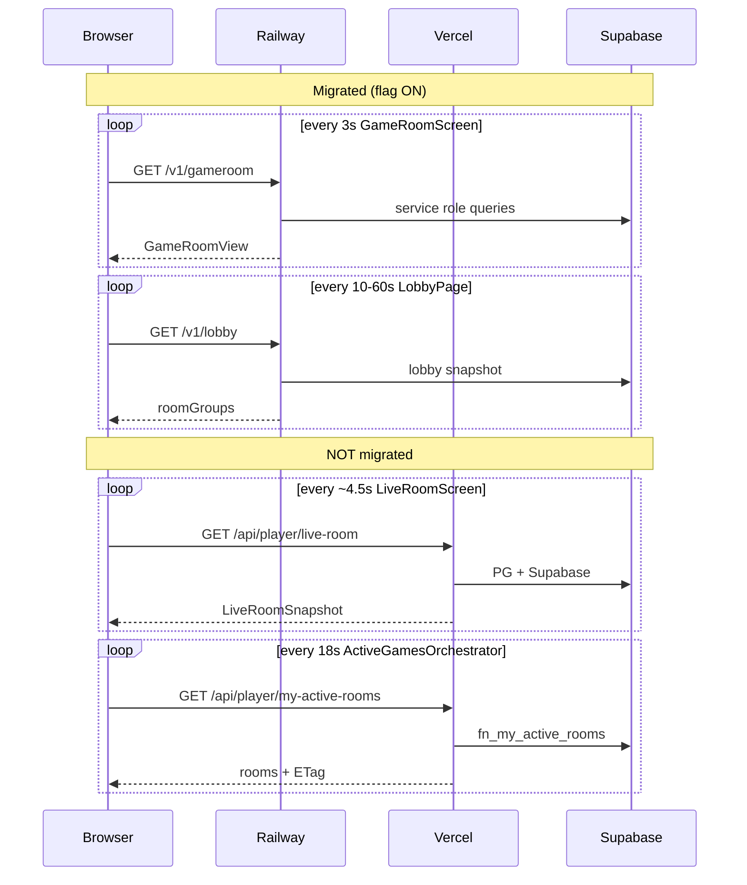
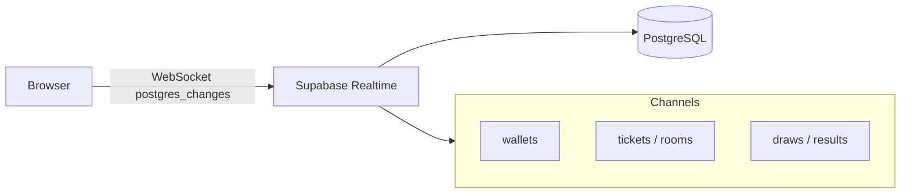
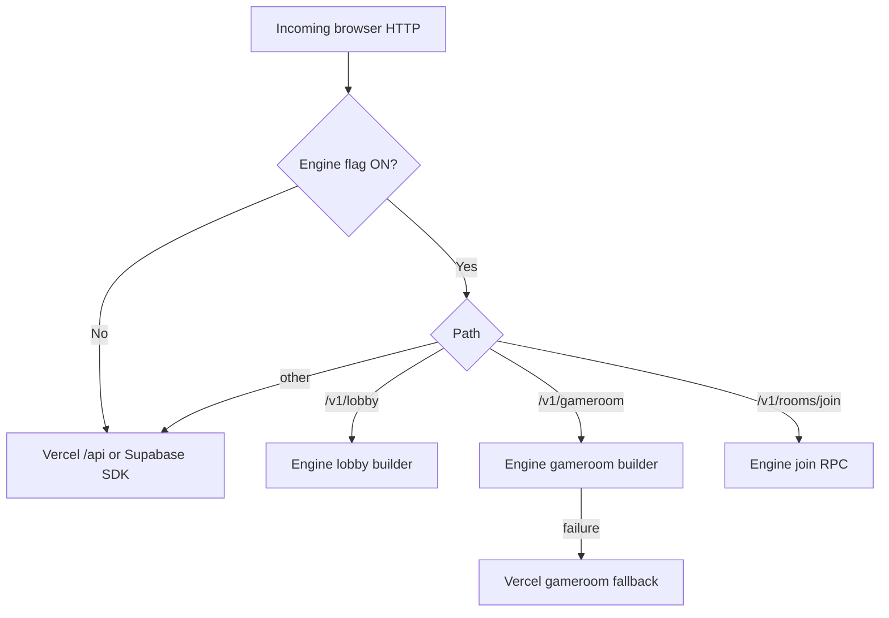

# API Migration Verification Report

> **Role:** Principal Software Architect — post-Phase 1 verification  
> **Date:** 2026-07-05  
> **Method:** Static code inspection only (no runtime probes, no config changes)  
> **Phase 1 reference:** `docs/architecture/API_MIGRATION_PHASE_1_REPORT.md`

---

## Executive Summary

Phase 1 migration **is implemented in code** behind `NEXT_PUBLIC_USE_GAME_ENGINE=true` + `NEXT_PUBLIC_GAME_ENGINE_URL`. Three player flows can route **Browser → Railway (Game Engine) → Supabase**:

1. Lobby snapshot polling (`LobbyPage`)
2. Game room view polling (`fetchGameRoomView`)
3. Join room (`joinOrCreateRoom`)

**What cannot be proven from code alone:**

| Item | Status |
|------|--------|
| Production flag `NEXT_PUBLIC_USE_GAME_ENGINE` value | **UNKNOWN** |
| Railway `GAME_ENGINE_API=true` in production | **UNKNOWN** |
| Production `GAME_ENGINE_CORS_ORIGINS` | **UNKNOWN** |
| Live traffic actually hitting `[ENGINE_PATH]` logs | **UNKNOWN** (requires runtime) |

**Verification gaps in Phase 1 wiring:**

- `useMenuLiveCounts` still calls `/api/player/lobby-snapshot` on Vercel **even when the flag is on**
- Join (engine path) still reads `room_templates` from **browser → Supabase** before calling Railway
- Gameroom engine path has **automatic Vercel fallback** on error
- **Live room** polling — the highest-frequency player poll — was **not** migrated

---

## 1. Current Request Architecture

Legend: **✓** = on path when flag ON · **—** = not on path · **LEGACY** = when flag OFF

### Phase 1 migrated flows (flag ON)

#### Lobby snapshot (`LobbyPage` polling)

```
Browser
  ↓  GET /v1/lobby  (Bearer JWT)
Railway  [Game Engine HTTP]
  ↓  Supabase service role (room_templates, rooms, tickets, v_lobby_online_players)
Supabase (PostgreSQL)
```

Redis: **—** (not used on this HTTP path; engine workers may use Redis separately)

#### Game room view (`fetchGameRoomView` → `GameRoomScreen` polling)

```
Browser
  ↓  GET /v1/gameroom?roomId= | ?templateId=
Railway  [Game Engine HTTP]
  ↓  Supabase service role (rooms, tickets, users, room_templates, app_runtime_flags)
Supabase (PostgreSQL)
```

On engine error → **fallback:**

```
Browser → Vercel (/api/player/gameroom) → PostgreSQL (DATABASE_URL) + Supabase
```

Redis: **—** on HTTP path

#### Join room (`joinOrCreateRoom`)

```
Browser
  ↓  SELECT room_templates (status check)     ← still direct Supabase
Supabase
  ↓  POST /v1/rooms/join
Railway  [Game Engine HTTP]
  ↓  RPC fn_system_join_or_create_room
Supabase (PostgreSQL)
```

Redis: **—**

---

### Major flows NOT migrated (same for flag ON/OFF unless noted)

#### Live room (in-game snapshots)

```
Browser
  ↓  GET /api/player/live-room
Vercel  [Next.js serverless]
  ↓  PostgreSQL (DATABASE_URL) + Supabase
Supabase (PostgreSQL)
```

#### Active games shell

```
Browser
  ↓  GET /api/player/my-active-rooms
Vercel
  ↓  RPC fn_my_active_rooms
Supabase
```

Plus Realtime:

```
Browser → Supabase Realtime (tickets, rooms)
```

#### Wallet / balances (display)

```
Browser → Supabase (wallets SELECT + Realtime postgres_changes)
Browser → Vercel GET /api/me/ding-balance  (hydrate)
```

#### Presence (lobby heartbeat)

```
Browser → Vercel POST /api/me/ping-presence → Supabase RPC fn_ping_presence
```

#### Tournament room

```
Browser → Vercel (/api/player/tournament-*, /api/player/runtime/*)
Browser → Supabase (tournaments, tournament_entries, tournament_payouts, …)
Browser → Supabase RPC (fn_tournament_wallet_hold / fn_tournament_wallet_release)
```

#### Leaderboard

```
Browser → Supabase RPC (get_weekly_leaders, get_daily_leaders, …)
```

#### Auth (session)

```
Browser → Supabase Auth (sign-in, session, token refresh)
```

#### Admin / dev panel

```
Browser → Vercel /api/admin/* | /api/dev-panel/*
Vercel → Supabase RPC / tables
```

#### Game Engine background workers (not browser-initiated)

```
Railway workers (scheduler, draw-processor, room-loop, …)
  ↓  Supabase (+ optional Redis locks/wake)
Supabase / Redis
```

#### Menu live counts (gap — not Phase 1)

```
Browser
  ↓  GET /api/player/lobby-snapshot   ← always Vercel, flag ignored
Vercel → Supabase

Browser → Supabase (tournaments, tournament_entries)
```

---

## 2. Request Inventory

**Flag ON** = `NEXT_PUBLIC_USE_GAME_ENGINE=true` and URL set (per `lib/gameEngine/config.ts`).

| Feature | HTTP endpoint | Current destination (flag ON) | Legacy destination (flag OFF) | Uses Vercel? | Uses Railway? | Uses Supabase directly? |
|---------|---------------|------------------------------|------------------------------|--------------|---------------|-------------------------|
| Lobby snapshot (page) | `GET /v1/lobby` | Railway → Supabase | `GET /api/player/lobby-snapshot` → Supabase | OFF | ON | — |
| Lobby snapshot (menu) | `GET /api/player/lobby-snapshot` | **Vercel** (gap) | Vercel → Supabase | ON | — | — |
| Game room view | `GET /v1/gameroom` | Railway → Supabase | `GET /api/player/gameroom` → PG+Supabase | fallback only | ON | — |
| Join room (mutation) | `POST /v1/rooms/join` | Railway → Supabase RPC | `fn_join_or_create_room` RPC | — | ON | template pre-check |
| Join template check | `room_templates` SELECT | Supabase (browser) | Supabase (browser) | — | — | ON |
| Live room snapshot | `GET /api/player/live-room` | Vercel → PG+Supabase | same | ON | — | — |
| Live room draws-only | `GET /api/player/live-room?scope=draws` | Vercel → PG+Supabase | same | ON | — | — |
| Active rooms | `GET /api/player/my-active-rooms` | Vercel → RPC | same | ON | — | — |
| Room results | `GET /api/player/room-results` | Vercel → Supabase | same | ON | — | — |
| Cancel waiting room | `POST /api/player/cancel-waiting-room` | Vercel → RPC | same | ON | — | — |
| Presence ping | `POST /api/me/ping-presence` | Vercel → RPC | same | ON | — | — |
| Ding balance | `GET /api/me/ding-balance` | Vercel → table | same | ON | — | — |
| Toman wallet read | `wallets` SELECT | Supabase (browser) | same | — | — | ON |
| Wallet realtime | `wallets` channel | Supabase Realtime | same | — | — | ON |
| Tournament tables | `GET /api/player/tournament-*` | Vercel → Supabase | same | ON | — | — |
| Tournament register | `fn_tournament_wallet_hold` | Supabase RPC (browser) | same | — | — | ON |
| Tournament release | `fn_tournament_wallet_release` | Supabase RPC (browser) | same | — | — | ON |
| Global reg lock (player) | `GET /api/player/runtime/global-registration-lock` | Vercel | same | ON | — | — |
| Leaderboard | leaderboard RPCs | Supabase RPC (browser) | same | — | — | ON |
| Auth | Supabase Auth API | Supabase | same | — | — | ON |
| Gameroom Realtime | postgres_changes | Supabase Realtime | same | — | — | ON |
| Live room Realtime | postgres_changes | Supabase Realtime | same | — | — | ON |
| Admin wallet/users | `/api/admin/*` | Vercel → Supabase | same | ON | — | — |
| Dev panel | `/api/dev-panel/*` | Vercel → Supabase | same | ON | — | — |
| Engine health | `GET /health` | Railway | N/A | — | ON | Redis ping optional |

---

## 3. Vercel Elimination Report

Applies when **`NEXT_PUBLIC_USE_GAME_ENGINE=true`** and engine is reachable.

### No longer executed on Vercel (primary path)

| API / flow | Notes |
|------------|-------|
| ✓ Lobby snapshot (`LobbyPage`) | Replaced by `GET /v1/lobby` |
| ✓ Join room mutation | Replaced by `POST /v1/rooms/join` (template pre-check still Supabase) |
| ✓ Game room view polling | Replaced by `GET /v1/gameroom` when engine succeeds |

### Partially eliminated

| API | Notes |
|-----|-------|
| ~ Game room view | Vercel `/api/player/gameroom` still used on **engine error fallback** |
| ~ Lobby snapshot | `useMenuLiveCounts` still hits Vercel every 15s |

### Still executed on Vercel (all 38 route handlers remain deployed)

**Player (hot):**

- `GET /api/player/live-room` — **CRITICAL** poll load
- `GET /api/player/my-active-rooms` — global shell poll
- `GET /api/player/room-results` — post-game burst
- `POST /api/player/cancel-waiting-room`
- `GET /api/player/lobby-snapshot` — menu counts hook
- `GET /api/player/tournament-*` (4 routes)
- `GET /api/player/runtime/global-registration-lock`
- `POST /api/me/ping-presence`
- `GET /api/me/ding-balance`

**Player (cold):** `lobby-room-groups`, `lobby-online-count` (if called)

**Admin (19 routes):** wallet, users, dashboard, reports, card-pool, runtime, admins

**Dev panel (5 routes):** settings, users, join-presets, dev-players, finance

**SSR / pages:** Next.js still serves all pages from Vercel regardless of API migration.

---

## 4. Remaining Hot Paths

Assumptions for load math: **1 concurrent user** on that screen, tab visible, typical constants from code. Multiply by concurrent users for fleet totals. **Vercel $ cost: UNKNOWN** (plan/tier not in repo).

| Poll / flow | Interval (code) | Req/min (1 user) | Req/hour (1 user) | Destination (flag ON) | Vercel? | Rank |
|-------------|-----------------|-------------------|-------------------|------------------------|---------|------|
| Live room draw sync | ~`draw_interval_sec` + 1.5s (~4.5s default) | ~13.3 | ~800 | Vercel | ON | **CRITICAL** |
| Game room lobby | 3s (1s near countdown) | ~20 | ~1,200 | Railway | OFF | **CRITICAL** |
| Live room full fallback | 12s stale watchdog | ~5 | ~300 | Vercel | ON | **HIGH** |
| Active games orchestrator | 18s (60–300s empty backoff) | ~3.3 | ~200 | Vercel | ON | **HIGH** |
| Lobby page snapshot | 10s (30–60s stable) | ~6 | ~360 | Railway | OFF | **HIGH** |
| Menu live counts | 15s | ~4 | ~240 | Vercel | ON | **MEDIUM** |
| Tournament screen | 10s × 2–3 loops | ~12–18 | ~720–1,080 | Mixed | partial | **MEDIUM** |
| Game end listener (legacy) | 12s | ~5 | ~300 | Vercel | ON | **MEDIUM** |
| Room results prize wait | 500ms × up to 30 | burst ~60 in 15s | event | Vercel | ON | **MEDIUM** |
| Presence ping | 60s | ~1 | ~60 | Vercel | ON | **LOW** |
| Wallet sync retry | 200–450ms × 8 | event | event | Supabase direct | — | **LOW** |
| Admin card-pool status | 2s during gen | ~30 | rare | Vercel | ON | **LOW** |
| Dev panel settings | 15s | ~4 | ~240 | Vercel | ON | **LOW** |

### Relative Vercel invocation impact (flag ON, illustrative 1k mixed players)

| Category | Before Phase 1 | After Phase 1 (est.) |
|----------|----------------|----------------------|
| Gameroom polls | 100% Vercel | ~0% Vercel (unless fallback) |
| Lobby page polls | 100% Vercel | ~0% Vercel |
| Live room polls | 100% Vercel | 100% Vercel |
| Active games | 100% Vercel | 100% Vercel |
| Menu lobby poll | 100% Vercel | 100% Vercel |

**Estimated Vercel serverless invocation reduction (player traffic only, flag ON): 18–28%** — dominated by unmigrated live-room + active-games polls.

---

## 5. Engine Coverage

### Player-facing feature matrix

| Feature | Phase 1 engine? | Notes |
|---------|-----------------|-------|
| Lobby snapshot (page) | ✓ | `getLobby()` |
| Lobby snapshot (menu) | ✗ | Still Vercel |
| Game room state | ✓ | `getRoomState` / `getGameRoomViewByTemplate` |
| Join room | ✓ | `joinOrCreateRoomViaEngine` (+ Supabase pre-check) |
| Live room state | ✗ | Still `/api/player/live-room` |
| Active games list | ✗ | Still `/api/player/my-active-rooms` |
| Room results | ✗ | Still Vercel |
| Cancel waiting room | ✗ | Still Vercel |
| Presence | ✗ | Still Vercel |
| Wallet (toman) | ✗ | Direct Supabase |
| Ding balance | ✗ | Still Vercel |
| Tournament | ✗ | Vercel + direct Supabase + RPC |
| Leaderboard | ✗ | Direct Supabase RPC |
| Auth | ✗ | Supabase Auth (by design) |
| Realtime (draws, wallet, tickets) | ✗ | Supabase Realtime (by design) |

### Migration percentage (approximate)

| Metric | Flag OFF | Flag ON |
|--------|----------|---------|
| Player features with engine primary path | **0%** (0/14) | **21%** (3/14) |
| Player **poll volume** on engine (est.) | 0% | **~22–30%** |
| Browser-direct financial RPCs migrated | 0% | **~33%** (join only; tournament hold/release remain) |
| Total API routes eliminated | 0/38 | **0/38 deployed** (3 bypassed on happy path) |

**Game Engine HTTP adoption score: ~25/100** (implementation exists; coverage narrow; production activation UNKNOWN).

---

## 6. Before vs After

### Request path comparison

| Flow | Before (flag OFF) | After (flag ON) |
|------|-------------------|-----------------|
| Lobby page | Browser → Vercel → Supabase | Browser → **Railway** → Supabase |
| Gameroom | Browser → Vercel → PG + Supabase | Browser → **Railway** → Supabase |
| Join | Browser → Supabase RPC | Browser → Supabase (read) → **Railway** → Supabase RPC |
| Live room | Browser → Vercel → PG + Supabase | **Unchanged** |
| Active games | Browser → Vercel → Supabase | **Unchanged** |
| Wallet display | Browser → Supabase + Vercel | **Unchanged** |

### Estimated impact (flag ON, production traffic — directional only)

| Metric | Estimated change | Confidence |
|--------|------------------|------------|
| Vercel serverless invocations (player) | **−18% to −28%** | Medium (depends on room-state mix) |
| Vercel CPU / duration | **−15% to −25%** | Medium (gameroom route was PG-heavy) |
| Browser-direct Supabase RPC (join) | **−100%** for join mutation | High |
| Browser-direct Supabase reads | **~−2%** (template pre-check only) | High |
| Polling load on Vercel | **−20% to −30%** | Medium |
| Polling load on Railway HTTP | **+20% to −30%** of former gameroom+lobby Vercel polls | Medium |
| Supabase total QPS | **~flat** (same DB work, different caller) | High |



---

## 7. Remaining Direct Database Calls (Browser)

Filtered to **client-callable** paths (excludes `app/api/**` server routes).

### `supabase.rpc()` — browser

| RPC | File | Migration priority |
|-----|------|-------------------|
| `fn_join_or_create_room` | `services/rooms.ts` | **P0** — legacy path only; engine replaces when flag ON |
| `fn_tournament_wallet_hold` | `TournamentRoomScreen.tsx` | **P0** — financial mutation |
| `fn_tournament_wallet_release` | `TournamentRoomScreen.tsx` | **P0** — financial mutation |
| `get_weekly_leaders` | `lib/features/leaderboard/leaderboard.ts` | P2 — read |
| `get_daily_leaders` | `lib/features/leaderboard/leaderboard.ts` | P2 — read |
| `get_daily_leaders_by_date` | `lib/features/leaderboard/leaderboard.ts` | P2 — read |
| `get_user_referral_code_history` | `lib/auth-helpers.ts` | P3 — read |
| `fn_dashboard_*`, `fn_player_*`, `fn_leaderboard_weekly` | `services/dashboard.ts`, `financial-reports.ts`, `leaderboard.ts` | P3 — mostly admin/reporting |

### `supabase.from()` — browser (selected high-signal)

| Table | File(s) | Priority |
|-------|---------|----------|
| `room_templates` | `services/rooms.ts` (join pre-check) | P1 — move into engine join |
| `rooms`, `tickets`, `users` | `services/rooms.ts` (legacy helpers) | P2 |
| `wallets` | `useBalances.ts`, `useWalletBalances.ts` | P1 — display; keep Realtime |
| `tournaments`, `tournament_entries` | `TournamentRoomScreen.tsx`, `useMenuLiveCounts.ts` | P1 |
| `tournament_payouts`, `tournament_round_rooms`, `room_winners` | `TournamentRoomScreen.tsx` | P2 |
| `ding_balances`, `ding_transactions` | `lib/features/ding/ding.ts` | P2 |
| `users`, `user_profiles` | auth/profile components | P3 |

### `supabase.channel()` — browser (Realtime)

| Channel pattern | Component | Priority |
|-----------------|-----------|----------|
| `live-room-{roomId}` | `LiveRoomScreen` | Keep on Supabase (notification layer) |
| `gameroom_live_probe_*`, `room_*_tickets`, `template_*_rooms` | `GameRoomScreen` | Keep |
| `my_active_rooms_*` | `ActiveGamesOrchestrator`, `useActiveGames` | Keep |
| `wallet_balance_changes_*` | `useBalances` | Keep |
| `game_end_*` | `GameEndResultsListener` | Keep |

Realtime should remain Supabase per architecture rules; migration priority is **snapshots and mutations**, not channels.

---

## 8. Next Phase Plan

Ordered by **ROI × performance × risk**.

### Phase 2 — Live room + active games (highest ROI)

| Item | Endpoint | Why |
|------|----------|-----|
| Live room full snapshot | `GET /v1/live-room` | **Largest remaining Vercel poll** (~800 req/h/user in-play) |
| Live room draws-only | `GET /v1/live-room?scope=draws` | Draw watchdog poll |
| Active rooms | `GET /v1/active-rooms` | Global shell poll every 18s |
| Fix gap | `useMenuLiveCounts` → `getLobby()` | Completes lobby migration |

**Risk:** Medium — PG snapshot parity on Vercel today; engine must match `lib/liveRoomSnapshotPg.ts` behavior.  
**Performance win:** **CRITICAL** — could remove ~50–60% of remaining player Vercel invocations.

### Phase 3 — Financial + room mutations

| Item | Why |
|------|-----|
| Tournament `fn_tournament_wallet_hold/release` → engine | Last browser financial RPCs |
| `cancel-waiting-room` → engine | Mutation + auth hardening |
| Move join template pre-check into engine | Removes last join-related browser read |

**Risk:** High — money paths; requires staged rollout + DB permission tightening.

### Phase 4 — Reads, cache, admin

| Item | Why |
|------|-----|
| Room results snapshot on engine | Post-game burst off Vercel |
| Leaderboard + dashboard reads with Redis TTL | Lower priority reads |
| Admin routes stay on Vercel or separate admin service | Low traffic |

**Risk:** Low–medium.

---

## 9. Architecture Diagrams

### Overall system (post Phase 1)



### Frontend request routing



### Polling architecture



### Realtime (unchanged)



### API routing decision tree



---

## 10. Final Score

Scores 0–100. Higher is better unless noted.

| Dimension | Score | Rationale |
|-----------|-------|-----------|
| **Architecture** | 62 | Clean feature-flag dual path; split brain (PG on Vercel vs Supabase-only on engine); incomplete lobby coverage |
| **Performance** | 48 | Highest-QPS polls (live-room) still on Vercel cold serverless |
| **Scalability** | 55 | Engine HTTP scales independently but carries little traffic today |
| **Cloud Readiness** | 58 | Multi-tier design present; production cutover state UNKNOWN |
| **Game Engine Adoption** | 28 | 3/14 player features; ~25% poll volume |
| **Vercel Dependency (remaining)** | 78 | **High remaining dependency** (78 = still heavily reliant; target is lower) |
| **Railway Utilization (HTTP API)** | 32 | Workers run; browser HTTP mostly unused unless flag ON |
| **Supabase Dependency** | 85 | Still central SSOT; engine and Vercel both fan in |

### Single highest-impact migration remaining

**Migrate `GET /api/player/live-room` (full + `scope=draws`) to the Game Engine.**

Reason:

- It is the **most frequent player poll** in the codebase (~13+ requests/minute per active in-game user).
- It still forces **Vercel → direct PostgreSQL** on every draw watchdog tick.
- Phase 1 removed gameroom load from Vercel but left the **heavier in-game path** untouched.
- Realtime can remain on Supabase; only the **snapshot fallback poll** needs to move.

Secondary quick win: wire **`useMenuLiveCounts`** to `getLobby()` when the flag is on (one-line architectural completion of Phase 1 lobby scope).

---

## Appendix A — Code Evidence Checklist

| Requirement | Verified in code? | Location |
|-------------|-------------------|----------|
| Feature flag gating | Yes | `lib/gameEngine/config.ts` |
| `[ENGINE_PATH]` logs | Yes | `lib/gameEngineClient.ts` |
| `[LEGACY_PATH]` logs | Yes | `services/rooms.ts`, `app/player/lobby/page.tsx` |
| Engine `/v1/lobby` | Yes | `game-engine/src/http/server.ts` |
| Engine `/v1/gameroom` | Yes | `game-engine/src/http/server.ts` |
| Engine `/v1/rooms/join` | Yes | `game-engine/src/http/server.ts` |
| CORS for browser | Yes | `game-engine/src/http/cors.ts` |
| Vercel routes removed | **No** (by design) | all `app/api/**` intact |
| Production flag enabled | **UNKNOWN** | not in repo |

---

## Appendix B — How to Confirm in Production (runtime)

Without modifying code:

1. Open browser DevTools → Console on `/player/lobby` and a waiting room.
2. Search logs for `[ENGINE_PATH]` vs `[LEGACY_PATH]`.
3. Network tab: filter by game-engine host vs same-origin `/api/`.
4. Railway logs: `command api listening` + request lines on `/v1/*`.
5. If only `[LEGACY_PATH]` appears → flag OFF or CORS/URL misconfiguration.

---

*End of report. No application code or configuration was modified during this verification.*
