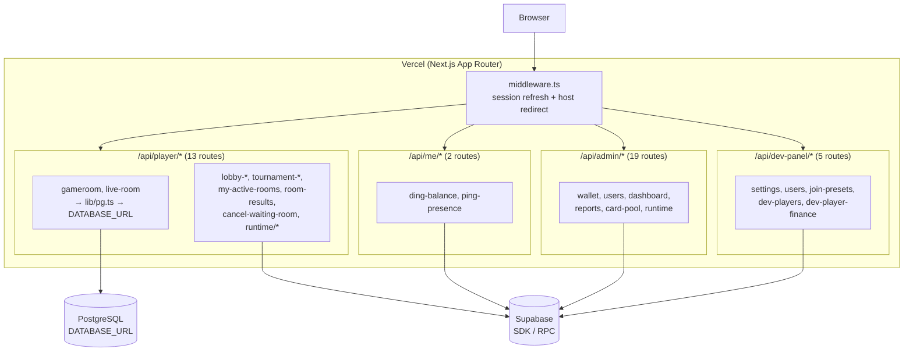
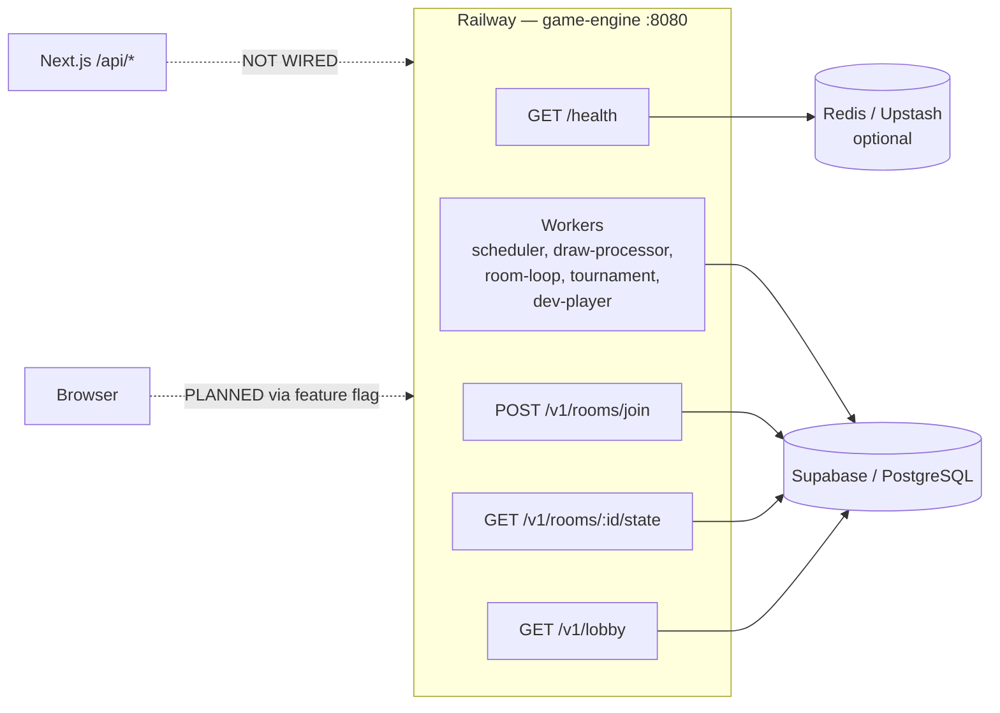
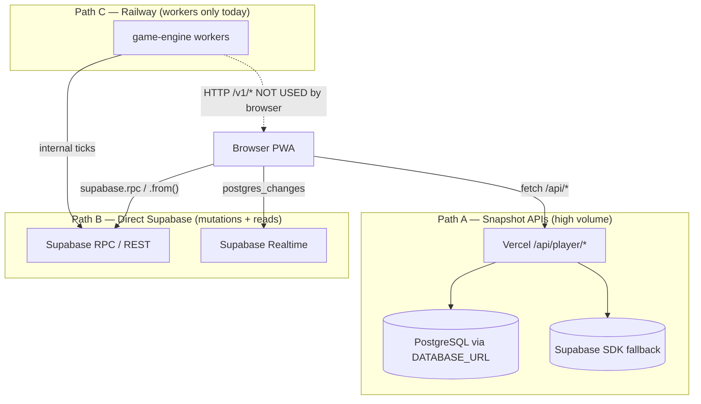
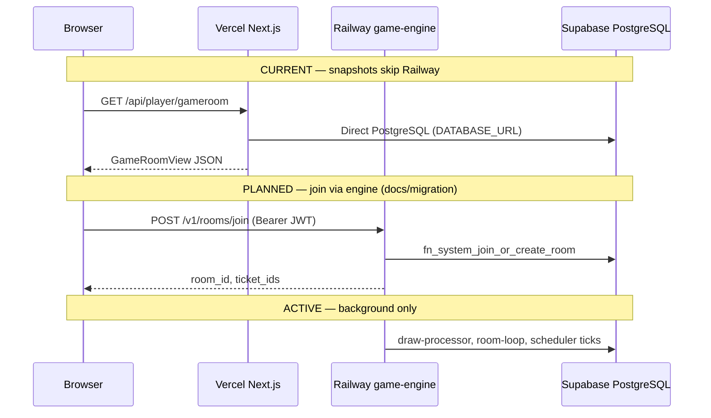
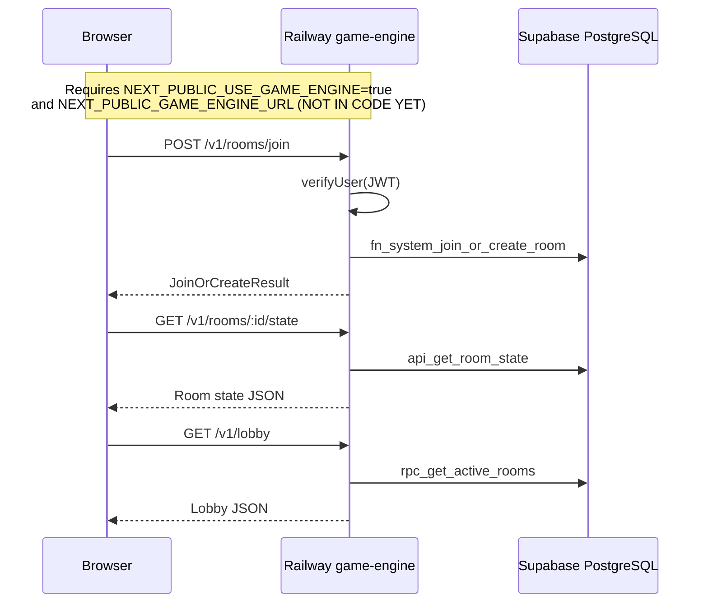
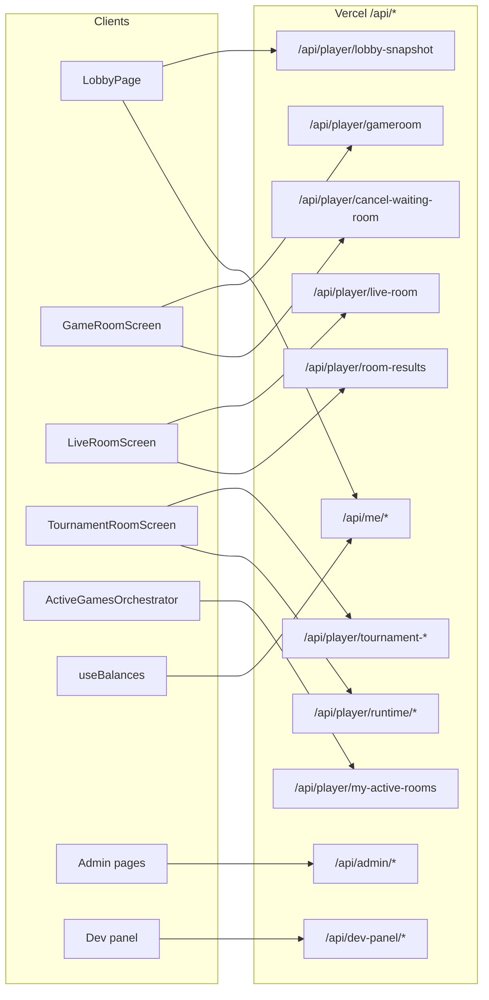
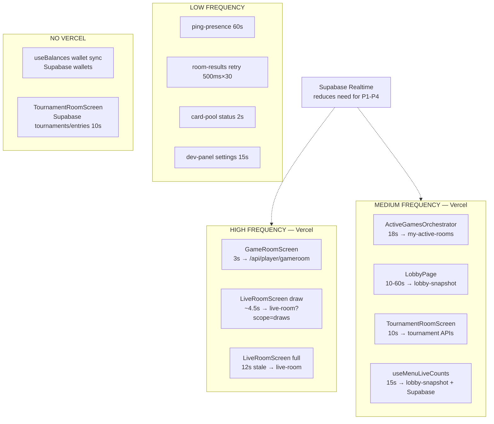
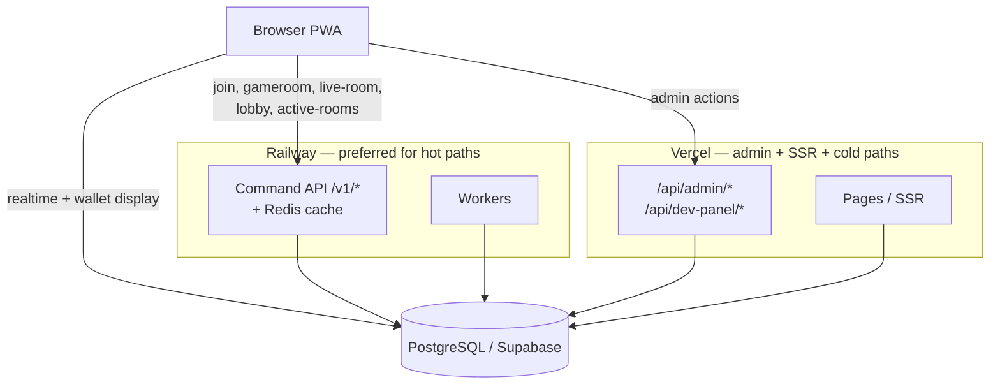

# API Request Graph Report

> Generated: 2026-07-05  
> Scope: Full codebase analysis (`winway` monorepo)  
> Method: Static analysis of `app/api/**`, `game-engine/**`, client hooks/screens, and `services/*`. No runtime traffic captured.

---

## Executive Summary

Winway uses a **three-tier hybrid architecture**:

| Tier | Role | Technology |
|------|------|------------|
| **Browser (PWA)** | Player/admin UI | Next.js client components |
| **Vercel (Next.js)** | 38 serverless API route handlers + SSR | `/app/api/**/route.ts` |
| **Railway (game-engine)** | Background workers + optional command API | Node.js HTTP on port 8080 |
| **Supabase / PostgreSQL** | Source of truth | Supabase SDK, RPC, Realtime; direct PG via `DATABASE_URL` |

**Critical finding:** The browser **never calls Railway today**. All player HTTP snapshots go **Browser → Vercel `/api/*` → PostgreSQL / Supabase**. Railway game-engine runs workers and an optional `/v1/*` command API that is **implemented but not wired** to the frontend.

**Second path (no Vercel):** Many reads and all financial mutations still go **Browser → Supabase** directly (RPC + table queries + Realtime).

---

## 1. API Inventory

### 1.1 Next.js API Routes (Vercel Serverless Functions)

**Total:** 38 route handlers in `app/api/**/route.ts`  
**Pages Router:** None  
**Edge runtime:** None detected (one route forces `runtime = "nodejs"`)  
**External HTTP from API layer:** Only `/api/admin/card-pool/generate` fallback to Supabase REST

#### Me / Presence (2)

| Method | Path | Auth | Data Backend | Purpose |
|--------|------|------|--------------|---------|
| GET | `/api/me/ding-balance` | User JWT | Supabase table `ding_balances` | Ding coin balance |
| POST | `/api/me/ping-presence` | User JWT | Supabase RPC `fn_ping_presence` | Online presence heartbeat |

#### Player — Room / Game (6)

| Method | Path | Auth | Data Backend | Purpose |
|--------|------|------|--------------|---------|
| GET | `/api/player/gameroom` | User JWT | **PostgreSQL** (`lib/gameroomRoomPg`) + Supabase | Waiting-room / preview snapshot |
| GET | `/api/player/live-room` | User JWT | **PostgreSQL** (`lib/liveRoomSnapshotPg`) + Supabase | Live game snapshot (`scope=draws` for draws-only) |
| GET | `/api/player/room-results` | User JWT | Supabase | Post-game winners + provably-fair spec |
| GET | `/api/player/my-active-rooms` | User JWT | Supabase RPC `fn_my_active_rooms` | Active room list (ETag / 304) — **nodejs runtime** |
| POST | `/api/player/cancel-waiting-room` | User JWT | Supabase RPC `fn_cancel_waiting_room` | Cancel waiting room |
| GET | `/api/player/runtime/global-registration-lock` | User JWT | Supabase `app_runtime_flags` | Global registration lock (player) |

#### Player — Lobby (3)

| Method | Path | Auth | Data Backend | Purpose |
|--------|------|------|--------------|---------|
| GET | `/api/player/lobby-snapshot` | User JWT | Supabase (aggregated) | Combined lobby room groups + online count |
| GET | `/api/player/lobby-room-groups` | User JWT | Supabase | Template-grouped room stats |
| GET | `/api/player/lobby-online-count` | User JWT | Supabase view `v_lobby_online_players` | Online player count |

#### Player — Tournament (4)

| Method | Path | Auth | Data Backend | Purpose |
|--------|------|------|--------------|---------|
| GET | `/api/player/tournament-active-tables` | User JWT | Supabase | Active/finished tables |
| GET | `/api/player/tournament-finished-tables` | None | Supabase | Finished round tables |
| GET | `/api/player/tournament-entry-names` | User JWT | Supabase | Entrant display names |
| GET | `/api/player/runtime/global-registration-lock` | User JWT | Supabase | Registration lock |

#### Admin — Wallet (2)

| Method | Path | Auth | Data Backend | Purpose |
|--------|------|------|--------------|---------|
| POST | `/api/admin/wallet/adjust` | Admin JWT | Supabase RPC `fn_wallet_apply_delta` | Manual deposit/withdraw |
| POST | `/api/admin/wallet/transfer` | Admin JWT | Supabase RPC `fn_wallet_transfer_panel` | Panel wallet transfer |

#### Admin — Users (5)

| Method | Path | Auth | Data Backend | Purpose |
|--------|------|------|--------------|---------|
| POST | `/api/admin/users/set-role` | Admin JWT | Supabase | Change user role |
| POST | `/api/admin/users/set-password` | Admin JWT | Supabase Auth Admin | Reset password |
| GET, POST | `/api/admin/users/set-commission` | Admin JWT | Supabase | Agent commission rates |
| POST | `/api/admin/users/toggle-suspension` | Admin JWT | Supabase | Toggle suspension |
| POST | `/api/admin/users/nicknames` | Admin JWT | Supabase | Batch nickname lookup |

#### Admin — Admins (2)

| Method | Path | Auth | Data Backend | Purpose |
|--------|------|------|--------------|---------|
| POST | `/api/admin/admins/set-sub-role` | Admin JWT | Supabase | Change admin sub-role |
| POST | `/api/admin/admins/toggle-status` | Admin JWT | Supabase | Enable/disable admin |

#### Admin — Dashboard / Reports (4)

| Method | Path | Auth | Data Backend | Purpose |
|--------|------|------|--------------|---------|
| GET | `/api/admin/dashboard/snapshot` | Admin JWT | Supabase | Dashboard financial snapshot |
| GET | `/api/admin/dashboard/commission-summary` | Admin JWT | Supabase RPC | Commission totals |
| GET | `/api/admin/games/report` | Admin JWT | Supabase RPC `fn_admin_games_report` | Games report |
| GET | `/api/admin/tournaments/report` | Admin JWT | Supabase | Tournament report |

#### Admin — Card Pool (5)

| Method | Path | Auth | Data Backend | Purpose |
|--------|------|------|--------------|---------|
| GET | `/api/admin/card-pool/active` | Admin JWT | Supabase | Active pool info |
| GET | `/api/admin/card-pool/status` | Admin JWT | Supabase | Build progress |
| GET | `/api/admin/card-pool/history` | Admin JWT | Supabase | Historical pools |
| POST | `/api/admin/card-pool/generate` | Admin JWT | Supabase RPC + REST fallback | Generate pool |
| GET | `/api/admin/card-pool/download` | Admin JWT | Supabase | Download CSV |

#### Admin — Runtime (1)

| Method | Path | Auth | Data Backend | Purpose |
|--------|------|------|--------------|---------|
| GET, POST | `/api/admin/runtime/global-registration-lock` | Admin JWT | Supabase | Read/update global lock |

#### Dev Panel (5)

| Method | Path | Auth | Data Backend | Purpose |
|--------|------|------|--------------|---------|
| GET, PATCH | `/api/dev-panel/settings` | Dev panel JWT | Supabase | Scheduler settings + stats |
| POST | `/api/dev-panel/join-presets` | Dev panel JWT | Supabase | Create/update join preset |
| GET | `/api/dev-panel/users` | Dev panel JWT | Supabase | List dev players |
| PATCH | `/api/dev-panel/dev-players/[userId]` | Dev panel JWT | Supabase | Update dev player config |
| GET | `/api/dev-panel/dev-player-finance` | Dev panel JWT | Supabase RPC | Dev player finance summary |

---

### 1.2 Browser → Supabase Direct (Bypasses Vercel)

These are **not** Next.js API routes but are part of the client request surface.

| Call site | Operation | Type | Risk |
|-----------|-----------|------|------|
| `services/rooms.ts` | `supabase.rpc("fn_join_or_create_room")` | Financial mutation | **Critical** |
| `src/screens/TournamentRoomScreen.tsx` | `fn_tournament_wallet_hold` / `fn_tournament_wallet_release` | Financial mutation | **Critical** |
| `services/rooms.ts` | `room_templates`, `rooms`, `tickets`, `users` SELECT | Read | Medium |
| `lib/hooks/useBalances.ts` | `wallets` SELECT + Realtime | Read / display | Medium |
| `lib/hooks/useMenuLiveCounts.ts` | `tournaments`, `tournament_entries` SELECT | Read | Low |
| `src/screens/TournamentRoomScreen.tsx` | `tournaments`, `tournament_entries` polling | Read | Medium |
| `services/dashboard.ts` | Dashboard RPCs | Admin read | Low |
| `lib/features/leaderboard/leaderboard.ts` | Leaderboard RPCs | Read | Low |
| `app/admin/tournaments/create|edit` | Tournament admin RPCs | Admin mutation | High |
| All Realtime channels | `postgres_changes` on `draws`, `rooms`, `tickets`, `wallets`, `results` | Notification | Low (display only) |

> Full RPC inventory documented in `docs/migration/api-migration-plan.md`.

---

### 1.3 Middleware

**File:** `middleware.ts`

| Behavior | Applies to `/api/*`? |
|----------|---------------------|
| Supabase session cookie refresh (`updateSupabaseSession`) | Yes |
| Host redirect: main app → admin host for `/admin*`, `/dev-panel*` | Yes (page routes; API on main host **UNKNOWN** if called cross-host) |
| API authorization gate | **No** — auth enforced per-route |

---

## 2. Vercel Function Map

Every `app/api/**/route.ts` file becomes a **Vercel Serverless Function** on deploy. There is no separate `api/` folder or `vercel.json` rewrite layer.

### Vercel config notes

| Item | Value |
|------|-------|
| `next.config.mjs` | Empty — no rewrites/proxies |
| `vercel.json` | **Not present** |
| `export const dynamic` | `force-dynamic` on `gameroom`, `live-room` |
| `export const runtime` | `nodejs` on `my-active-rooms` only |
| External fetch from Vercel | Supabase REST fallback in card-pool generate only |

---

## 3. Railway / Backend Request Map

### 3.1 Game Engine Service

**Location:** `game-engine/`  
**Entry:** `game-engine/src/index.ts`  
**Deploy:** Docker (`game-engine/Dockerfile`, EXPOSE 8080) — Railway implied, no `railway.toml` in repo  
**HTTP framework:** Raw Node.js `http.createServer` (no Express/Fastify/Hono)

#### HTTP Endpoints

| Method | Path | Auth | Enabled when | Underlying DB |
|--------|------|------|--------------|---------------|
| GET | `/health` | None | Always (if `httpPort > 0`) | Redis ping only |
| POST | `/v1/rooms/join` | Bearer JWT | `GAME_ENGINE_API=true` | RPC `fn_system_join_or_create_room` |
| GET | `/v1/rooms/:id/state` | Bearer JWT | `GAME_ENGINE_API=true` | RPC `api_get_room_state` |
| GET | `/v1/lobby` | Bearer JWT | `GAME_ENGINE_API=true` | RPC `rpc_get_active_rooms` |

**Default:** `GAME_ENGINE_API=false` → **health only**.

#### Background Workers (not HTTP — internal Supabase polling/ticks)

| Role | Module | Trigger |
|------|--------|---------|
| `scheduler` | `workers/room-scheduler` | `setInterval` (configurable ms) |
| `draw-processor` | `workers/draw-processor` | Interval + Redis wake on enqueue |
| `room-loop` | `workers/room-loop` | RoomLoopManager continuous loop |
| `tournament-orchestrator` | `workers/tournament-orchestrator` | Interval tick |
| `dev-player-scheduler` | `workers/dev-player` | Interval tick |
| `dev-player-processor` | `workers/dev-player` | Interval tick |

Workers are gated by `SCHEDULER_ENABLED` and `GAME_ENGINE_ROLES`. Business logic execution depends on `GAME_RUNTIME` (`legacy_db` | `hybrid` | `engine`).

#### Next.js → Railway proxy mapping

| Next.js route | Railway endpoint | Status |
|---------------|------------------|--------|
| *(none)* | — | **NOT CONNECTED** |

Planned (from `docs/migration/api-migration-plan.md`):

| Future client call | Railway endpoint | Replaces |
|--------------------|------------------|----------|
| `joinOrCreateRoom()` | `POST /v1/rooms/join` | `fn_join_or_create_room` |
| Room state read | `GET /v1/rooms/:id/state` | Direct Supabase reads |
| Lobby read | `GET /v1/lobby` | Lobby snapshot RPCs |

Env vars `RAILWAY_URL`, `GAME_ENGINE_URL`, `NEXT_PUBLIC_GAME_ENGINE_URL`, `NEXT_PUBLIC_USE_GAME_ENGINE` — **documented only, not referenced in application code**.

---

## 4. Polling Detection

No React Query, SWR, raw WebSocket, or SSE in client code. All polling is hand-rolled `setInterval` / recursive `setTimeout`. Supabase Realtime supplements polling on critical paths.

### 4.1 Production Player Polling

| # | Component | Interval | Endpoint / Source | Via Vercel? | Purpose |
|---|-----------|----------|-------------------|-------------|---------|
| P1 | `GameRoomScreen` | **3s** (1s near countdown) | `GET /api/player/gameroom` | **Yes** | Waiting-room snapshot |
| P2 | `LiveRoomScreen` draw watchdog | **~draw_interval + 1.5s** (tick 1s) | `GET /api/player/live-room?scope=draws` | **Yes** | Draw sync fallback |
| P3 | `LiveRoomScreen` full fallback | **12s stale** (tick 2s) | `GET /api/player/live-room` | **Yes** | Full snapshot fallback |
| P4 | `ActiveGamesOrchestrator` | **18s** (60s→300s when empty) | `GET /api/player/my-active-rooms` | **Yes** | Global active rooms sync |
| P5 | `GameEndResultsListener` (legacy) | **12s** | `GET /api/player/my-active-rooms` | **Yes** | Game-end detection |
| P6 | `LobbyPage` | **10s→60s adaptive** | `GET /api/player/lobby-snapshot` | **Yes** | Lobby room groups |
| P7 | `LobbyPage` presence | **60s** | `POST /api/me/ping-presence` | **Yes** | Online heartbeat |
| P8 | `useMenuLiveCounts` | **15s** | `/api/player/lobby-snapshot` + Supabase tables | **Mixed** | Menu live counts |
| P9 | `TournamentRoomScreen` | **10s × 3 loops** | Supabase + `/api/player/tournament-*`, `/api/player/runtime/*` | **Mixed** | Tournament state |
| P10 | `fetchRoomResultsWhenPrizesReady` | **500ms × 30** | `GET /api/player/room-results` | **Yes** | Prize-ready retry |
| P11 | `useBalances` wallet sync | **200ms→450ms × 8** | Supabase `wallets` | **No** | Post-settlement sync |

### 4.2 Admin / Dev Polling

| Component | Interval | Endpoint |
|-----------|----------|----------|
| `app/admin/card-pool/page.tsx` | 2s (during generation) | `GET /api/admin/card-pool/status` |
| `DevPlayerSettingsManager` | 15s | `GET /api/dev-panel/settings` |

### 4.3 Server-Side (Railway) Polling

Game-engine workers use internal interval loops — **not browser-initiated**. Frequency controlled by env (e.g. `drawProcessorIntervalMs`, `roomSchedulerIntervalMs`, `tournamentTickIntervalMs`).

### 4.4 Realtime (Not Polling — Reduces Poll Need)

| Channel prefix | Tables | Components |
|----------------|--------|------------|
| `wallet_balance_changes_*` | `wallets` | `useBalances`, `useWalletBalances` |
| `my_active_rooms_*` | `tickets`, `rooms` | `ActiveGamesOrchestrator`, `useActiveGames` |
| `gameroom_live_probe_*` | `draws`, `rooms`, `tickets` | `GameRoomScreen` |
| `live-room-*` | `draws`, `rooms`, `results` | `LiveRoomScreen` |
| `game_end_*` | `tickets`, `rooms` | `GameEndResultsListener` |

All Realtime: **Browser → Supabase** (WebSocket managed by Supabase client).

---

## 5. Request Flow Graph

### 5.1 Primary Paths (As Deployed Today)

### 5.2 Browser → Vercel → Railway → Supabase (Target / Partial)

**Status:** Only the **Railway worker → Supabase** leg is active. Vercel and browser do not call Railway HTTP endpoints today.

### 5.3 Browser → Railway → Supabase (Planned Direct)

### 5.4 All API Routes — Client Callers

### 5.5 All Polling Flows

---

## 6. Invocation Risk Ranking

Risk = **(frequency × latency sensitivity × business criticality × Vercel hop cost)**

| Rank | Flow | Freq | Path | Risk | Rationale |
|------|------|------|------|------|-----------|
| **R1** | Live room draw sync poll | ~every 3–5s per active player | Browser → Vercel → PG | **CRITICAL** | Highest poll rate in live game; PG queries on every cold/warm serverless invocation |
| **R2** | Game room lobby poll | 3s (1s near start) | Browser → Vercel → PG | **CRITICAL** | Sustained load in waiting rooms; hybrid PG+Supabase route |
| **R3** | Join room mutation | On user action | Browser → Supabase RPC direct | **CRITICAL** | Financial mutation bypasses server tier; no engine command API yet |
| **R4** | Active games poll | 18s global per session | Browser → Vercel → Supabase RPC | **HIGH** | Runs for every logged-in player shell-wide; ETag helps but still hits Vercel |
| **R5** | Tournament wallet hold/release | On user action | Browser → Supabase RPC direct | **HIGH** | Financial mutation from browser |
| **R6** | Lobby snapshot poll | 10–60s | Browser → Vercel → Supabase | **HIGH** | All lobby visitors; adaptive but still Vercel-bound |
| **R7** | Live room full fallback | 12s stale | Browser → Vercel → PG | **HIGH** | Heavy snapshot payload |
| **R8** | Room results prize retry | 500ms × 30 | Browser → Vercel | **MEDIUM** | Burst after game end |
| **R9** | Tournament screen polls | 10s × 3 | Mixed Vercel + Supabase | **MEDIUM** | Lower concurrency than main lobby |
| **R10** | Menu live counts | 15s | Mixed | **MEDIUM** | Runs on home/menu shell |
| **R11** | Presence ping | 60s | Browser → Vercel | **LOW** | Lightweight RPC |
| **R12** | Admin / dev API calls | On action / rare poll | Browser → Vercel | **LOW** | Low traffic, acceptable on Vercel |
| **R13** | Realtime subscriptions | Event-driven | Browser → Supabase | **LOW** | Display-only; correct per architecture rules |

### UNKNOWN items

| Item | Notes |
|------|-------|
| Production Vercel plan / concurrency limits | Not in repo |
| Railway production URL / `GAME_ENGINE_API` flag state | Not in repo |
| Whether `DATABASE_URL` on Vercel shares pool with Railway | **UNKNOWN** |
| Cross-host admin API calls from main app domain | Middleware redirects pages; API cross-host usage **UNKNOWN** |
| `GAME_RUNTIME` value in production | Affects whether Railway workers or DB cron owns draws |

---

## 7. Recommendations — Bypass Vercel Where Possible

### 7.1 Immediate (High Impact)

1. **Enable Browser → Railway for join (already designed)**  
   - Flip `GAME_ENGINE_API=true` on Railway.  
   - Implement feature flag in `services/rooms.ts` per `docs/migration/api-migration-plan.md`.  
   - Removes financial RPC from browser direct path; JWT verified at engine.

2. **Move high-frequency snapshot reads off Vercel**  
   - Add engine endpoints (or extend `/v1/rooms/:id/state`) for gameroom + live-room equivalents with Redis short-TTL cache.  
   - Point `fetchGameRoomView` / `fetchLiveRoomSnapshot` at `NEXT_PUBLIC_GAME_ENGINE_URL` when flag enabled.  
   - **Benefit:** Eliminates R1/R2/R7 serverless PG connection churn.

3. **Keep Realtime-first, tighten poll fallbacks**  
   - Live room already watchdog-polls only when stale — verify Realtime health before adding new poll paths.  
   - Consider raising `REALTIME_STALE_MS` only after metrics prove Realtime reliability.

### 7.2 Medium Term

4. **Lobby snapshot on Railway with cache**  
   - Engine already has `GET /v1/lobby` stub calling `rpc_get_active_rooms`.  
   - Extend to match `lobby-snapshot` contract; cache 5–10s in Redis.  
   - Removes R6 from Vercel.

5. **Active games: direct engine or Supabase with client-side ETag**  
   - `my-active-rooms` ETag pattern works — expose same contract from Railway to avoid Vercel cold starts.  
   - Or: rely more on Realtime + orchestrator (already default in prod).

6. **Route tournament financial RPCs through engine (phase 2)**  
   - Per migration plan: `fn_tournament_wallet_hold/release` → engine commands.  
   - Addresses R5.

### 7.3 Keep on Vercel (Appropriate)

| Route class | Reason |
|-------------|--------|
| Admin wallet, users, reports | Low frequency; admin session already on admin host |
| Dev panel | Internal tooling only |
| Card pool generation | Long-running; may need Vercel Pro timeout tuning anyway |
| `ping-presence` | Low cost; optional move later |

### 7.4 Infrastructure

7. **Do not duplicate PG pools unnecessarily**  
   - If snapshots move to Railway, prefer **one** PG pool on Railway + Redis cache rather than PG from both Vercel and Railway.

8. **Document production env in deploy runbooks**  
   - Add `GAME_ENGINE_API`, `NEXT_PUBLIC_GAME_ENGINE_URL`, `GAME_RUNTIME` to deployment checklist (values currently **UNKNOWN** from codebase).

### 7.5 Target Architecture

---

## 8. Centralized Client API Modules

| Module | Target |
|--------|--------|
| `lib/adminApiClient.ts` | `/api/admin/*` |
| `lib/devPanelApiClient.ts` | `/api/dev-panel/*` |
| `services/rooms.ts` | `/api/player/*` + direct Supabase |
| `lib/activeGames/ActiveGamesOrchestrator.ts` | `/api/player/my-active-rooms` |
| `lib/hooks/useBalances.ts` | `/api/me/ding-balance` + Supabase `wallets` |
| `lib/hooks/useMenuLiveCounts.ts` | `/api/player/lobby-snapshot` + Supabase |
| `lib/supabaseClient.ts` | Auth, Realtime, direct reads/mutations |

No shared `lib/api/` facade exists — routing decisions are per-service.

---

## 9. Related Documentation

| Doc | Content |
|-----|---------|
| `docs/migration/api-migration-plan.md` | Engine command API + feature-flag cutover |
| `docs/roadmap/GAME_ENGINE_MIGRATION.md` | Engine worker migration |
| `.cursor/rules/data-access.mdc` | PostgreSQL vs Supabase access standard |
| `.cursor/rules/realtime.mdc` | Realtime is notification, not truth |

---

## 10. Summary Counts

| Category | Count |
|----------|-------|
| Next.js API routes | 38 |
| Railway HTTP endpoints (when API enabled) | 4 (incl. `/health`) |
| Next.js routes proxying to Railway | **0** |
| Browser polling loops (production) | 11 |
| Supabase Realtime channel patterns | 6+ |
| Browser-direct financial RPCs | 2+ (join, tournament hold/release) |
