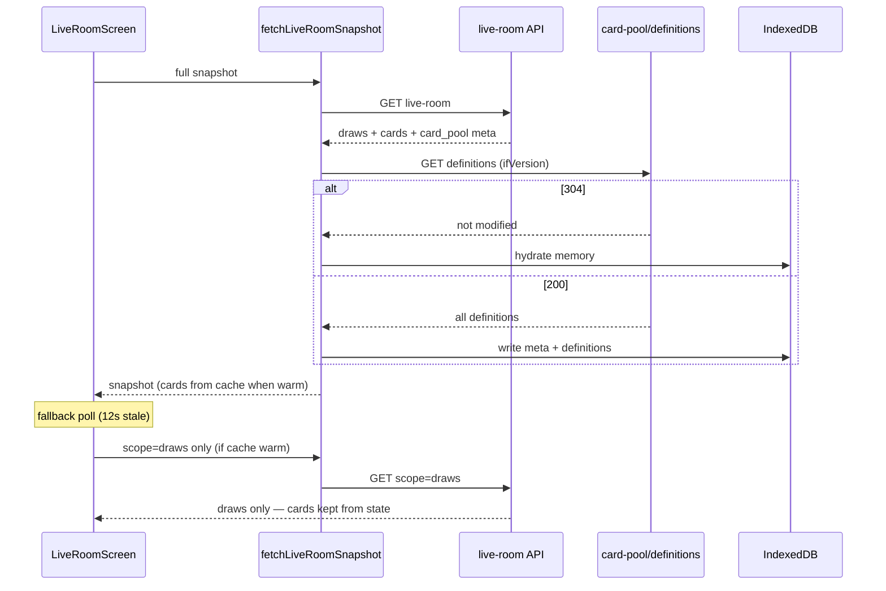

# Card Pool Cache — Implementation Report

> Generated: 2026-07-05  
> Scope: Browser-side caching for immutable global card pool definitions  
> Feature flag: `NEXT_PUBLIC_USE_CARD_POOL_CACHE` (default **off**)

---

## Implementation plan (as executed)

### Reused modules

| Module | Role |
|--------|------|
| `lib/liveRoomSnapshotPg.ts` | `buildLiveRoomCards`, PG loaders — extended with `pool_card_id` on card rows |
| `lib/pg.ts` | PostgreSQL source of truth for definitions + pool version metadata |
| `lib/gameEngine/config.ts` pattern | `lib/cardPool/config.ts` — same boolean env-flag style |
| `lib/gameResultsDedupe.ts` pattern | Versioned storage key naming (`winway_card_pool_v1`) |
| `lib/auth/hardExit.ts` | Clears in-memory cache on player hard exit |
| `app/api/player/live-room/route.ts` | Extended response (additive fields only) |
| `apps/engines/bingo/src/http/live-room-view.ts` | Engine parity for `card_pool` + `pool_card_id` |
| `services/rooms.ts` | `fetchLiveRoomSnapshot` orchestration hook |
| `src/screens/LiveRoomScreen.tsx` | Draws-only fallback poll when cache is warm |

### New files

| File | Purpose |
|------|---------|
| `lib/cardPool/types.ts` | Shared types + `buildCardPoolVersionKey()` |
| `lib/cardPool/config.ts` | `isCardPoolCacheEnabled()` |
| `lib/cardPool/cardPoolSnapshotPg.ts` | PG loaders for pool meta + definitions |
| `lib/cardPool/indexedDb.ts` | Native IndexedDB persistence (no new npm deps) |
| `lib/cardPool/client.ts` | Fetch, warm, memory cache, invalidation |
| `lib/cardPool/resolve.ts` | Apply cached grids to live-room snapshots |
| `app/api/player/card-pool/definitions/route.ts` | Player-authenticated bulk definitions API |

### Cache invalidation

1. **Version key:** `${commitHash}:${prngVersion}` from `card_pools` (same fields used by admin card-pool UI / provably-fair metadata).
2. **Room binding:** Live-room snapshot includes `card_pool` metadata resolved via `rooms.pool_id → card_pools`.
3. **On warm:** Client compares stored IndexedDB meta `versionKey` with server meta.
4. **Mismatch:** Clear IndexedDB + memory, fetch full definitions from `/api/player/card-pool/definitions`.
5. **Match:** `GET ...?ifVersion=<key>` returns **304**; client hydrates from IndexedDB (server remains authority for the version stamp).
6. **Integrity:** When applying cache to a full snapshot, server grids are preferred; cache replaces only when missing or verifies equal grids.

### Version / hash source

- **Authoritative:** PostgreSQL `card_pools.commit_hash` + `card_pools.prng_version`
- **Not used for client cache:** Redis `cache:card-registry:version` (game-engine internal, not wired to browser)
- **Per-room display only:** `rooms.room_seed_hash` (draw provably-fair; unrelated to pool definition cache)

### Why this matches existing architecture

- **PostgreSQL is source of truth** for definitions (`card_pool_cards` / `card_numbers`), with Supabase SDK fallback in the API route — same hybrid as live-room.
- **Realtime is not truth** — cache is populated from snapshot APIs only.
- **Feature flag** mirrors Game Engine cutover (`NEXT_PUBLIC_USE_*`, default off, instant rollback).
- **No API renames** — live-room path unchanged; new route is additive.
- **Immutable data only** — ticket assignments, player names, draws, wallet remain server-driven.

---

## API changes (backward compatible)

### New: `GET /api/player/card-pool/definitions`

| Query | Description |
|-------|-------------|
| `poolId` | Optional; defaults to active pool (`is_active=true`) |
| `ifVersion` | Optional; returns `304` when `${commitHash}:${prngVersion}` matches |

Response:

```json
{
  "ok": true,
  "version": { "poolId", "commitHash", "prngVersion", "cardCount" },
  "versionKey": "…:…",
  "definitions": [{ "poolCardId", "cardNo", "card": [[…]] }]
}
```

### Extended: `GET /api/player/live-room` and `GET /v1/live-room`

Additive fields only:

- `card_pool?: { poolId, commitHash, prngVersion, cardCount }`
- `cards[].pool_card_id?: string | null`

Existing clients ignore new fields.

---

## Client behavior (flag ON)



---

## Rollout

1. Deploy code (flag off) — zero behavior change.
2. Staging: set `NEXT_PUBLIC_USE_CARD_POOL_CACHE=true`.
3. Verify logs: `[CardPoolCache] definitions cached`, `[CardPoolCache] fallback poll (draws-only…)`.
4. Activate new pool in admin — confirm version mismatch triggers refetch.
5. Production: enable flag per environment.

### Rollback

Set `NEXT_PUBLIC_USE_CARD_POOL_CACHE=false` — immediate return to full live-room fetches. IndexedDB data is inert while flag is off.

---

## Observability

Stable prefix: `[CardPoolCache]`

| Log | When |
|-----|------|
| `definitions served` | API route success |
| `memory hydrated from IndexedDB` | Client warm from disk |
| `version mismatch — clearing IndexedDB` | Pool rotation |
| `definitions cached` | Fresh download stored |
| `snapshot cards resolved from cache` | Grid apply/verify |
| `fallback poll (draws-only, card pool cache warm)` | Reduced fallback payload |

---

## Test plan

- [ ] Flag off: live-room behavior unchanged
- [ ] Flag on, first visit: definitions downloaded, IndexedDB populated
- [ ] Second visit same pool: `ifVersion` → 304, grids from IDB
- [ ] Admin activates new pool: version mismatch → refetch
- [ ] Live-room fallback poll uses `scope=draws` when cache warm
- [ ] Hard exit: memory cleared; re-entry can hydrate from IDB
- [ ] Game engine path: `card_pool` present on `/v1/live-room` full snapshot

---

## Known limitations / future work

- Definitions endpoint is Vercel-only (not mirrored on game-engine) — acceptable because cache warms from browser → Vercel PG path regardless of live-room engine routing.
- Full pool download on first warm (~500 cards) — mitigated by 304 on subsequent sessions.
- No Service Worker layer — out of scope; IndexedDB is sufficient for immutable definitions.
- `useMenuLiveCounts` / lobby paths do not pre-warm cache yet — optional follow-up.
