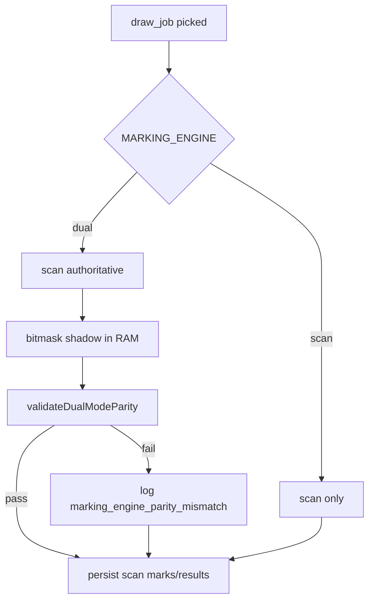

# Phase 2 — Dual-Mode Shadow Validation & Rollout

> **Status:** Implemented. Production authoritative path = `scan`.  
> Bitmask runs **only as shadow** via `MARKING_ENGINE=dual`.

---

## 1. Components Delivered

| Module | Path | Role |
|--------|------|------|
| Dual-mode validator | `apps/engines/bingo/src/runtime/dual-mode-validator.ts` | Strict parity checks |
| Mismatch reporter | `apps/engines/bingo/src/runtime/mismatch-reporter.ts` | Structured logs + rate stats |
| Engine policy | `apps/engines/bingo/src/runtime/marking-engine-policy.ts` | Blocks bitmask authority by default |
| Wiring | `evaluateDraw.ts`, `draw-processor/index.ts` | Shadow traffic in live draws |

**No new DB tables. No Redis changes. No new abstractions beyond these modules.**

---

## 2. Validation Rules (strict equality)

Each dual-mode draw validates:

| Check | Kind | Compares |
|-------|------|----------|
| Mark rows | `marks` | `ticket_id:value` sets |
| Line winners | `line_wins` | ticket+user pairs |
| Full winners | `full_wins` | ticket+user pairs |
| Combined wins | `all_wins` | ticket+type+user tuples |
| Full-house flag | `full_winner_flag` | `fullWinnerThisDraw` |
| First-line flag | `first_line_flag` | `setFirstLineDrawNumber` |
| Mask state | `mask_diff` | per-ticket scan mask vs bitmask mask + XOR |

Context logged on mismatch:

- `roomId`, `drawNumber`, `drawSequence`
- `drawsProcessed`, `wasReconciled`, `hasUnprocessedDraw`
- `firstLineDrawNumber`, `ticketCount`
- `maskDiffs[]` with `ticketId`, `cardId`, `scanMask`, `bitmaskMask`, `xor`

---

## 3. Log Events (grep-friendly)

| Event | Level | When |
|-------|-------|------|
| `marking_engine_parity_mismatch` | `error` | Any parity failure |
| `marking_engine_parity_summary` | `info` | Every N validations + end of batch |

Example mismatch query (log aggregator):

```
message="marking_engine_parity_mismatch"
```

Summary fields:

```json
{
  "MarkingParitySummary": {
    "validations": 12000,
    "mismatches": 0,
    "mismatchRate": 0,
    "mismatchRatePct": 0,
    "byKind": {},
    "authoritative": "scan",
    "shadow": "bitmask"
  }
}
```

---

## 4. Environment Variables

| Variable | Staging | Production (shadow) | Production (cutover — future) |
|----------|---------|---------------------|-------------------------------|
| `GAME_RUNTIME` | `engine` | `engine` | `engine` |
| `MARKING_ENGINE` | `dual` | `dual` | `bitmask` |
| `MARKING_BITMASK_AUTHORITY_ALLOWED` | `false` | `false` | `true` |
| `MARKING_PARITY_SUMMARY_EVERY` | `500` | `500` | `500` |

### Safety guarantees

- `MARKING_ENGINE=bitmask` without authority flag → **auto-downgrade to `dual`**
- Dual mode always persists **scan** results (marks, results, settlement)
- Bitmask path never writes to DB

---

## 5. Production Shadow Traffic Wiring



**Deploy steps (shadow):**

1. Apply Phase 0 SQL migration (`20260612120000_card_bitmask_phase0.sql`)
2. Deploy game-engine with:
   ```
   MARKING_ENGINE=dual
   MARKING_BITMASK_AUTHORITY_ALLOWED=false
   ```
3. Confirm logs show `global card registry loaded` on startup
4. Monitor `marking_engine_parity_summary` — target `mismatchRate = 0`

**Staging:** same config as production shadow.

---

## 6. Real-Room Validation Gate (required before cutover)

Benchmark alone is **not sufficient**. Require:

| Gate | Criteria |
|------|----------|
| Live draws validated | ≥ 10,000 dual-mode draws across ≥ 20 concurrent rooms |
| Mismatch rate | `0` for 7 consecutive days |
| Reconcile draws | ≥ 100 draws with `wasReconciled=true`, zero mismatches |
| Multi-winner draws | ≥ 50 line draws with 2+ winners, zero mismatches |
| Full-house draws | ≥ 20 full wins, zero mismatches |
| Peak load | Validation during peak concurrent users (5,000+) |

Track via `MarkingParitySummary.mismatchRate` in production logs.

---

## 7. Rollout Checklist

### Phase 2a — Staging shadow (now)

- [ ] Run SQL migration on staging DB
- [ ] Set `MARKING_ENGINE=dual`
- [ ] Run 24h soak test with real rooms
- [ ] Verify zero `marking_engine_parity_mismatch` events
- [ ] Test reconnect: restart engine mid-room, confirm `wasReconciled` draws pass

### Phase 2b — Production shadow

- [ ] Deploy with `MARKING_ENGINE=dual` (scan authoritative)
- [ ] Monitor parity summary dashboard/log alerts
- [ ] Run 7-day zero-mismatch window
- [ ] Sign-off from backend owner

### Phase 3 — Bitmask cutover (blocked until gate passed)

- [ ] Set `MARKING_BITMASK_AUTHORITY_ALLOWED=true`
- [ ] Set `MARKING_ENGINE=bitmask` on **one canary** engine replica
- [ ] Compare settlement outcomes vs scan replicas (24h)
- [ ] Full fleet cutover to `bitmask`

### Phase 4 — Cleanup (separate PR)

- [ ] Remove scan hot path
- [ ] Remove dual validator (or keep as test-only)
- [ ] Update docs

---

## 8. Rollback Strategy

| Scenario | Action | User impact |
|----------|--------|-------------|
| Mismatch detected in shadow | Keep `MARKING_ENGINE=dual`; investigate logs | None (scan authoritative) |
| Registry load failure | Falls back to `card_numbers` build; if fails, set `MARKING_ENGINE=scan` | None |
| Performance regression | Set `MARKING_ENGINE=scan` | None |
| Bad bitmask cutover | Set `MARKING_ENGINE=scan` + `MARKING_BITMASK_AUTHORITY_ALLOWED=false` | Immediate return to proven path |
| Emergency | Redeploy previous engine image with `MARKING_ENGINE=scan` | None |

**Rollback command (instant):**

```bash
MARKING_ENGINE=scan
MARKING_BITMASK_AUTHORITY_ALLOWED=false
```

Redeploy draw-processor — no DB migration rollback needed.

---

## 9. What NOT to do until 100% parity

- Do **not** set `MARKING_BITMASK_AUTHORITY_ALLOWED=true`
- Do **not** remove scan path
- Do **not** add Redis state replication
- Do **not** change settlement / marks schema

---

## 10. Files Changed (Phase 2)

```
apps/engines/bingo/src/runtime/dual-mode-validator.ts
apps/engines/bingo/src/runtime/mismatch-reporter.ts
apps/engines/bingo/src/runtime/marking-engine-policy.ts
apps/engines/bingo/src/runtime/marking-engine.ts          (refactored)
apps/engines/bingo/src/domain/draw/evaluateDraw.ts        (reporter wiring)
apps/engines/bingo/src/workers/draw-processor/index.ts    (batch summary)
apps/engines/bingo/src/config/env.ts                      (safety flags)
docs/architecture/bitmask-phase2-rollout.md
```
