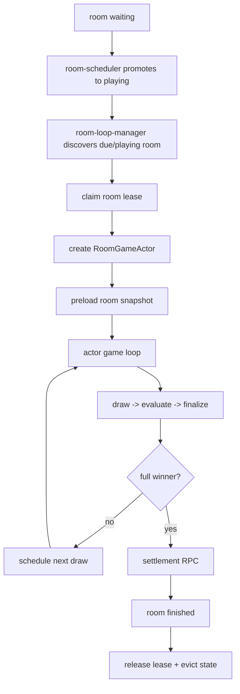
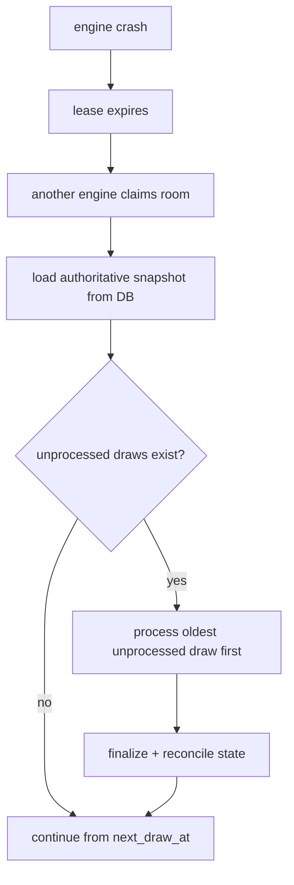

# Low-Latency Room-Actor Game Loop Architecture

> هدف: رساندن latency هر قرعه به کمتر از 3 ثانیه، با حفظ ترتیب قرعه‌ها،
> idempotency، recovery، provably-fair بودن قرعه، و atomic بودن مسیر مالی.
>
> این سند معماری هدف را برای تبدیل موتور فعلی از
> `scheduler -> draw_jobs -> pick -> actor` به مدل
> `room-actor-driven game loop` توضیح می‌دهد.

## 1. خلاصه تصمیم

معماری فعلی برای correctness و مهاجرت تدریجی خوب است، اما برای latency پایین
چند لایه انتظار دارد:

```text
room-scheduler tick
-> insert draw
-> DB trigger creates draw_job
-> draw-processor wake/poll
-> pick coordinator
-> room actor queue
-> evaluate
-> finalize
-> wait for scheduler tick
-> next draw
```

برای هدف کمتر از 3 ثانیه، clock هر room باید داخل actor همان room باشد:

```text
room actor owns game clock
-> waits until next_draw_at
-> inserts next draw
-> evaluates immediately in memory
-> finalizes in one DB RPC
-> schedules the next draw immediately
```

در این مدل `draw_jobs` حذف اجباری نمی‌شود، اما نقش آن از صف اصلی realtime به
audit/recovery/fallback تغییر می‌کند.

## 2. اهداف

### 2.1 SLO اصلی

برای هر قرعه عادی:

```text
draw due/inserted -> processed_at visible to clients <= 3000ms p95
```

هدف‌های داخلی پیشنهادی:

| بخش | هدف p95 |
| --- | ---: |
| wake / scheduling slack | < 150ms |
| insert draw guard | < 250ms |
| in-memory mark/evaluate | < 10ms |
| finalize RPC | < 500ms |
| client visibility / realtime | < 500ms |
| total | < 3000ms |

### 2.2 اهداف غیرقابل مذاکره

- هر room فقط یک قرعه فعال/درحال پردازش داشته باشد.
- قرعه‌ها داخل یک room strictly ordered باشند.
- پس از crash، بازی قابل recover باشد.
- `wallets`, `transactions`, `commissions` مستقیم از Node نوشته نشوند.
- settlement پولی همچنان از RPC اتمیک DB انجام شود.
- RNG همان `sha256(hex(room_seed) || ':' || n)` بماند.
- rollback به مسیر فعلی ممکن باشد.

## 3. اصول طراحی

### 3.1 Actor مالک clock اتاق است

در معماری هدف، room actor فقط پردازنده job نیست؛ خودش loop اصلی بازی اتاق است.

مسئولیت‌های actor:

- claim کردن مالکیت room
- preload کردن snapshot اتاق
- نگه داشتن state در RAM
- تصمیم درباره زمان قرعه بعدی
- insert قرعه
- mark/evaluate در حافظه
- finalize در DB
- تشخیص full winner و trigger کردن settlement
- release/renew کردن lease
- ثبت metrics

### 3.2 DB منبع حقیقت است، نه ساعت اصلی realtime

Postgres همچنان source of truth است:

- `rooms`
- `draws`
- `tickets`
- `marks`
- `results`
- ledger مالی

اما tickهای زمانی بازی دیگر نباید وابسته به poll دوره‌ای DB باشند.

### 3.3 Queue برای recovery، نه hot path

`draw_jobs` می‌تواند باقی بماند:

- audit اینکه کدام drawها باید پردازش شوند
- recovery پس از crash
- fallback به draw-processor قدیمی
- debug/metrics

ولی hot path ایده‌آل نباید این باشد که هر قرعه حتما منتظر pick coordinator و
actor queue بماند.

### 3.4 یک room، یک actor، یک lease

برای چند replica، مالکیت room باید در DB ثبت شود تا دو engine همزمان یک room را
جلو نبرند.

## 4. فلو معماری هدف

### 4.1 lifecycle کلی



### 4.2 فلو یک قرعه

```mermaid
sequenceDiagram
  participant Actor as RoomGameActor
  participant State as In-memory RoomState
  participant DB as Postgres
  participant UI as Clients

  Actor->>Actor: wait until nextDrawAt
  Actor->>State: get drawnNumbers / roomSeed
  Actor->>Actor: pickNextNumber(seed, drawnNumbers)
  Actor->>DB: rpc_room_actor_insert_draw_if_ready(roomId, n, owner)
  DB-->>Actor: inserted + drawId + jobId? + nextDrawAt
  Actor->>State: recordDrawInserted(n)
  Actor->>State: applyMarkAndEvaluateBitmask(n)
  Actor->>DB: rpc_finalize_engine_draw_job(...)
  DB-->>Actor: credited users + processed_at stamped
  DB-->>UI: realtime/update visible
  Actor->>Actor: compute next due time
```

### 4.3 فلو recovery پس از crash



## 5. تغییرات پیشنهادی DB

این تغییرات برای معماری کامل لازم یا بسیار مفیدند.

### 5.1 ستون‌های ownership روی `rooms`

```sql
ALTER TABLE public.rooms
  ADD COLUMN IF NOT EXISTS engine_owner_id text,
  ADD COLUMN IF NOT EXISTS engine_lease_until timestamptz,
  ADD COLUMN IF NOT EXISTS engine_claimed_at timestamptz,
  ADD COLUMN IF NOT EXISTS engine_loop_state text DEFAULT 'idle',
  ADD COLUMN IF NOT EXISTS last_draw_processed_at timestamptz;
```

معنی فیلدها:

| فیلد | معنی |
| --- | --- |
| `engine_owner_id` | شناسه replica/worker مالک room |
| `engine_lease_until` | اعتبار مالکیت |
| `engine_claimed_at` | زمان claim |
| `engine_loop_state` | `idle`, `active`, `settling`, `recovering`, `paused` |
| `last_draw_processed_at` | آخرین processed_at موفق برای scheduler/recovery |

### 5.2 RPC claim room

```sql
CREATE OR REPLACE FUNCTION public.rpc_claim_game_room(
  p_room_id uuid,
  p_owner_id text,
  p_lease_seconds integer DEFAULT 30
)
RETURNS boolean
LANGUAGE plpgsql
SECURITY DEFINER
AS $$
DECLARE
  v_now timestamptz := now();
BEGIN
  UPDATE public.rooms
  SET engine_owner_id = p_owner_id,
      engine_lease_until = v_now + make_interval(secs => p_lease_seconds),
      engine_claimed_at = COALESCE(engine_claimed_at, v_now),
      engine_loop_state = 'active',
      updated_at = v_now
  WHERE id = p_room_id
    AND status = 'playing'
    AND (
      engine_owner_id IS NULL
      OR engine_owner_id = p_owner_id
      OR engine_lease_until IS NULL
      OR engine_lease_until < v_now
    );

  RETURN FOUND;
END;
$$;
```

### 5.3 RPC renew lease

```sql
CREATE OR REPLACE FUNCTION public.rpc_renew_game_room_lease(
  p_room_id uuid,
  p_owner_id text,
  p_lease_seconds integer DEFAULT 30
)
RETURNS boolean
LANGUAGE plpgsql
SECURITY DEFINER
AS $$
DECLARE
  v_now timestamptz := now();
BEGIN
  UPDATE public.rooms
  SET engine_lease_until = v_now + make_interval(secs => p_lease_seconds),
      updated_at = v_now
  WHERE id = p_room_id
    AND engine_owner_id = p_owner_id
    AND status = 'playing';

  RETURN FOUND;
END;
$$;
```

### 5.4 RPC release lease

```sql
CREATE OR REPLACE FUNCTION public.rpc_release_game_room(
  p_room_id uuid,
  p_owner_id text
)
RETURNS void
LANGUAGE plpgsql
SECURITY DEFINER
AS $$
BEGIN
  UPDATE public.rooms
  SET engine_owner_id = NULL,
      engine_lease_until = NULL,
      engine_loop_state = 'idle',
      updated_at = now()
  WHERE id = p_room_id
    AND engine_owner_id = p_owner_id;
END;
$$;
```

### 5.5 RPC discover due rooms

```sql
CREATE OR REPLACE FUNCTION public.rpc_find_claimable_playing_rooms(
  p_limit integer DEFAULT 100
)
RETURNS TABLE(room_id uuid)
LANGUAGE sql
SECURITY DEFINER
AS $$
  SELECT r.id
  FROM public.rooms r
  WHERE r.status = 'playing'
    AND (
      r.engine_owner_id IS NULL
      OR r.engine_lease_until IS NULL
      OR r.engine_lease_until < now()
    )
  ORDER BY r.next_draw_at NULLS FIRST, r.updated_at
  LIMIT p_limit;
$$;
```

### 5.6 Guarded insert draw for actor owner

`rpc_insert_draw_if_ready` فعلی خوب است، اما برای actor-loop باید owner را هم
چک کند.

خروجی پیشنهادی:

```text
inserted | backpressure | duplicate | not_owner | not_playing | exhausted
```

رفتار:

- فقط owner فعلی room اجازه insert داشته باشد.
- اگر draw قبلی processed نشده، `backpressure`.
- اگر همه اعداد تمام شده‌اند، `exhausted`.
- `next_draw_at` در همان transaction جلو برود.
- `draw_jobs` می‌تواند همچنان توسط trigger ساخته شود.

### 5.7 Indexهای لازم

```sql
CREATE INDEX IF NOT EXISTS idx_rooms_engine_claimable
ON public.rooms(status, engine_lease_until, next_draw_at)
WHERE status = 'playing';

CREATE INDEX IF NOT EXISTS idx_draws_room_processed
ON public.draws(room_id, processed_at, created_at);

CREATE INDEX IF NOT EXISTS idx_draw_jobs_room_status_number
ON public.draw_jobs(room_id, status, draw_number);
```

## 6. تغییرات پیشنهادی در engine

### 6.1 ساختار جدید فایل‌ها

```text
game-engine/src/
  workers/
    room-loop/
      index.ts                 # starts room loop manager
      roomLoopManager.ts       # discovers/claims rooms
      roomGameActor.ts         # owns one room clock
      roomLease.ts             # DB lease helpers
      roomLoopMetrics.ts       # latency metrics
  domain/
    room-loop/
      runDrawCycle.ts          # one draw cycle
      recoverRoom.ts           # unprocessed draw recovery
      scheduleNextDraw.ts      # next draw timing policy
```

### 6.2 نقش جدید

به `EngineRole` اضافه شود:

```ts
type EngineRole =
  | "scheduler"
  | "draw-processor"
  | "tournament-orchestrator"
  | "dev-player-scheduler"
  | "dev-player-processor"
  | "room-loop";
```

### 6.3 حالت runtime پیشنهادی

دو مسیر ممکن:

```text
GAME_RUNTIME=engine
GAME_ENGINE_ROLES=room-loop,tournament-orchestrator,...
```

یا یک flag مستقل:

```text
ROOM_LOOP_MODE=actor
```

برای rollback بهتر است flag جدا داشته باشیم:

| Flag | معنی |
| --- | --- |
| `ROOM_LOOP_MODE=scheduler_queue` | مسیر فعلی |
| `ROOM_LOOP_MODE=actor` | room actor owns clock |

### 6.4 RoomLoopManager

وظایف:

- هر `ROOM_LOOP_DISCOVERY_MS` roomهای claimable را بگیرد.
- برای هر room، `rpc_claim_game_room` بزند.
- اگر claim موفق بود، `RoomGameActor` بسازد.
- actorهای مرده/finished را cleanup کند.
- leaseهای actorها را renew کند یا renew را به خود actor بسپارد.

### 6.5 RoomGameActor

State داخلی:

```ts
type ActorStatus =
  | "loading"
  | "recovering"
  | "waiting_next_draw"
  | "processing_draw"
  | "settling"
  | "finished"
  | "stopped";
```

Loop:

```ts
while (!stopped) {
  await renewLease();
  await recoverUnprocessedDrawsIfAny();
  const waitMs = computeWaitUntilNextDraw(room);
  await sleepUntil(waitMs, wakeSignal);
  await runOneDrawCycle();
}
```

### 6.6 runOneDrawCycle

Pseudo-code:

```ts
async function runOneDrawCycle(actor) {
  const dueAt = Date.now();
  const state = actor.state;

  if (state.hasUnprocessedDraw()) {
    await processOldestUnprocessedDraw();
    return;
  }

  const nextNumber = pickNextNumber(state.seed, state.drawnNumbers);
  if (nextNumber == null) {
    await finishExhaustedRoom();
    return;
  }

  const insert = await repo.insertDrawIfReadyForOwner({
    roomId,
    ownerId,
    number: nextNumber,
    now,
    intervalSec,
  });

  if (insert.outcome === "backpressure") {
    actor.requestReconcile();
    return actor.wakeSoon(50);
  }

  if (insert.outcome !== "inserted") {
    return handleInsertOutcome(insert.outcome);
  }

  state.recordDrawInserted(nextNumber);

  const evalResult = await applyMarksAndEvaluateWithState(..., {
    persist: false,
    deferSettlement: true,
  });

  await repo.finalizeEngineDrawJob(...);

  state.recordDrawProcessed(nextNumber);

  if (evalResult.fullWinnerThisDraw) {
    await settleRoomIfNeeded(...);
    actor.stop();
    return;
  }

  actor.scheduleNextFromRoomNextDrawAt();
}
```

## 7. نقش `draw_jobs` در معماری جدید

### 7.1 گزینه A: نگه داشتن `draw_jobs` فقط برای audit/recovery

Trigger فعلی بعد از insert در `draws` همچنان `draw_jobs` می‌سازد. اما actor
منتظر pick coordinator نمی‌ماند.

در finalize:

- job متناظر `done` شود.
- اگر job وجود نداشت، ساخته یا نادیده گرفته شود.

مزیت:

- rollback ساده
- ابزارهای monitoring فعلی حفظ می‌شوند
- recovery از jobs همچنان ممکن است

عیب:

- یک جدول اضافه در مسیر write باقی می‌ماند

### 7.2 گزینه B: حذف `draw_jobs` از hot path

Actor مستقیما `draws` را پردازش می‌کند و `draw_jobs` فقط برای fallback ساخته
می‌شود یا اصلا در actor mode ساخته نمی‌شود.

مزیت:

- latency کمتر
- مدل ذهنی ساده‌تر

عیب:

- rollback سخت‌تر
- نیاز به recovery جدید بر اساس `draws.processed_at IS NULL`

پیشنهاد: فاز اول گزینه A.

## 8. مدل timing جدید

### 8.1 قبل

```text
draw insert
-> wait for pick
-> wait for actor
-> process
-> finalize
-> wait for scheduler
-> next draw
```

### 8.2 بعد

```text
actor timer fires
-> insert draw
-> process immediately
-> finalize
-> actor schedules next timer
```

### 8.3 ستون‌های metrics

ستون‌های موجود مفیدند:

- `queue_wait_ms`
- `processing_ms`
- `finalize_ms`
- `drain_started_at`
- `first_picked_at`
- `handler_started_at`

برای actor-loop بهتر است اضافه شود:

```sql
ALTER TABLE public.draws
  ADD COLUMN IF NOT EXISTS actor_due_at timestamptz,
  ADD COLUMN IF NOT EXISTS actor_insert_started_at timestamptz,
  ADD COLUMN IF NOT EXISTS actor_inserted_at timestamptz,
  ADD COLUMN IF NOT EXISTS actor_evaluate_started_at timestamptz,
  ADD COLUMN IF NOT EXISTS actor_finalize_started_at timestamptz,
  ADD COLUMN IF NOT EXISTS actor_next_scheduled_at timestamptz;
```

محاسبات:

| Metric | فرمول |
| --- | --- |
| scheduler slack | `actor_insert_started_at - actor_due_at` |
| insert DB time | `actor_inserted_at - actor_insert_started_at` |
| evaluate time | `actor_finalize_started_at - actor_evaluate_started_at` |
| finalize time | `processed_at - actor_finalize_started_at` |
| total draw latency | `processed_at - actor_due_at` |

## 9. Backpressure policy

Backpressure همچنان لازم است:

- اگر draw قبلی `processed_at IS NULL` دارد، draw بعدی insert نشود.
- actor باید همان draw قبلی را recover/process کند.
- اگر unprocessed draw قدیمی پیدا شد، آن اولویت بالاتر از draw جدید دارد.

Policy:

```text
oldest unprocessed draw first
then next due draw
never skip unless explicit recovery policy says skip
```

## 10. Settlement policy

Settlement پولی می‌تواند بیشتر از قرعه عادی طول بکشد. برای SLO قرعه، دو حالت
داریم:

### 10.1 Settlement synchronous

وقتی full winner آمد:

```text
finalize draw -> settle room -> finished
```

مزیت:

- ساده
- وضعیت room سریع نهایی می‌شود

عیب:

- آخرین قرعه ممکن است latency بالاتر داشته باشد

### 10.2 Settlement async-but-guarded

وقتی full winner آمد:

```text
finalize draw -> room status settling -> settlement worker -> finished
```

مزیت:

- latency ثبت قرعه پایین می‌ماند
- settlement جدا monitor می‌شود

عیب:

- UI باید status `settling` را درست نشان دهد
- worker settlement لازم است

پیشنهاد: فاز اول synchronous بماند. اگر فقط آخرین draw کند بود، بعدا async شود.

## 11. Ding policy

Ding نباید دو بار اعمال شود.

در actor-loop یکی از این دو باید انتخاب شود:

| روش | توضیح |
| --- | --- |
| DB trigger | `processed_at` باعث Ding aggregation شود |
| finalize RPC | Ding credits داخل `rpc_finalize_engine_draw_job` اعمال شود |

پیشنهاد برای latency:

- Ding داخل finalize RPC بماند.
- trigger Ding در engine actor mode خاموش یا gated شود.
- `ding_aggregated_at` guard باقی بماند.

## 12. Client visibility

برای اینکه کاربر قرعه را زیر 3 ثانیه حس کند، backend کافی نیست.

مسیر UI باید:

- روی `draws` یا room state snapshot realtime بگیرد.
- polling سنگین نکند.
- payload live room سبک باشد.
- client فقط state لازم همان room/user را بگیرد.

فلو:

```text
processed_at set
-> realtime event / lightweight room snapshot update
-> client applies draw + marks/results
```

## 13. Migration plan

### Phase 0: measurement

- baseline فعلی با ستون‌های timing
- ثبت `stateWarm`, `reconciled`, `actorQueueWait`, `pickQueueWait`
- SLO dashboard:
  - p50/p95/p99 total draw latency
  - active rooms
  - unprocessed draws
  - settlement lag

### Phase 1: event-driven wake بدون تغییر معماری کامل

- بعد از finalize، scheduler wake شود.
- pick on enqueue تهاجمی‌تر شود.
- actor queue delay لاگ شود.
- `ROOM_SCHEDULER_INTERVAL_MS` و `DRAW_PROCESSOR_INTERVAL_MS` کاهش یابد.

هدف: کاهش latency بدون DB migration بزرگ.

### Phase 2: room lease schema

- ستون‌های owner/lease اضافه شود.
- RPCهای claim/renew/release اضافه شود.
- فقط monitoring و dry-run claim انجام شود.

### Phase 3: RoomLoopManager shadow mode

- actorها room را claim کنند ولی draw insert نکنند.
- فقط next action را محاسبه و با مسیر فعلی مقایسه کنند.
- parity با scheduler فعلی سنجیده شود.

### Phase 4: actor-loop برای subset اتاق‌ها

- flag در `room_templates` یا `rooms.meta`:

```json
{ "loop_mode": "actor" }
```

- فقط roomهای dev/test با actor-loop جلو بروند.
- draw_jobs همچنان audit/recovery باشد.

### Phase 5: rollout تدریجی

- 5% roomها
- 25% roomها
- 50% roomها
- 100% roomها

در هر مرحله:

- p95 latency < 3000ms
- no duplicate draw
- no out-of-order draw
- no double Ding
- no settlement mismatch

### Phase 6: simplify old path

پس از soak:

- scheduler فقط waiting -> playing و recovery انجام دهد.
- draw-processor قدیمی fallback بماند.
- cronهای DB خاموش بمانند.

## 14. Rollback plan

Rollback باید کمتر از 15 دقیقه باشد.

مراحل:

1. `ROOM_LOOP_MODE=scheduler_queue`
2. stop room-loop role
3. clear expired leases یا ignore leases در مسیر قدیمی
4. re-enable current scheduler/draw-processor
5. اگر لازم بود DB cron fallback روشن شود

DB schema جدید rollback فوری نمی‌خواهد؛ می‌تواند inert بماند.

## 15. Correctness checks

### 15.1 No duplicate draw

Invariant:

```text
unique(room_id, number)
```

و در actor:

```text
number not in drawnNumbers
```

### 15.2 No concurrent owner

Invariant:

```text
one non-expired lease per room
```

### 15.3 No out-of-order processing

Invariant:

```text
oldest unprocessed draw must be processed first
```

### 15.4 Result idempotency

Invariant:

```text
unique(ticket_id, win_type)
```

### 15.5 Money idempotency

Settlement RPC باید چندبار call شدن را تحمل کند.

## 16. Test plan

### 16.1 Unit tests

- `pickNextNumber` parity
- `RoomGameActor` schedule policy
- lease claim/renew/release outcomes
- unprocessed draw recovery order
- full winner stops loop

### 16.2 Integration tests

سناریوها:

- 1 room, 30 tickets, interval 1s
- 20 rooms, 200 tickets, interval 1s
- 50 rooms, 200 tickets, interval 3s
- engine crash after insert before finalize
- engine crash after finalize before next schedule
- Redis unavailable
- DB transient error
- full winner settlement retry

### 16.3 Load tests

گزارش باید از DB timing ستون‌ها ساخته شود، نه فقط stdout logs.

موفقیت:

```text
p95 total draw latency < 3000ms
p99 total draw latency < 5000ms
queued/unprocessed draws stable
settling lag < 60s
no duplicate results
```

## 17. Operational runbook

### 17.1 Alerts

- `draw_latency_p95 > 3000ms for 5m`
- `unprocessed_draws > active_rooms * 2`
- `expired_leases_with_playing_rooms > 0`
- `rooms_in_settling > 60s`
- `duplicate draw insert attempts > 0`
- `engine lease renew failures > 0`

### 17.2 Manual recovery

اگر actor گیر کرد:

```sql
UPDATE rooms
SET engine_owner_id = NULL,
    engine_lease_until = NULL,
    engine_loop_state = 'idle'
WHERE id = '<room_id>';
```

سپس room توسط replica دیگر claim می‌شود.

## 18. ریسک‌ها

| ریسک | راه کنترل |
| --- | --- |
| دو actor برای یک room | DB lease + guarded insert |
| crash وسط قرعه | recovery از `draws.processed_at IS NULL` |
| double Ding | `ding_aggregated_at` guard + یک مسیر فعال |
| settlement طولانی | status `settling` + retry + alert |
| drift با مسیر DB قدیمی | shadow mode + parity tests |
| latency Redis lock | owner lease در DB برای room loop، Redis فقط optional |
| memory growth | evict on finished + max active actors + metrics |

## 19. پیشنهاد نهایی

برای این پروژه، مسیر منطقی این است:

1. اول fast wake و scheduler slack را در معماری فعلی کم کنیم.
2. همزمان schema lease را اضافه کنیم.
3. actor-loop را shadow کنیم.
4. actor-loop را برای roomهای test/dev فعال کنیم.
5. بعد از parity و load test، roomهای واقعی را تدریجی منتقل کنیم.

تغییر اصلی ذهنی:

```text
از: DB queue drives each draw
به: Room actor drives each draw, DB persists and guards
```

این معماری هم latency را پایین می‌آورد، هم correctness و rollback را حفظ می‌کند.
