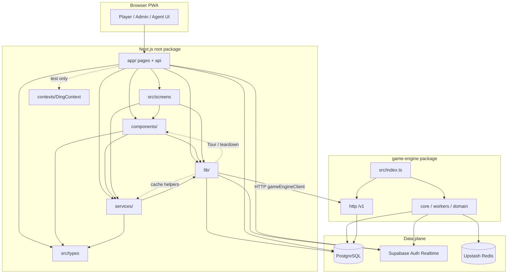
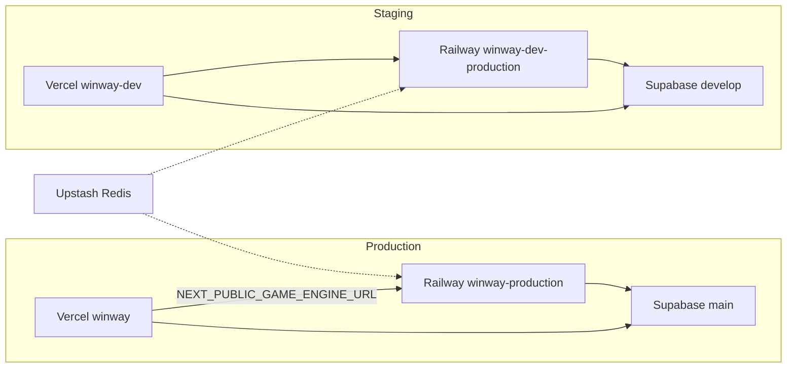

# P4.0 — Current Repository Map

> **P4.2 path note:** After P4.2 the engine lives at `apps/game-engine/`. This P4.0 document is a **point-in-time** snapshot; bare `game-engine/` paths below describe the pre-move layout (unless the sentence already discusses the target `apps/game-engine/`).

> Snapshot of the repository **as it exists today**.  
> No proposed moves. See [p4-0-target-architecture.md](./p4-0-target-architecture.md) for target.

---

## 1. Current tree (condensed)

```
winway-dev/
├── .cursor/                          # Cursor rules
├── .git/
├── .next/                            # GENERATED (gitignored)
├── .supabase-config-push/            # CLI config-push staging
│   └── supabase/config.toml
├── app/                              # Next App Router
│   ├── (auth)/                       # login, signup, register, recovery
│   ├── (ding)/                       # route group (partial)
│   ├── (game)/                       # lobby, room, test-bingo-card
│   ├── (messages)/
│   ├── (protected)/                  # legacy protected shell
│   ├── (public)/auth/
│   ├── (settings)/
│   ├── (wallet)/
│   ├── admin/                        # Admin portal UI
│   ├── agent/                        # Agent portal UI
│   ├── api/
│   │   ├── admin/                    # privileged APIs
│   │   ├── auth/
│   │   ├── dev-panel/
│   │   ├── me/
│   │   └── player/                   # player snapshots / actions
│   ├── dev-panel/                    # Dev tooling UI
│   ├── ding/, messages/, theme/      # misc / legacy routes
│   ├── player/                       # Player portal (primary)
│   ├── post-login/
│   ├── test-*                        # demo / test pages
│   ├── globals.css
│   ├── layout.tsx
│   └── page.tsx
├── components/                       # Shared React UI
│   ├── admin/, agent/, auth/, common/
│   ├── dev-panel/, reports/, room/
│   ├── support/, theme/, tour/, tournament/
│   └── BingoCard.tsx, DingHeader.tsx, …
├── contexts/
│   └── DingContext.tsx               # legacy island
├── docs/
│   ├── adr/, architecture/, audits/
│   ├── backend/, frontend/, migration/
│   ├── roadmap/, runbooks/, security/
│   └── system-map/, incidents/, …
├── game-engine/                      # Standalone Node service
│   ├── Dockerfile
│   ├── docker-compose.multi-replica.yml
│   ├── package.json
│   ├── scripts/                      # load-test, tests
│   └── src/
│       ├── index.ts                  # PROCESS ENTRY
│       ├── runtime.ts                # mode helpers
│       ├── commands/, config/, coordination/
│       ├── core/ (bitmask, card-registry, wallet, rng, …)
│       ├── db/, domain/, finance/
│       ├── health/, http/, integration/
│       ├── metrics/, redis/, repositories/
│       ├── runtime/, state/, workers/
│       └── benchmarks/
├── lib/                              # Next shared libraries
│   ├── activeGames/, audio/, auth/
│   ├── cardPool/, contexts/, dashboard/
│   ├── features/, gameEngine/, hooks/
│   ├── pg.ts, supabase*.ts, *SnapshotPg.ts
│   └── …
├── notebooks/
│   └── placeholder.ipynb
├── packages/
│   └── game-contracts/
│       └── README.md                 # stub only — no package.json
├── public/                           # PWA + static assets
│   ├── backgrounds/, icons/, images/
│   ├── sounds/, themes/, tour/
│   ├── manifest-*.webmanifest
│   ├── offline.html, sw.js
│   └── draw-fairness.html
├── scripts/                          # ops / env / admin SQL
├── services/                         # data services (client-oriented)
│   ├── *.ts                          # dashboard, rooms, users, …
│   └── dev-panel/
├── sql/
│   ├── functions/
│   ├── migrations/                   # CANONICAL (~197)
│   │   └── _game_engine/
│   └── optimization/
├── src/
│   ├── assets/
│   ├── lib/bingo-generator.ts
│   ├── screens/                      # MainMenu, GameRoom, LiveRoom, Tournament
│   └── types/                        # DTOs for services/UI
├── supabase/
│   ├── config.toml
│   ├── migrations/                   # 3 files only
│   └── .temp/                        # CLI cache
├── tmp/                              # local temp
├── .env.local.example
├── .env.develop.local.example
├── .tmp-*                            # scratch (tracked — DELETE later)
├── build.log / build.err / …
├── middleware.ts
├── next.config.mjs
├── package.json                      # Next app
├── tsconfig.json                     # excludes game-engine
├── README.md
├── ARCHITECTURE_PLAN.md              # aspirational / partially stale
└── winway.code-workspace
```

---

## 2. Application map

```
┌──────────────────────────────────────────────────────────────┐
│                     REPOSITORY (single git)                   │
│                                                              │
│  ┌─────────────────────────────┐  ┌────────────────────────┐ │
│  │ APP: Next.js (root)         │  │ APP: game-engine       │ │
│  │ package.json @ /            │  │ package.json @         │ │
│  │                             │  │   game-engine/         │ │
│  │ Surfaces:                   │  │                        │ │
│  │  • Player UI                │  │ Entrypoint:            │ │
│  │  • Admin UI                 │  │  src/index.ts          │ │
│  │  • Agent UI                 │  │                        │ │
│  │  • Dev Panel UI             │  │ Roles: scheduler,      │ │
│  │  • API routes               │  │  draw, room-loop,      │ │
│  │                             │  │  tournament,           │ │
│  │ Deploy: Vercel              │  │  dev-player*           │ │
│  │ Hosts: main + admin         │  │ Deploy: Railway Docker │ │
│  └─────────────────────────────┘  └────────────────────────┘ │
│                                                              │
│  packages/game-contracts → EMPTY PLACEHOLDER                 │
│  scripts/, sql/, supabase/ → infra & tools (not apps)        │
└──────────────────────────────────────────────────────────────┘
```

---

## 3. Dependency graph (code)



### Import rules in force today

| Edge | Status |
|------|--------|
| Next TS → `game-engine/**` | **None** (tsconfig exclude) |
| Engine TS → root `app/lib/services` | **None** |
| Next → Engine | **HTTP only** (`NEXT_PUBLIC_GAME_ENGINE_URL`) |
| Both → Postgres | **Yes** (SoT) |

---

## 4. Duplication map (mirrors)

```
lib/liveRoomSnapshotPg.ts  ≈  game-engine/src/http/live-room-snapshot-pg.ts
app/api/player/live-room   ≈  game-engine GET /v1/live-room
app/api/player/gameroom    ≈  game-engine GET /v1/gameroom
app/api/player/lobby-snapshot ≈ game-engine GET /v1/lobby
lib/provablyFair*.ts       ≈  game-engine/src/core/rng.ts
lib/pg.ts                  ≈  game-engine/src/db/pg.ts
src/types/*                ↔  services/*   (complementary, not copies)
```

---

## 5. API surface map

### Next.js `app/api`

| Group | Routes (summary) |
|-------|------------------|
| `player/` | gameroom, live-room, lobby-snapshot, my-active-rooms, room-results, cancel-waiting-room, tournament-*, card-pool/definitions, runtime/global-registration-lock |
| `admin/` | tournaments[+id], reports, dashboard/snapshot, wallet adjust/transfer, users/*, admins/*, card-pool/*, runtime lock |
| `dev-panel/` | users, dev-players, settings, join-presets, finance |
| `me/` | ding-balance, ping-presence |
| `auth/` | validate-referral-code |

### Game Engine HTTP

| Path | Role |
|------|------|
| `GET /health` | Liveness |
| `GET /ready` | Coordination-aware readiness |
| `GET /v1/lobby` | Lobby snapshot (engine path) |
| `GET /v1/gameroom` | Gameroom snapshot |
| `GET /v1/live-room` | Live-room snapshot |
| `POST /v1/rooms/join` | Join command |
| Commands API | Additional orchestration commands (`http/commands.ts`) |

---

## 6. Deployment graph



| Platform | Project / service | Public host | Build root |
|----------|-------------------|-------------|------------|
| Vercel | `winway` | `dingmoney.org` + `admin.dingmoney.org` | `/` |
| Vercel | `winway-dev` | `dev.dingmoney.org` + `admin.dev.*` | `/` |
| Railway | production engine | `*.up.railway.app` | `game-engine/` |
| Railway | staging engine | `*.up.railway.app` | `game-engine/` |
| Supabase | main / develop | `*.supabase.co` | N/A (SQL via `sql/migrations`) |

---

## 7. Environment consumption map

```
.env.local.example ──────────────► Next local / Vercel (shape)
.env.develop.local.example ──────► Next develop local
game-engine/.env.example ────────► Railway + engine local
game-engine/.env.develop.local.example ► engine → develop Supabase

scripts/use-supabase-*.ps1 ──────► switches Next env files
scripts/sync-game-engine-env.ps1 ► copies keys into engine env
```

---

## 8. Folder role cheat sheet

| Path | Role in current architecture |
|------|------------------------------|
| `app/` | Routes + API |
| `components/` | UI widgets |
| `src/screens/` | Large player screens mounted by `app/player/*` |
| `src/types/` | Shared DTOs |
| `lib/` | Cross-cutting Next logic |
| `services/` | Fetch/cache layer for admin/player UI |
| `game-engine/` | Authoritative game loop runtime |
| `sql/migrations/` | DB schema/RPC source of truth |
| `supabase/` | CLI project metadata (partial) |
| `docs/` | Human architecture / audits |
| `scripts/` | Operator tools |
| `packages/` | Future shared packages (empty) |
