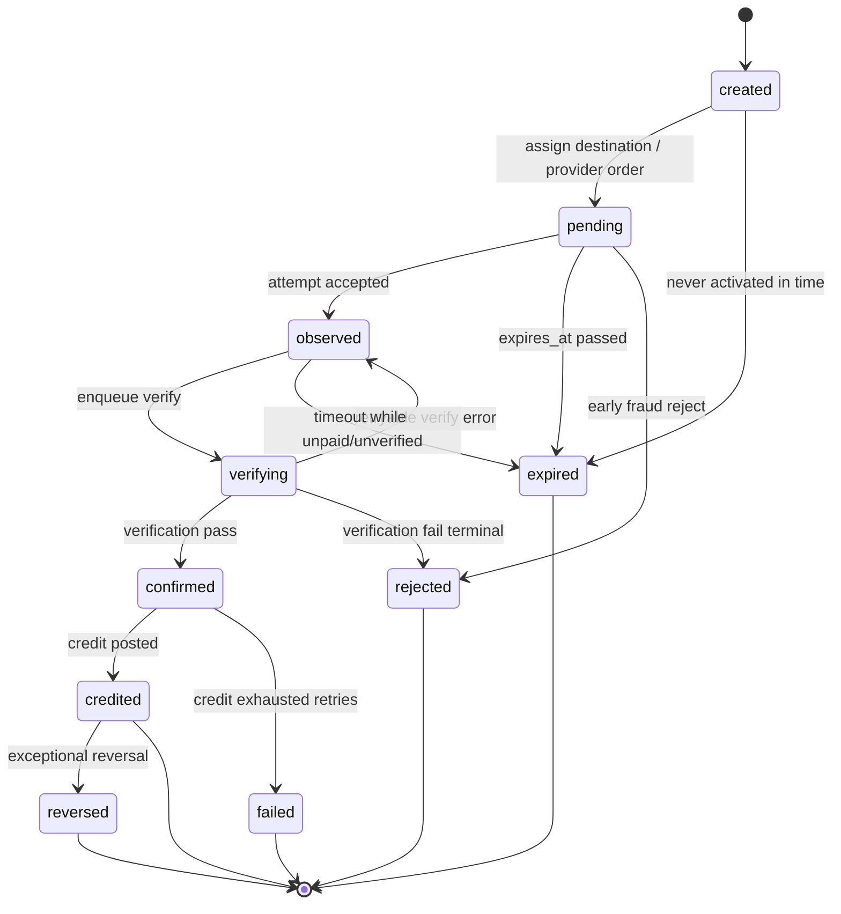

# P6.2 — Deposit Lifecycle

> **READ ONLY** design · Companion to `p6-2-deposit-domain-model.md`

---

## 1. States (intent-centric)

Primary state machine lives on **`deposit_intents.status`**.

| State | Meaning |
|-------|---------|
| `created` | Intent row exists; destination may be unassigned |
| `pending` | Ready to receive payment (address/order issued) |
| `observed` | ≥1 attempt linked; not yet verified pass |
| `verifying` | Verification zone working (async OK) |
| `confirmed` | Verification **pass**; credit not yet posted |
| `credited` | Wallet credit posted (terminal success) |
| `failed` | Terminal technical failure (retry policy exhausted) |
| `expired` | Past `expires_at` without successful credit |
| `rejected` | Verification fail for policy/fraud (terminal) |
| `reversed` | Exceptional clawback marker (future; withdrawals still N/A) |

**Supporting statuses**

- `deposit_credits.status`: `pending` → `posted` \| `failed`  
- Attempts/verifications: immutable rows (no lifecycle overwrite)

---

## 2. Lifecycle diagram



---

## 3. Allowed transitions

| From | To | Who | Guard |
|------|----|-----|-------|
| `created` → `pending` | Deposit service | Destination/order assigned |
| `created` → `expired` | Expiry job | `now > expires_at` |
| `pending` → `observed` | Ingress | Attempt UNIQUE accepted + intent match |
| `pending` → `expired` | Expiry job | No credit; past expiry |
| `pending` → `rejected` | Verifier/admin | Explicit reject |
| `observed` → `verifying` | Verifier | Lock intent |
| `verifying` → `confirmed` | Verifier | All money-contract checks pass |
| `verifying` → `rejected` | Verifier | Hard fail (forgery, wrong dest, etc.) |
| `verifying` → `observed` | Verifier | Soft fail (RPC timeout) — retry |
| `observed` → `expired` | Expiry job | |
| `confirmed` → `credited` | Creditor | `deposit_credits` posted + apply_delta OK |
| `confirmed` → `failed` | Creditor | Non-retryable or max retries |
| `credited` → `reversed` | Controlled admin+system | Future policy only |

---

## 4. Forbidden transitions

| Forbidden | Why |
|-----------|-----|
| `expired` → `credited` | R06 — no credit after expiry |
| `rejected` → `credited` | Bypass verification |
| `credited` → `pending` / `confirmed` | Rewrite history |
| Any → `credited` without `confirmed` | Skip verification |
| `confirmed` → `rejected` after credit row posted | Use `reversed` path later |
| Client/API user → `credited` | Wallet mutation server-only |
| Adapter → any money state directly | Adapters emit evidence only |
| Engine → deposit states | Separation of duties |

---

## 5. Terminal / retryable

| Kind | States |
|------|--------|
| **Terminal success** | `credited` |
| **Terminal failure** | `expired`, `rejected`, `failed` |
| **Terminal exceptional** | `reversed` |
| **Retryable** | `observed`, `verifying` (soft errors), `confirmed` (credit retry until posted) |

Once `credited`, retries of webhooks must be **no-ops** (idempotent).

---

## 6. Who may transition

| Actor | Allowed |
|-------|---------|
| **Authenticated user** | Create intent (own `user_id` only); read own status |
| **Ingress worker** | Insert attempt; `pending`→`observed` |
| **Verification worker** | `observed`↔`verifying`→`confirmed`/`rejected` |
| **Credit worker** | `confirmed`→`credited`/`failed` |
| **Expiry job** | →`expired` when allowed |
| **Admin** | Read; limited reject; **no** raw balance mint via this domain without Manual adapter (future) |
| **Game engine** | **None** |
| **Fiat/Tron adapter** | Produce evidence structs only — **no** status writes |

---

## 7. Money contract (credit gate)

Before `confirmed` → `credited`, **all** must be true:

| # | Check |
|---|--------|
| 1 | `external_payment_id` unique for successful verification |
| 2 | `verification.user` / intent `user_id` match |
| 3 | Amount matches policy (exact or documented tolerance) |
| 4 | Currency/token matches intent |
| 5 | Destination matches intent `destination_ref` |
| 6 | `now ≤ expires_at` at confirmation time (policy: also at credit time) |
| 7 | Confirmations ≥ required (chain) or gateway success code trusted |
| 8 | No existing `deposit_credits` with status `posted` for intent / idempotency_key |

### Idempotency boundary

```
CreditCommand.idempotency_key
  = deposit:fiat:{provider}:{gateway_payment_id}
  | deposit:tron:{txid}:{log_index}
  | deposit:manual:{intent_id}
```

Passed into ledger as `transactions.idempotency_key` (or domain unique + ledger source_ref).

**Safe retry:** same key → return existing posted credit; no second apply_delta.

---

## 8. Wallet integration contract (design)

```
Credit worker (server-only):
  BEGIN
    LOCK intent FOR UPDATE
    assert status = confirmed
    upsert deposit_credits (unique idempotency_key)
    if already posted → COMMIT; return success
    CALL fn_wallet_apply_delta(
      user_id, currency, +amount,
      type = deposit,
      source_kind = deposit_domain,
      source_ref = intent_id,
      idempotency_key = ...,
      allow_negative = false
    )
    set credit.posted + ledger_tx_id
    set intent.status = credited
    append deposit_events
  COMMIT
```

Requirements:

- **One DB transaction**
- **Exactly-once** logical credit
- **Safe retry**
- **No** direct `UPDATE wallets`
- **No** client-provided delta
- **No** silent fallback to cashdesk or engine

On apply_delta failure: leave `confirmed`, credit `pending`/`failed`, retry with backoff.

---

## 9. Failure scenario matrix

| Scenario | Behavior |
|----------|----------|
| **Duplicate webhook** | Attempt UNIQUE on delivery id → duplicate rejected or ignored; verify/credit idempotent |
| **Forged webhook** | Attempt `unauthorized`; no verify pass; intent stays pending/observed |
| **Out-of-order webhook** | Status monotonic; late “pending” after credited → ignore |
| **Expired invoice** | Expiry job → `expired`; verify must fail if past expiry |
| **Underpayment** | Fail verify (`amount_mismatch`) or hold in `observed` per policy — **no partial credit in v1** |
| **Overpayment** | v1: reject or confirm only expected amount (record excess in evidence); no auto-withdraw |
| **Wrong currency/token** | `rejected` |
| **Wrong destination** | `rejected` |
| **Duplicate TXID** | Second verify pass blocked by UNIQUE external_payment_id |
| **Chain reorg** | Require N confirmations; if reorg before credit, verify fails; after credit → manual `reversed` playbook (rare) |
| **Credit TX rollback** | Intent stays `confirmed`; credit not posted; retry |
| **Crash after confirm before credit** | Reconciler: `confirmed` without posted credit → enqueue credit |
| **Crash after credit before HTTP response** | Idempotent key → retry returns already credited |

---

## 10. Amount policy (v1 recommendation)

| Channel | Policy |
|---------|--------|
| Fiat | **Exact** match to `amount_expected` |
| USDT | Exact token amount; dust underpayment → reject; overpay → record, credit expected only **or** reject (pick one in implementation; prefer **reject overpay** until ops tooling exists) |

---

P6_2_DEPOSIT_DOMAIN_DESIGN_COMPLETE
