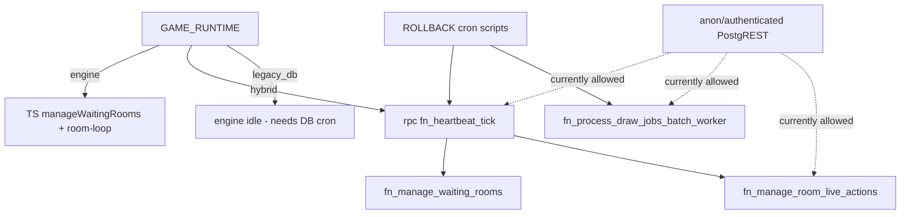

# P1.6 — Hybrid Retirement & Legacy Orchestrator ACL Audit (Read-Only)

> **Date:** 2026-07-31  
> **Supabase:** `yqnptpreowkimopxicfz`  
> **Railway:** `winway-dev` → `https://winway-dev-production.up.railway.app`  
> **Mode:** READ-ONLY — SELECT catalog queries only; no GRANT/REVOKE executed; no migrations created/applied; no env/deploy/code/commit changes.  
> **Prior:** P1.5 `NO_SAFE_SQL_REMOVAL_FOUND`; Wave 2A complete; bingo crons absent.

---

## Executive verdict

| Question | Answer |
|----------|--------|
| Is hybrid **currently** driving game clock? | **No** — live `GAME_RUNTIME=engine` |
| Can hybrid activate accidentally? | **Yes** — env flip to `hybrid` + `SCHEDULER_ENABLED=true` still RPCs `fn_heartbeat_tick` |
| Can hybrid/legacy **code** be deleted yet? | **No** — keep rollback paths |
| Is **ACL lockdown** of legacy orchestrators safe to prepare? | **Yes** — engine uses `service_role`; revoke anon/authenticated/PUBLIC only |
| P0B migration on this project? | **Never applied** (`schema_migrations` has no `20260721180000` / `%p0b%`) |

### Final status

```
READY_FOR_ACL_LOCKDOWN
```

---

## 1. Live runtime evidence table

| Variable / signal | Evidenced live value | Code default | Misconfiguration risk | Hybrid accidental activation? |
|-------------------|----------------------|--------------|----------------------|-------------------------------|
| `GAME_RUNTIME` | **`engine`** (Railway `variables`) | parse: invalid/missing → **`legacy_db`** (`.env.example` recommends `engine`) | Missing/typo → `legacy_db`: workers **idle**, bingo crons **gone** → **stuck clock** | Set to `hybrid` → `callDbScheduler` → `fn_heartbeat_tick` |
| `SCHEDULER_ENABLED` | **`true`** | **`false`** (`=== "true"`) | `false` stops ticks even if runtime=engine | Required true for hybrid heartbeat ticks |
| `GAME_ENGINE_ROLES` | `scheduler,draw-processor,tournament-orchestrator,room-loop,dev-player-scheduler,dev-player-processor` | empty set if unset | Missing `room-loop`/`scheduler` → incomplete lifecycle | N/A for hybrid RPC (still needs scheduler role) |
| `ENABLE_SHADOW_PARITY` | **missing** → treated **false** | false unless `=== "true"` | Accidental `true` only adds observe path | Does not call orchestrator RPCs by itself |
| `GAME_ENGINE_API` | **`true`** | (config) | — | — |
| `ENGINE_REPLICA_COUNT` | **`1`** | — | — | — |
| `COORDINATION_STRICT` | **`false`** | — | Multi-replica risk if scaled without Redis | — |
| Redis | health: **`disabled`** | — | OK for 1 replica; scaling blocked | — |
| HTTP `/health` | `200` `{"ok":true,"service":"game-engine","redis":"disabled"}` | — | — | — |
| Runtime logs | Continuous **`room-loop heartbeat`** + **`[DrawPicker] poll`**; `shadowDecisions=0`; **no** `fn_heartbeat_tick` errors/calls observed | — | Confirms engine actors, not hybrid DB clock | — |

**Sources:** `railway variables` (linked service `winway-dev`), `railway logs` (2026-07-31), `GET /health`, `apps/game-engine/src/config/env.ts`, `apps/game-engine/src/runtime.ts`.

**Code path (hybrid still wired):**

```
GAME_RUNTIME=hybrid && SCHEDULER_ENABLED
  → room-scheduler tick
  → !executesBusinessLogic → callDbScheduler()
  → supabase.rpc("fn_heartbeat_tick")
```

`executesBusinessLogic` is **only** true for `engine`.

---

## 2. Legacy caller graph

### `public.fn_heartbeat_tick()`

| Caller | Classification |
|--------|----------------|
| `game-engine/.../room-scheduler/index.ts` `callDbScheduler` | **feature-flag / runtime fallback** — active **only** when `GAME_RUNTIME=hybrid` |
| Body callees: `fn_manage_waiting_rooms`, `fn_manage_room_live_actions` | DB internal |
| `scripts/game-engine-cron-heartbeat.sql` RESTORE | **rollback script** |
| `docs/runbooks/dev-game-cron-mutex-apply.md` RESTORE | **rollback script** |
| Migrations / security docs / audits | **docs/history** |
| Browser/Next `rpc(...)` | **none found** |
| Live Railway (`engine`) | **not active** |

### `public.fn_process_draw_jobs_batch()` / `_worker(integer,integer)`

| Caller | Classification |
|--------|----------------|
| TS `supabase.rpc(...)` | **none** |
| `processDrawBatch.ts` | **docs/history** (comment “mirrors” only) |
| `scripts/game-engine-cron-draw-workers.sql` | **rollback script** |
| Mutex runbook RESTORE | **rollback script** |
| `src/types/supabase.ts` | **generated types** |
| Migrations / optimization SQL | **docs/history** |
| Unknown external | **possible** via PostgREST while anon EXECUTE remains |

### `game_core.fn_manage_waiting_rooms(integer,boolean)`

| Caller | Classification |
|--------|----------------|
| `fn_heartbeat_tick` body | DB (hybrid/cron path) |
| Engine `manageWaitingRooms` TS | **not an RPC** — port; engine mode does not call this |
| Migrations | **history** |

### `game_core.fn_manage_room_live_actions()`

| Caller | Classification |
|--------|----------------|
| `fn_heartbeat_tick` body | DB |
| `core/rng.ts` comments | **docs/history** |
| Engine room-loop | uses `rpc_insert_draw_if_ready*` — **not** this fn |



---

## 3. ACL table (live DEV — this session)

| Function | SECURITY DEFINER | search_path | owner | anon X | authenticated X | service_role X | postgres X | ACL summary | PostgREST / direct RPC |
|----------|------------------|-------------|-------|--------|-----------------|----------------|------------|-------------|------------------------|
| `public.fn_heartbeat_tick()` | false | unset | postgres | **true** | **true** | true | true | PUBLIC + anon + auth + service_role | **Yes** — `public` + anon USAGE; RPC possible as anon/auth |
| `public.fn_process_draw_jobs_batch()` | false | unset | postgres | **true** | **true** | true | true | same | **Yes** |
| `public.fn_process_draw_jobs_batch_worker(int,int)` | false | unset | postgres | **true** | **true** | true | true | same | **Yes** |
| `game_core.fn_manage_waiting_rooms(int,bool)` | **true** | `public, game_core` | postgres | true* | true* | true | true | PUBLIC + postgres + service_role (*via PUBLIC*) | **Indirect** — `anon` has **no** `USAGE` on `game_core`; still callable via heartbeat SECURITY INVOKER… wait heartbeat is invoker so waiting_rooms runs as caller. Hybrid uses service_role. Direct game_core RPC likely blocked without schema exposure |
| `game_core.fn_manage_room_live_actions()` | false | unset | postgres | **true** | **true** | true | true | PUBLIC + anon + auth + service_role | Direct game_core: **USAGE false** for anon; exposure **unproven** if schema not in API. Grants still dangerous if schema ever exposed |

**Schema USAGE (live):** `anon` → `public` **true**, `game_core` **false**; `authenticated` → `game_core` **false**.  
`pgrst.db_schemas` still not readable from SQL session (NULL historically).

---

## 4. Migration vs live discrepancy (P0B)

| Check | Result |
|-------|--------|
| Repo file | `sql/migrations/20260721180000_p0b_lock_engine_queue_lifecycle_grants.sql` |
| File comment | “Applied to main (**`gtwgatewbagklpmxdlsj`**)” — **different project** than `yqnptpreowkimopxicfz` |
| `schema_migrations` on DEV | `p0b_version_exists=false`, `p0b_name_exists=false` |
| Live ACL vs post-P0B expected | Still has **anon/authenticated/PUBLIC** EXECUTE on heartbeat/batch/live_actions |
| Signature mismatch? | **No** — all five `regprocedure` targets from P0B resolve on DEV |
| Overload mismatch? | **No** for these five |
| Applied then reverted? | **No evidence** of apply on this project |
| **Root cause** | **Never applied** to Final Pre-Launch DEV (`yqnptpreowkimopxicfz`); written/applied for another Supabase ref |

**Scope note:** Full historical P0B also locks Railway primitives (`rpc_pick_draw_jobs`, claim/lease/insert, janitor, etc.). **This P1.6 plan intentionally locks only legacy orchestrators**, preserving engine primitives’ current grants (separate hardening wave).

---

## 5. Proposed ACL lockdown SQL (DO NOT EXECUTE in this phase)

### 5.1 Lockdown (legacy orchestrators only)

```sql
-- P1.6 plan — DEV yqnptpreowkimopxicfz — LEGACY ORCHESTRATORS ONLY
-- Preserves: service_role + postgres EXECUTE
-- Does NOT touch: rpc_pick_draw_jobs, rpc_claim_*, rpc_insert_draw_*,
--   rpc_finalize_*, fn_finish_room_and_settle, janitor, card-pool, finance

BEGIN;

DO $$
DECLARE
  fn regprocedure;
BEGIN
  FOREACH fn IN ARRAY ARRAY[
    'public.fn_heartbeat_tick()'::regprocedure,
    'public.fn_process_draw_jobs_batch()'::regprocedure,
    'public.fn_process_draw_jobs_batch_worker(integer,integer)'::regprocedure,
    'game_core.fn_manage_waiting_rooms(integer,boolean)'::regprocedure,
    'game_core.fn_manage_room_live_actions()'::regprocedure
  ]
  LOOP
    EXECUTE format('REVOKE ALL ON FUNCTION %s FROM PUBLIC', fn);
    EXECUTE format('REVOKE ALL ON FUNCTION %s FROM anon', fn);
    EXECUTE format('REVOKE ALL ON FUNCTION %s FROM authenticated', fn);
    EXECUTE format('GRANT EXECUTE ON FUNCTION %s TO service_role', fn);
    EXECUTE format('GRANT EXECUTE ON FUNCTION %s TO postgres', fn);
  END LOOP;
END;
$$;

COMMIT;
```

### 5.2 Verification queries (post-apply)

```sql
SELECT
  n.nspname||'.'||p.proname||'('||pg_get_function_identity_arguments(p.oid)||')' AS fn,
  has_function_privilege('anon', p.oid, 'EXECUTE') AS anon_x,
  has_function_privilege('authenticated', p.oid, 'EXECUTE') AS auth_x,
  has_function_privilege('service_role', p.oid, 'EXECUTE') AS service_x,
  has_function_privilege('postgres', p.oid, 'EXECUTE') AS postgres_x,
  p.proacl::text AS acl
FROM pg_proc p
JOIN pg_namespace n ON n.oid = p.pronamespace
WHERE (n.nspname, p.proname) IN (
  ('public','fn_heartbeat_tick'),
  ('public','fn_process_draw_jobs_batch'),
  ('public','fn_process_draw_jobs_batch_worker'),
  ('game_core','fn_manage_waiting_rooms'),
  ('game_core','fn_manage_room_live_actions')
);

-- Expect: anon_x=false, auth_x=false, service_x=true, postgres_x=true
```

Negative test (as anon JWT / anon key): `POST /rest/v1/rpc/fn_heartbeat_tick` → **permission denied**.  
Positive: Railway continues room-loop / draw-processor (uses other RPCs + service_role).

### 5.3 Rollback GRANT SQL

```sql
BEGIN;

GRANT EXECUTE ON FUNCTION public.fn_heartbeat_tick() TO PUBLIC, anon, authenticated, service_role;
GRANT EXECUTE ON FUNCTION public.fn_process_draw_jobs_batch() TO PUBLIC, anon, authenticated, service_role;
GRANT EXECUTE ON FUNCTION public.fn_process_draw_jobs_batch_worker(integer, integer) TO PUBLIC, anon, authenticated, service_role;
GRANT EXECUTE ON FUNCTION game_core.fn_manage_waiting_rooms(integer, boolean) TO PUBLIC, service_role;
GRANT EXECUTE ON FUNCTION game_core.fn_manage_room_live_actions() TO PUBLIC, anon, authenticated, service_role;

COMMIT;
```

*(Matches pre-lockdown effective shape; adjust if you prefer not restoring PUBLIC.)*

---

## 6. Hybrid retirement readiness (separate from ACL)

| Decision | Ready? | Notes |
|----------|--------|-------|
| Keep `GAME_RUNTIME=engine` | **Yes** | Evidenced live |
| Delete hybrid/legacy code paths | **No** | Explicit rollback surface |
| Drop orchestrator SQL | **No** | P1.5; still B |
| ACL-lock orchestrators | **Yes** | This phase |
| Env guardrails (optional follow-up) | Recommended | Alert if `GAME_RUNTIME≠engine`; never unset (defaults to `legacy_db`) |

---

## 7. Validation checklist (after future lockdown apply)

- [ ] Verification query: anon/auth EXECUTE = false on all five  
- [ ] Anon RPC `fn_heartbeat_tick` fails  
- [ ] Railway `/health` ok; room-loop + DrawPicker logs healthy  
- [ ] Join → promote → draw → settle smoke (engine path)  
- [ ] `service_role` can still `SELECT public.fn_heartbeat_tick()` (hybrid rollback intact)  
- [ ] Maintenance crons unchanged (janitor, card-pool, partitions, retention)  
- [ ] No revoke on `rpc_pick_draw_jobs` / claim / insert / settle / wallet  

---

## Status

```
READY_FOR_ACL_LOCKDOWN
```
