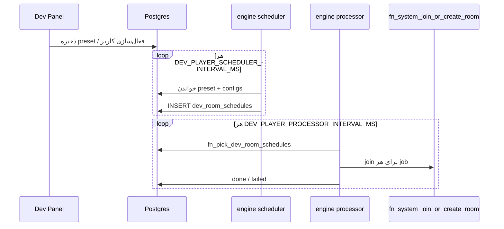

# Dev Player — معماری و جریان اجرا

این سند نحوهٔ کار **Dev Player** را در WinWay توضیح می‌دهد: تنظیمات ادمین، ذخیره‌سازی در Postgres، و منطق زمان‌دار در **game-engine**.

## اهداف

- شبیه‌سازی پلیرهای واقعی برای پر کردن میزها و تست بار
- کنترل از **Dev Panel** (تنظیمات سراسری، presetهای Join، config هر کاربر)
- اجرای خودکار join در بازه‌های زمانی مشخص، با رعایت limit هر template

## لایه‌ها (تفکیک مسئولیت)

```
┌─────────────────────────────────────────────────────────────────┐
│  Dev Panel (Next.js)                                            │
│  /dev-panel/settings  — presetها، کنترل سیستم                 │
│  /dev-panel/users     — فعال‌سازی کاربر + play window شخصی    │
└────────────────────────────┬────────────────────────────────────┘
                             │ REST API (CRUD فقط)
                             ▼
┌─────────────────────────────────────────────────────────────────┐
│  Postgres (منبع حقیقت داده)                                   │
│  dev_player_settings, dev_player_join_presets,                  │
│  dev_player_join_preset_template_limits, dev_player_configs,    │
│  dev_room_schedules (صف job)                                    │
└────────────┬───────────────────────────────┬──────────────────┘
             │ خواندن/نوشتن schedule          │ pick + join RPC
             ▼                                ▼
┌────────────────────────────┐   ┌──────────────────────────────┐
│ game-engine                │   │ Postgres RPC (اتمیک)         │
│ domain/dev-players         │   │ fn_pick_dev_room_schedules   │
│ workers/dev-player         │   │ fn_system_join_or_create_room│
│  • scheduler               │   └──────────────────────────────┘
│  • processor               │
└────────────────────────────┘
```

| لایه | مسئولیت | نباید چه کاری بکند |
|------|---------|-------------------|
| **Next.js API** | CRUD تنظیمات و preset | تصمیم join / tick |
| **Postgres tables** | ذخیره config و صف | منطق پیچیده preset (در SQL سنگین) |
| **game-engine** | scheduler + processor | UI ادمین |
| **DB RPC** | pick اتمیک + join واقعی | انتخاب template / play window |

## جداول کلیدی

| جدول | نقش |
|------|-----|
| `dev_player_settings` | فلگ سیستم/scheduler، tick اسکدولر/پردازشگر، چرخه وقفه، runtime state، timezone، preset فعال |
| `dev_player_join_presets` | preset نام‌دار: play window، wallet، فیلتر VIP/تورنومنت، auto-approve |
| `dev_player_join_preset_template_limits` | per-template: min/max میز فعال، min پلیر عادی در میز، max dev player در میز، join interval، max join/tick |
| `dev_player_configs` | per-user: play window، بازه قیمت، max ticket، `is_enabled` |
| `dev_room_schedules` | صف join: `user_id`, `room_template_id`, `ticket_count`, `status` |

## preset فعال (Join)

از Dev Panel → **رفتار Join** یک preset انتخاب و ذخیره می‌شود. فیلدهای مهم:

- **بازه‌های زمانی عملکرد** — وقتی scheduler اجازهٔ ساخت schedule دارد
- **templateهای فعال** (checkbox) — فقط non-tournament
- **حداقل/حداکثر میز فعال** — تعداد `waiting`/`playing` قبل از join جدید
- **فاصله join / max per tick** — per template
- **حداقل wallet / exclude VIP / auto-approve**

`active_join_preset_id` روی `dev_player_settings` مشخص می‌کند کدام preset در runtime استفاده شود.

## game-engine — ماژول dev-players

مسیر کد:

```
apps/game-engine/src/
  domain/dev-players/
    buildScheduleBatch.ts    ← scheduler entry (delegates to manager)
    runDevPlayerManager.ts   ← Dev Player Manager (random cycle + one join/tick)
    schedulerCycle.ts        ← random work/pause + join spacing
    processScheduleBatch.ts  ← processor: pick + join
    isWithinPlayWindow.ts
    templateGates.ts
    types.ts
  repositories/devPlayerRepo.ts
  workers/dev-player/
    scheduler.ts
    processor.ts
```

### نقش‌ها (`GAME_ENGINE_ROLES`)

| Role | جایگزین | cadence |
|------|---------|---------|
| `dev-player-scheduler` | (آینده) `fn_tick_dev_players` | از Dev Panel → **فاصله tick اسکدولر** (پیش‌فرض ۶۰s) |
| `dev-player-processor` | edge `dev-schedule-worker` | Dev Panel → **فاصله tick پردازشگر** (پیش‌فرض ۶۰s) |

**مهم:** این workerها مستقل از `GAME_RUNTIME` هستند. حتی در `legacy_db` (وقتی cron بازی فعال است) می‌توانند dev player را اجرا کنند.

### Dev Player Manager (`runDevPlayerManager`)

هر tick اسکدولر **حداکثر یک join** برنامه‌ریزی می‌کند.

1. `system_enabled` و `scheduler_enabled` روشن باشد
2. اگر **شروع وقفه + طول وقفه** تنظیم شده:
   - مدت فعالیت تصادفی بین ۵۰ و «شروع وقفه» (ثانیه)
   - مدت وقفه تصادفی بین ۵۰ و «طول وقفه» (ثانیه)
   - در فاز وقفه schedule ساخته نمی‌شود (state در `dev_player_settings`)
   - در هر دوره کاری، هر template حداکثر «تعداد join در هر دوره کاری» (`max_joins_per_tick`) بار join می‌زند؛ با شروع دوره بعدی شمارنده صفر می‌شود
3. preset فعال + play window preset
4. templateهای فعال preset که واجد شرایط‌اند:
   - فیلتر VIP/تورنومنت/status
   - min/max میز فعال (`waiting`/`playing`)
   - حداقل پلیر عادی در میز هدف join
   - زیر سقف max dev player در همان میز
   - زمان join رسیده (فاصله تصادفی ۵..`join_interval_seconds` per template)
   - سقف joinهای دوره کاری پر نشده (`joins_in_work_cycle < max_joins_per_tick`)
5. یک template تصادفی از واجد شرایط‌ها
6. یک dev player تصادفی با اولویت **غیرتکراری** (بدون حضور در روم `waiting`/`playing`؛ در غیر این صورت reuse مجاز)
7. شرایط فردی بازیکن: play window، wallet، بازه قیمت، نبود schedule معلق
8. تعداد کارت تصادفی بین ۱ و `min(max_ticket_count, template.max_cards_per_player)` برای همان tick
9. INSERT یک ردیف در `dev_room_schedules` + ثبت `next_join_at` برای همان template

### Processor tick (`processScheduleBatch`)

1. jobهای `processing` قدیمی‌تر از ۱۲۰ث → برگشت به `approved` (retry)
2. `fn_pick_dev_room_schedules(limit)` — `FOR UPDATE SKIP LOCKED`
3. برای هر job: `fn_system_join_or_create_room`
4. موفق → `status=done` + `result_room_id`
5. خطا → `status=failed` + `last_error`

## Dev Panel API (بدون tick)

| مسیر | کار |
|------|-----|
| `GET/PATCH /api/dev-panel/settings` | سیستم، tick اسکدولر، preset فعال |
| `POST /api/dev-panel/join-presets` | ذخیره preset |
| `GET/PATCH /api/dev-panel/dev-players/[userId]` | config هر کاربر |

## راه‌اندازی engine

```bash
cd apps/game-engine
cp .env.example .env
# SUPABASE_URL, SUPABASE_SERVICE_ROLE_KEY
GAME_ENGINE_ROLES=dev-player-scheduler,dev-player-processor
npm run dev
```

**فاصله tick اسکدولر / پردازشگر:** Dev Panel → تنظیمات → کنترل سیستم (۵ تا ۳۶۰۰ ثانیه).

متغیرهای env (fallback): `DEV_PLAYER_SCHEDULER_INTERVAL_MS`, `DEV_PLAYER_PROCESSOR_INTERVAL_MS`, `DEV_PLAYER_PROCESSING_STUCK_TIMEOUT_SEC` (پیش‌فرض ۱۲۰).

## مهاجرت از edge function

امروز cron شماره ۲۱ هر دقیقه edge function `dev-schedule-worker` را صدا می‌زند.

**برای cutover به engine:**

1. game-engine را با `dev-player-processor` بالا بیاورید
2. cron job مربوط به edge را **غیرفعال** کنید (تا دوبار join نشود)
3. scheduler را با `dev-player-scheduler` فعال کنید (ساخت schedule از preset)

اسکریپت مرجع: `scripts/dev-schedule-worker-cron.sql`

## وضعیت فعلی / فاز بعد

| قابلیت | وضعیت |
|--------|--------|
| UI preset + per-template limits | ✅ |
| ذخیره preset در DB | ✅ |
| Scheduler در game-engine | ✅ |
| Processor در game-engine | ✅ |
| غیرفعال کردن cron edge | دستی هنگام deploy |
| تأیید دستی schedule (`draft`) | UI ادمین schedule — آینده |

## دیاگرام جریان



## اصول طراحی

1. **Config در DB، تصمیم در engine** — preset پیچیده در TypeScript قابل تست است
2. **صف جدا (`dev_room_schedules`)** — scheduler و executor decouple هستند
3. **Join فقط از RPC** — wallet/hold/ticket مثل join واقعی
4. **Template تورنومنت** — در UI و scheduler حذف می‌شود
