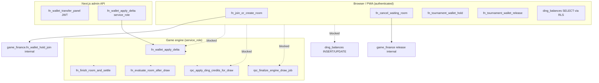

# DING MONEY — P0-A Financial & Ding Remediation Report

**Date:** 2026-07-21  
**Target:** Deployed Supabase **main** (`gtwgatewbagklpmxdlsj`) — branch `v02` not modified  
**Related:** [P0 live verification](./DING_MONEY_P0_LIVE_SECURITY_VERIFICATION_REPORT.md) · [Final audit](./DING_MONEY_SECURITY_AUDIT_FINAL_REPORT.md)

---

## 1. Executive summary

P0-A applied **one privilege/RLS migration** on main that removes direct **PUBLIC / anon / authenticated** access to wallet apply-delta primitives, game_finance wallet/settlement internals, Ding mutation RPCs, engine finalize/ding-credit RPCs, and client **DML** on `public.ding_balances`. **Service role** retains `EXECUTE` on all locked functions. Browser/PWA entry points that enforce `auth.uid()` and were confirmed in static analysis remain **unchanged** (join/cancel, tournament hold/release, admin transfer panel).

| Item | Value |
|------|--------|
| Repo migration file | `sql/migrations/20260721160000_p0a_lock_financial_ding_client_access.sql` |
| Applied on main (catalog) | `supabase_migrations.schema_migrations.version` **20260721153034**, name `20260721160000_p0a_lock_financial_ding_client_access` |
| Functions locked | **31** (see §5) |
| Balance/ledger data changed | **No** |
| Game rules / settlement math changed | **No** |

---

## 2. Preflight (read-only, immediately before apply)

### 2.1 Static dependency evidence (no browser caller → included in P0-A)

| Caller | RPC / path | Role |
|--------|------------|------|
| `app/api/admin/wallet/adjust/route.ts` | `public.fn_wallet_apply_delta` | **service_role** |
| `apps/game-engine/src/finance/index.ts` | `fn_wallet_apply_delta`, `fn_finish_room_and_settle`, commission RPCs | **service_role** |
| `apps/game-engine/src/repositories/index.ts` | `rpc_apply_ding_credits_for_draw`, `rpc_finalize_engine_draw_job` (17-arg) | **service_role** |
| `apps/game-engine/src/domain/draw/processDrawBatch.ts`, `reconcileWinners.ts` | `fn_evaluate_room_after_draw` | **service_role** |
| `apps/game-engine/src/domain/room/janitorRepair.ts` | `fn_janitor_repair_unsettled_finished` | **service_role** |
| Join/cancel/tournament | `fn_join_or_create_room`, `fn_cancel_waiting_room`, `fn_tournament_wallet_hold` / `release` | **authenticated** (DEFINER); hold/release **not** revoked |

**Excluded from revocation (authenticated EXECUTE retained):**

- `public.fn_join_or_create_room(uuid, integer, text)` — `services/rooms.ts`
- `public.fn_cancel_waiting_room(...)` — `app/api/player/cancel-waiting-room/route.ts`
- `public.fn_tournament_wallet_hold` / `fn_tournament_wallet_release` — `src/screens/TournamentRoomScreen.tsx`
- `public.fn_wallet_transfer_panel` (both overloads) — `app/api/admin/wallet/transfer/route.ts` (JWT-scoped `auth.uid()` + hierarchy inside RPC)

**No app/PWA direct caller found for:** `update_ding_balance`, `rpc_apply_ding_credits_for_draw`, `rpc_finalize_engine_draw_job`, `fn_adjust_wallet_manual`, `fn_adjust_referral_wallet`, or direct `game_finance.fn_wallet_*` RPCs (join uses wrapper only).

Ding reads: `app/api/me/ding-balance/route.ts`, `services/user-account.ts` — **SELECT** on `ding_balances` only.

### 2.2 Live pre-migration state (summary)

- All P0-A target functions: **PUBLIC + anon + authenticated + service_role EXECUTE = true** (see P0 live report).
- `ding_balances`: RLS SELECT own row; UPDATE policy `"Users can receive realtime ding balance updates"` with `USING (auth.uid() = user_id)` only; anon/authenticated had **INSERT/UPDATE** (and related) on columns.
- `pg_default_acl`: broad default grants for `postgres` and `supabase_admin` on `public` (functions/tables/sequences). **Not altered in P0-A** (see §8 P0-B).

---

## 3. Dependency map (post-P0-A)



---

## 4. Migration SQL (exact)

Applied SQL matches the repo file:

`sql/migrations/20260721160000_p0a_lock_financial_ding_client_access.sql`

Mechanism:

1. Temporary helper `pg_temp.p0a_lock_fn_to_service_role(regprocedure)`: `REVOKE ALL ON FUNCTION … FROM PUBLIC, anon, authenticated`; `GRANT EXECUTE … TO service_role`.
2. Loop over **31** `regprocedure` entries (exact overloads, including 17-argument `rpc_finalize_engine_draw_job`).
3. `REVOKE INSERT, UPDATE, DELETE, TRUNCATE, REFERENCES, TRIGGER ON public.ding_balances FROM anon, authenticated`.
4. `DROP POLICY "Users can receive realtime ding balance updates" ON public.ding_balances`.

**Not changed:** `public.app_runtime_flags`, engine heartbeat / pick-draw RPCs (P0-B).

---

## 5. Post-migration privilege matrix (catalog verification)

Verified with `has_function_privilege` on main after apply. Pattern for all **31** locked functions:

| Role | EXECUTE |
|------|---------|
| PUBLIC | **false** |
| anon | **false** |
| authenticated | **false** |
| service_role | **true** |

Functions (alphabetical):

| Function |
|----------|
| `public.fn_adjust_referral_wallet(uuid, numeric, text, transaction_type, text)` |
| `public.fn_adjust_wallet_manual(uuid, numeric, text, transaction_type, text)` |
| `public.fn_evaluate_room_after_draw(uuid, integer)` |
| `game_core.fn_evaluate_room_after_draw(uuid, integer)` |
| `public.fn_finish_room_and_settle(uuid, uuid)` |
| `game_finance.fn_finish_room_and_settle(uuid, uuid)` |
| `public.fn_janitor_repair_unsettled_finished(integer)` |
| `public.fn_payout_room_if_full(uuid)` |
| `public.rpc_apply_ding_credits_for_draw(uuid, integer, integer, jsonb)` |
| `public.rpc_finalize_engine_draw_job(bigint, uuid, integer, jsonb, jsonb, boolean, integer, jsonb, integer, integer, timestamptz ×5, text, bigint)` |
| `public.fn_wallet_apply_delta(uuid, text, numeric, transaction_type, text, text, text, jsonb, boolean)` |
| `game_finance.fn_wallet_apply_delta` (same args) |
| `game_finance.fn_wallet_add`, `fn_wallet_deposit`, `fn_wallet_withdraw`, `fn_wallet_subtract`, `fn_wallet_capture`, `fn_wallet_capture_and_distribute`, `fn_wallet_capture_join` |
| `game_finance.fn_wallet_hold_join` (2 overloads), `fn_wallet_release`, `fn_wallet_release_join` (3 overloads), `fn_wallet_summary` |
| `game_finance.fn_record_ticket_commission`, `fn_distribute_ticket_commission`, `fn_payout_room_prize`, `fn_payout_winners` |
| `public.update_ding_balance(uuid, numeric)` |

### 5.1 Retained authenticated paths (spot-check)

| Function | authenticated EXECUTE |
|----------|----------------------|
| `fn_join_or_create_room(uuid, integer, text)` | **true** |
| `fn_cancel_waiting_room` (both overloads) | **true** |
| `fn_tournament_wallet_hold` | **true** |
| `fn_tournament_wallet_release` | **true** |
| `fn_wallet_transfer_panel` (both overloads) | **true** |

### 5.2 `public.ding_balances`

| Policy | Status |
|--------|--------|
| `Users can view their own ding balance` (SELECT) | **Retained** |
| `Users can receive realtime ding balance updates` (UPDATE) | **Dropped** |

| Grantee | Table privileges after P0-A |
|---------|----------------------------|
| anon | **SELECT** only |
| authenticated | **SELECT** only |

---

## 6. Regression analysis

### 6.1 Expected still working (static)

| Flow | Why |
|------|-----|
| Room join / card purchase hold | `fn_join_or_create_room` DEFINER → internal `game_finance` hold; caller does not need EXECUTE on hold_join |
| Waiting room cancel/refund | `fn_cancel_waiting_room` DEFINER chain |
| Tournament registration hold/release | Direct RPC still granted to authenticated |
| Admin wallet adjust | Service role `fn_wallet_apply_delta` |
| Admin bulk transfer | Authenticated `fn_wallet_transfer_panel` via verified JWT |
| Draw → marks → evaluate → settle → ding credits | Engine **service_role** RPCs |
| Player ding balance display | SELECT + `/api/me/ding-balance`; per-draw sync (no client UPDATE) |
| Realtime ding row **reads** | Postgres realtime replication does not require client UPDATE policy |

### 6.2 Expected broken for attackers (intended)

- PostgREST `rpc('fn_wallet_apply_delta', …)` as logged-in player → **permission denied**
- Direct `update_ding_balance` / table UPDATE on own `ding_balances` row → **denied**
- Forged `rpc_finalize_engine_draw_job` / `rpc_apply_ding_credits_for_draw` from browser → **denied**

### 6.3 Residual risk (not P0-A scope)

- **P0-B:** `fn_heartbeat_tick`, `rpc_pick_draw_jobs`, `rpc_requeue_failed_draw_jobs`, etc. still broadly executable if exposed via API.
- **Admin transfer panel:** Still authenticated EXECUTE; compromise of admin JWT remains a hierarchy-trust issue (by design).
- **Default privileges:** New functions owned by `postgres` / `supabase_admin` may still auto-grant to anon/authenticated until P0-B hardening.
- **`app_runtime_flags`:** RLS-safe for client DML; excessive grants remain (P0-B cleanup).

---

## 7. Staging / production smoke test plan (mutations)

Run on staging (or controlled main smoke) with real auth tokens:

1. **Player:** join room → hold deducted; cancel waiting room → refund; tournament hold + release on failed/success path.
2. **Player:** confirm `ding_balances` read via app; attempt direct Supabase client `.update()` on ding row → must fail.
3. **Player:** attempt `supabase.rpc('fn_wallet_apply_delta', …)` → must fail.
4. **Engine:** one full draw cycle (pick job → finalize → settlement → ding credits) with service credentials.
5. **Admin:** adjust (service route) and transfer panel (JWT route) on test users.
6. **Commission/settlement:** finish room with winners; verify wallet balances and commission logs.

---

## 8. Rollback (emergency only — re-opens critical exposure)

**Do not run on production unless reverting a mistaken deploy.** Restores pre-P0-A attack surface.

```sql
BEGIN;

-- Example pattern for each locked function F:
-- GRANT EXECUTE ON FUNCTION F TO PUBLIC, anon, authenticated, service_role;

-- Restore ding_balances client mutation (NOT recommended):
-- GRANT INSERT, UPDATE, DELETE, REFERENCES, TRIGGER ON public.ding_balances TO anon, authenticated;

-- Restore permissive UPDATE policy (NOT recommended):
-- CREATE POLICY "Users can receive realtime ding balance updates"
--   ON public.ding_balances FOR UPDATE
--   USING (auth.uid() = user_id);

COMMIT;
```

Prefer **forward fix** (re-apply P0-A migration from repo) over rollback if a legitimate caller was missed—then grant EXECUTE only to that caller’s role after code review.

---

## 9. P0-B deferrals

| Item | Rationale |
|------|-----------|
| `public.fn_heartbeat_tick`, `rpc_pick_draw_jobs`, `game_core.rpc_pick_draw_jobs` | Engine/lifecycle; separate blast-radius review |
| `public.rpc_requeue_failed_draw_jobs` | Engine queue control |
| `ALTER DEFAULT PRIVILEGES` for `postgres` / `supabase_admin` | Requires owner-scoped hardening migration |
| Revoke excess grants on `app_runtime_flags` | Low direct DML risk today; grant hygiene |
| In-function authorization hardening inside DEFINER bodies | Defense in depth; P0-A is grant-layer containment |

---

## 10. P0 finding status after P0-A

| ID | Finding | After P0-A |
|----|---------|------------|
| P0-01 | Public wallet apply_delta | **Mitigated at grant layer** (client EXECUTE removed) |
| P0-02 | Ding table/RPC abuse | **Mitigated** (no client DML; ding/finalize RPCs service_role only) |
| P0-03 | Heartbeat / pick_draw_jobs | **Open → P0-B** |
| P0-04 | app_runtime_flags grants | **Unchanged → P0-B** |

---

*Report generated after live apply and read-only catalog verification on main (`gtwgatewbagklpmxdlsj`).*
