# DING MONEY — P0-B Engine Queue Lifecycle Remediation Plan

**Date:** 2026-07-21  
**Mode:** Planning / review gate only — **no migration applied**, no production mutations  
**Target:** Deployed Supabase **main** (`gtwgatewbagklpmxdlsj`) — **do not modify** branch `v02` (`ucpbrfghhssmqfizkphl`)  
**Prerequisite:** [P0-A remediation report](./DING_MONEY_P0A_FINANCIAL_DING_REMEDIATION_REPORT.md) (applied and smoke-tested)

---

## 1. Executive summary

P0-B closes the remaining **engine / queue / lifecycle** attack surface confirmed live on main: publicly executable heartbeat, draw-job claiming, requeue, legacy batch processors, lifecycle promotion, lease control, mark application, and janitor repair primitives. **No browser/PWA static caller** exists for any candidate RPC; all legitimate application paths use **game-engine service_role** or **database-internal / pg_cron (postgres)** execution.

This document is the **review gate** deliverable. Apply only after explicit approval of §8 SQL and §12 staging plan.

| Item | Decision |
|------|----------|
| Functions to lock | **20** exact signatures (§5) |
| Functions deferred | Read-only engine helpers + default-privilege hardening (§6) |
| `app_runtime_flags` | Revoke **all** anon/authenticated table privileges; retain service_role; **do not change RLS** |
| Default privileges | **DEFER** to P0-B2 (§9) |
| Game logic / runtime config | **No changes** |

---

## 2. Safety gate (browser dependency check)

**Rule:** Do not revoke until every legitimate caller is known.

| Candidate RPC | Browser/PWA caller? | Next.js authenticated caller? | Engine service_role? | pg_cron / DB internal? | P0-B action |
|---------------|--------------------|------------------------------|----------------------|------------------------|-------------|
| `public.fn_heartbeat_tick` | **No** | **No** | Yes (`hybrid` scheduler) | Yes (cron job 9) | **Lock** |
| `public.rpc_pick_draw_jobs` | **No** | **No** | Yes (`pickDrawJobs.ts`) | No | **Lock** |
| `game_core.rpc_pick_draw_jobs` (×2) | **No** | **No** | No (engine uses public wrapper) | Yes (batch workers) | **Lock** |
| `public.rpc_requeue_failed_draw_jobs` | **No** | **No** | No static caller | Yes (wrapper → game_core) | **Lock** |
| `game_core.fn_requeue_failed_draw_jobs` | **No** | **No** | No (TS uses table UPDATE) | Yes (`fn_janitor_sweep`) | **Lock** |
| `public.fn_process_draw_jobs_batch*` | **No** | **No** | No (TS equivalents) | Yes (cron workers 11–13) | **Lock** |
| `game_core.fn_manage_waiting_rooms` | **No** | **No** | Via `fn_heartbeat_tick` or TS port | Yes | **Lock** |
| `game_core.fn_manage_room_live_actions` | **No** | **No** | Via `fn_heartbeat_tick` or TS port | Yes | **Lock** |
| Lease / insert / marks RPCs | **No** | **No** | Yes (`GameRepo`) | Some internal | **Lock** |
| `game_core.fn_janitor_sweep` | **No** | **No** | No | Yes (cron job 14) | **Lock** |
| `game_core.fn_janitor_repair_unsettled_finished` | **No** | **No** | No (engine calls **public** wrapper, P0-A locked) | Yes | **Lock** |
| `public.rpc_find_claimable_playing_rooms` | **No** | **No** | Yes (read-only) | No | **Defer P0-B2** |
| `public.rpc_has_earlier_unprocessed_draw` | **No** | **No** | Yes (read-only) | No | **Defer P0-B2** |

**pg_cron note:** Cron jobs run as **`postgres`** (owner). Revoking `PUBLIC` / `anon` / `authenticated` does **not** break cron; owner/superuser privileges remain.

**Unknown caller resolved:** `public.rpc_requeue_failed_draw_jobs` has no TypeScript caller but exists live as a thin wrapper to `game_core.fn_requeue_failed_draw_jobs()` — safe to lock with the core function.

---

## 3. Engine caller dependency map

### 3.1 Application callers (static analysis)

```mermaid
flowchart TB
  subgraph browser [Browser_PWA]
    Join[fn_join_or_create_room]
    Tourn[fn_tournament_wallet_hold_release]
  end

  subgraph nextjs [Next_js_server_service_role]
    RuntimeFlags[app_runtime_flags read_write]
    Gameroom[GET gameroom snapshot]
  end

  subgraph engine [Game_engine_service_role]
    SchedHybrid[room_scheduler hybrid]
    SchedEngine[manageWaitingRooms engine]
    Pick[pickDrawJobs]
    RoomLoop[GameRepo lease_and_insert]
    BatchHybrid[processDrawBatch hybrid]
    BatchEngine[processEngineDrawJob engine]
    JanitorTS[repairUnsettledFinishedRooms]
    ReapTS[reapStaleDrawJobs table_UPDATE]
  end

  subgraph dbcron [pg_cron_postgres]
    CronHB[fn_heartbeat_tick]
    CronDW[fn_process_draw_jobs_batch_worker]
    CronJan[fn_janitor_sweep]
  end

  SchedHybrid --> fnHT[public.fn_heartbeat_tick]
  fnHT --> fmw[game_core.fn_manage_waiting_rooms]
  fnHT --> fmla[game_core.fn_manage_room_live_actions]
  CronHB --> fnHT

  Pick --> pubPick[public.rpc_pick_draw_jobs]
  CronDW --> gcPick[game_core.rpc_pick_draw_jobs]
  BatchHybrid --> pubPick
  BatchHybrid --> marks[public.rpc_apply_marks_for_draw]

  RoomLoop --> claim[rpc_claim_game_room]
  RoomLoop --> renew[rpc_renew_game_room_lease]
  RoomLoop --> release[rpc_release_game_room]
  RoomLoop --> ownerInsert[rpc_insert_draw_if_ready_owner_guard]

  JanitorTS --> pubJan[public.fn_janitor_repair_unsettled_finished]
  CronJan --> fnReQ[game_core.fn_requeue_failed_draw_jobs]

  browser -.->|blocked_after_P0B| fnHT
  browser -.->|blocked_after_P0B| pubPick
```



### 3.2 Per-RPC caller table

| RPC | Primary callers | Role | File(s) |
|-----|-----------------|------|---------|
| `public.fn_heartbeat_tick` | Room scheduler (`hybrid`); pg_cron | service_role / postgres | `game-engine/src/workers/room-scheduler/index.ts`; `scripts/game-engine-cron-heartbeat.sql` |
| `public.rpc_pick_draw_jobs(integer)` | Draw processor | service_role | `game-engine/src/domain/draw/pickDrawJobs.ts` → `pickCoordinator.ts`, `processDrawBatch*.ts` |
| `game_core.rpc_pick_draw_jobs` | Legacy batch workers | postgres (cron) | `public.fn_process_draw_jobs_batch_worker` body |
| `public.fn_process_draw_jobs_batch*` | pg_cron only | postgres | `scripts/game-engine-cron-draw-workers.sql` |
| `public.rpc_requeue_failed_draw_jobs` | *(none in TS)* | — | Live wrapper only |
| `game_core.fn_requeue_failed_draw_jobs` | `fn_janitor_sweep` | DB internal | Janitor sweep body |
| `game_core.fn_manage_waiting_rooms` | `fn_heartbeat_tick`; TS `manageWaitingRooms` | service_role / postgres | `game-engine/src/domain/room/index.ts` |
| `game_core.fn_manage_room_live_actions` | `fn_heartbeat_tick`; TS `runOneDrawCycle` | service_role / postgres | `game-engine/src/domain/room-loop/runDrawCycle.ts` |
| `public.rpc_apply_marks_for_draw` | Hybrid batch path | service_role | `game-engine/src/domain/draw/processDrawBatch.ts` |
| `public.rpc_claim_game_room` etc. | Room-loop | service_role | `game-engine/src/repositories/index.ts` |
| `public.fn_janitor_repair_unsettled_finished` | Engine janitor tick | service_role | `game-engine/src/domain/room/janitorRepair.ts` |
| `game_core.fn_janitor_sweep` | pg_cron job 14 | postgres | Cron only |
| Stale job requeue (engine) | **Table UPDATE**, not RPC | service_role | `GameRepo.requeueStaleProcessingJobs`, `requeueDrawJobsById` |

---

## 4. Runtime ownership map

Controlled by `GAME_RUNTIME` (`legacy_db` | `hybrid` | `engine`) and `GAME_ENGINE_ROLES`.

| Concern | `legacy_db` | `hybrid` | `engine` |
|---------|-------------|----------|----------|
| Waiting → playing | pg_cron → `fn_heartbeat_tick` → `fn_manage_waiting_rooms` | Engine scheduler → `fn_heartbeat_tick` (same DB path) | Engine scheduler → TS `manageWaitingRooms` |
| Live draw clock | pg_cron → `fn_heartbeat_tick` → `fn_manage_room_live_actions` | Same via heartbeat | `room-loop` → `runOneDrawCycle` + owner-guarded insert |
| Draw job pick | pg_cron → `fn_process_draw_jobs_batch_worker` → `game_core.rpc_pick_draw_jobs` | draw-processor → `public.rpc_pick_draw_jobs` | `pickCoordinator` → `public.rpc_pick_draw_jobs` |
| Draw finalize | Batch worker DB RPCs | `processDrawBatch` or `processEngineDrawJob` | `rpc_finalize_engine_draw_job` (P0-A locked) |
| Stale requeue | Worker exception + janitor | Engine `reapStaleDrawJobs` + cron janitor | TS table updates only |
| Janitor repair | cron `fn_janitor_sweep` | cron + engine `repairUnsettledFinishedRooms` | Engine janitor tick |
| Redis leader locks | N/A | scheduler + draw-processor | Same + per-room draw locks |
| Lease epoch fencing | N/A | Partial | PG: claim/renew/release + owner-guard insert + finalize epoch |

**Multi-replica requirements (review only — do not change env in P0-B planning):**

- `COORDINATION_STRICT=true` when `ENGINE_REPLICA_COUNT > 1`
- Valid Redis for global worker leader locks
- Mutually exclusive runtime ownership: disable pg_cron game jobs when engine drives loops (`startupGate.ts` logs watch list: `bingo_heartbeat`, `bingo_draw_worker_*`)
- `room-loop` role should co-run with `scheduler` for waiting promotion

---

## 5. Live engine mutation surface (main, read-only)

**Connected project verified:** `https://gtwgatewbagklpmxdlsj.supabase.co`

### 5.1 Pre-migration ACL matrix (P0-B targets)

All listed functions currently have **PUBLIC + anon + authenticated + service_role EXECUTE = true**, except `public.fn_janitor_repair_unsettled_finished(integer)` (**already P0-A locked** — service_role only).

| Signature | Schema | DEFINER | In-body caller auth |
|-----------|--------|---------|---------------------|
| `fn_heartbeat_tick()` | public | invoker | **None** — calls game_core lifecycle |
| `rpc_pick_draw_jobs(integer)` | public | **yes** | **None** — mutates `draw_jobs` |
| `rpc_pick_draw_jobs(integer)` | game_core | invoker | **None** |
| `rpc_pick_draw_jobs(integer,integer,integer)` | game_core | invoker | **None** |
| `rpc_requeue_failed_draw_jobs()` | public | **yes** | **None** — delegates to game_core |
| `fn_requeue_failed_draw_jobs()` | game_core | **yes** | **None** |
| `fn_process_draw_jobs_batch()` | public | invoker | **None** |
| `fn_process_draw_jobs_batch_worker(integer,integer)` | public | invoker | **None** |
| `fn_manage_waiting_rooms(integer,boolean)` | game_core | **yes** | **None** — promotes rooms |
| `fn_manage_room_live_actions()` | game_core | invoker | **None** — inserts draws |
| `rpc_apply_marks_for_draw(uuid,integer)` | public | invoker | **None** |
| `rpc_apply_marks_for_draw(uuid,integer)` | game_core | invoker | **None** — also evaluates |
| `rpc_claim_game_room(uuid,text,integer)` | public | **yes** | Owner/lease checks in body |
| `rpc_renew_game_room_lease(uuid,text,integer,bigint)` | public | **yes** | Owner match in body |
| `rpc_release_game_room(uuid,text,bigint)` | public | **yes** | Owner match in body |
| `rpc_insert_draw_if_ready(uuid,integer,timestamptz,integer)` | public | **yes** | Room status/backpressure only |
| `rpc_insert_draw_if_ready_owner_guard(...)` | public | **yes** | **Owner + lease epoch** |
| `fn_janitor_sweep()` | game_core | **yes** | **None** |
| `fn_janitor_repair_unsettled_finished(integer)` | game_core | **yes** | **None** |
| `fn_stamp_orphan_draws_on_terminal_rooms()` | game_core | **yes** | **None** |

### 5.2 Post-migration target matrix (all §5.1 lock candidates)

| Role | EXECUTE |
|------|---------|
| PUBLIC | **false** |
| anon | **false** |
| authenticated | **false** |
| service_role | **true** |
| postgres (owner/cron) | **unchanged** (owner privileges) |

---

## 6. Functions proposed for revoke (approved lock set)

**20 functions** — exact `regprocedure` signatures for migration:

### public (11)

1. `public.fn_heartbeat_tick()`
2. `public.rpc_pick_draw_jobs(integer)`
3. `public.rpc_requeue_failed_draw_jobs()`
4. `public.fn_process_draw_jobs_batch()`
5. `public.fn_process_draw_jobs_batch_worker(integer,integer)`
6. `public.rpc_apply_marks_for_draw(uuid,integer)`
7. `public.rpc_claim_game_room(uuid,text,integer)`
8. `public.rpc_renew_game_room_lease(uuid,text,integer,bigint)`
9. `public.rpc_release_game_room(uuid,text,bigint)`
10. `public.rpc_insert_draw_if_ready(uuid,integer,timestamp with time zone,integer)`
11. `public.rpc_insert_draw_if_ready_owner_guard(uuid,integer,timestamp with time zone,text,integer,timestamp with time zone,bigint)`

### game_core (9)

12. `game_core.rpc_pick_draw_jobs(integer)`
13. `game_core.rpc_pick_draw_jobs(integer,integer,integer)`
14. `game_core.fn_requeue_failed_draw_jobs()`
15. `game_core.fn_manage_waiting_rooms(integer,boolean)`
16. `game_core.fn_manage_room_live_actions()`
17. `game_core.fn_janitor_sweep()`
18. `game_core.fn_janitor_repair_unsettled_finished(integer)`
19. `game_core.fn_stamp_orphan_draws_on_terminal_rooms()`
20. `game_core.rpc_apply_marks_for_draw(uuid,integer)`

---

## 7. Functions intentionally NOT changed

| Object | Reason |
|--------|--------|
| P0-A locked financial/Ding/settlement RPCs | Already service_role only |
| `fn_join_or_create_room`, `fn_cancel_waiting_room`, tournament hold/release | Verified browser flows |
| `fn_wallet_transfer_panel` | Admin JWT-scoped transfer |
| `public.fn_janitor_repair_unsettled_finished(integer)` | Already P0-A locked; engine calls this wrapper |
| `public.rpc_find_claimable_playing_rooms(integer)` | **P0-B2** — read-only STABLE; engine service_role; no client abuse path beyond reconnaissance |
| `public.rpc_has_earlier_unprocessed_draw(uuid,integer)` | **P0-B2** — read-only helper |
| `public.rpc_finalize_engine_draw_job(...)` | P0-A locked |
| `load_test_cleanup`, dev-panel RPCs | Separate dev/load-test grant review |
| `app_runtime_flags` RLS policies | RLS enabled, zero policies — already blocks client DML; grants-only cleanup in P0-B |
| Engine function **bodies** | Out of scope — grant layer only |

---

## 8. Proposed migration SQL (DRAFT — DO NOT APPLY YET)

**Filename (on approval):** `sql/migrations/20260721180000_p0b_lock_engine_queue_lifecycle_grants.sql`

```sql
-- P0-B: Remove anon/authenticated/PUBLIC direct access to engine/queue/lifecycle primitives.
-- Trusted paths: game-engine service_role, postgres/pg_cron owner, SECURITY DEFINER internals.
BEGIN;

CREATE OR REPLACE FUNCTION pg_temp.p0b_lock_fn_to_service_role(p_fn regprocedure)
RETURNS void
LANGUAGE plpgsql
AS $$
BEGIN
  EXECUTE format('REVOKE ALL ON FUNCTION %s FROM PUBLIC', p_fn);
  EXECUTE format('REVOKE ALL ON FUNCTION %s FROM anon', p_fn);
  EXECUTE format('REVOKE ALL ON FUNCTION %s FROM authenticated', p_fn);
  EXECUTE format('GRANT EXECUTE ON FUNCTION %s TO service_role', p_fn);
END;
$$;

DO $$
DECLARE
  fn regprocedure;
BEGIN
  FOREACH fn IN ARRAY ARRAY[
    'public.fn_heartbeat_tick()'::regprocedure,
    'public.rpc_pick_draw_jobs(integer)'::regprocedure,
    'public.rpc_requeue_failed_draw_jobs()'::regprocedure,
    'public.fn_process_draw_jobs_batch()'::regprocedure,
    'public.fn_process_draw_jobs_batch_worker(integer,integer)'::regprocedure,
    'public.rpc_apply_marks_for_draw(uuid,integer)'::regprocedure,
    'public.rpc_claim_game_room(uuid,text,integer)'::regprocedure,
    'public.rpc_renew_game_room_lease(uuid,text,integer,bigint)'::regprocedure,
    'public.rpc_release_game_room(uuid,text,bigint)'::regprocedure,
    'public.rpc_insert_draw_if_ready(uuid,integer,timestamp with time zone,integer)'::regprocedure,
    'public.rpc_insert_draw_if_ready_owner_guard(uuid,integer,timestamp with time zone,text,integer,timestamp with time zone,bigint)'::regprocedure,
    'game_core.rpc_pick_draw_jobs(integer)'::regprocedure,
    'game_core.rpc_pick_draw_jobs(integer,integer,integer)'::regprocedure,
    'game_core.fn_requeue_failed_draw_jobs()'::regprocedure,
    'game_core.fn_manage_waiting_rooms(integer,boolean)'::regprocedure,
    'game_core.fn_manage_room_live_actions()'::regprocedure,
    'game_core.fn_janitor_sweep()'::regprocedure,
    'game_core.fn_janitor_repair_unsettled_finished(integer)'::regprocedure,
    'game_core.fn_stamp_orphan_draws_on_terminal_rooms()'::regprocedure,
    'game_core.rpc_apply_marks_for_draw(uuid,integer)'::regprocedure
  ] LOOP
    PERFORM pg_temp.p0b_lock_fn_to_service_role(fn);
  END LOOP;
END;
$$;

-- app_runtime_flags: all legitimate reads/writes use service_role server paths.
-- RLS enabled with no policies already blocks client row access; remove excess grants.
REVOKE ALL ON TABLE public.app_runtime_flags FROM anon;
REVOKE ALL ON TABLE public.app_runtime_flags FROM authenticated;
GRANT SELECT, INSERT, UPDATE, DELETE, REFERENCES, TRIGGER ON TABLE public.app_runtime_flags TO service_role;

COMMIT;
```

---

## 9. `app_runtime_flags` grant cleanup

### Live state (main)

| Property | Value |
|----------|--------|
| RLS | **enabled** (`relrowsecurity=true`, `force_rls=false`) |
| Policies | **none** |
| anon/authenticated grants | **ALL** column privileges (SELECT, INSERT, UPDATE, DELETE, …) |
| Effective client DML | **Blocked by RLS** (no permissive policy) |
| Legitimate reads/writes | **service_role only** |

### Static callers (all service_role)

| Caller | Operation |
|--------|-----------|
| `app/api/player/runtime/global-registration-lock/route.ts` | SELECT |
| `app/api/admin/runtime/global-registration-lock/route.ts` | SELECT, UPSERT |
| `app/api/player/gameroom/route.ts` | SELECT (embedded in snapshot) |
| `game-engine/src/http/gameroom-view.ts` | SELECT |

**No browser/PWA direct table access.**

### P0-B decision

- **Revoke ALL** on `app_runtime_flags` from `anon` and `authenticated` (including SELECT).
- **Retain** full grants for `service_role`.
- **Do not** add/remove RLS policies.
- **Do not** enable FORCE RLS in P0-B (optional P1 hardening).

---

## 10. Default privileges recommendation

### Live `pg_default_acl` (public schema)

| Owner | Object type | Default grant |
|-------|-------------|---------------|
| `postgres` | functions (`f`) | EXECUTE to anon, authenticated, service_role |
| `postgres` | tables (`r`) | ALL to anon, authenticated, service_role |
| `supabase_admin` | functions (`f`) | EXECUTE to anon, authenticated, service_role |
| `supabase_admin` | tables (`r`) | ALL to anon, authenticated, service_role |

**No scoped defaults found for `game_core` schema** — per-function grants only.

### Recommendation: **DEFER to P0-B2**

Reasons:

1. Two owners (`postgres`, `supabase_admin`) with conflicting broad defaults — wrong `ALTER DEFAULT PRIVILEGES` scope could break migrations or Supabase tooling.
2. Future browser RPCs intentionally granted via explicit `GRANT` in migrations should remain the norm.
3. P0-B grant revokes address **current** exposure; defaults are a **forward-looking** hygiene item.

P0-B2 should document: migration role at apply time, which owner creates new functions, and a targeted `ALTER DEFAULT PRIVILEGES FOR ROLE … IN SCHEMA public REVOKE …` plan with rollback.

---

## 11. Regression analysis

### Expected still working

| Flow | Why |
|------|-----|
| Hybrid scheduler heartbeat | Engine calls `fn_heartbeat_tick` as **service_role** |
| Engine waiting promotion | TS `manageWaitingRooms` (direct SQL, not RPC) |
| Engine room-loop draws | `rpc_claim_game_room`, owner-guard insert, lease renew/release as **service_role** |
| Draw processor pick/finalize | `rpc_pick_draw_jobs`, `rpc_finalize_engine_draw_job` as **service_role** |
| Hybrid batch marks path | `rpc_apply_marks_for_draw` as **service_role** |
| Janitor repair tick | `public.fn_janitor_repair_unsettled_finished` (P0-A) as **service_role** |
| Stale job reaper | Direct `draw_jobs` UPDATE via **service_role** repo |
| pg_cron legacy jobs | Run as **postgres** owner — unaffected by client revokes |
| Global registration lock API | **service_role** table access retained |
| Player join/cancel/tournament | Unchanged (not in P0-B set) |

### Expected broken for attackers (intended)

- Browser/PostgREST `rpc('fn_heartbeat_tick')` → permission denied
- Browser claim/requeue/lifecycle RPCs → permission denied
- Direct client DML on `app_runtime_flags` → denied (grants + RLS)

### Residual risks (post P0-B)

- Read-only engine helpers still callable if exposed (`rpc_find_claimable_playing_rooms`) — reconnaissance only
- New functions created under broad default privileges remain auto-exposed until P0-B2
- Multi-replica without Redis + `COORDINATION_STRICT` — operational concurrency risk, not grant-layer

---

## 12. Rollback SQL (emergency only)

```sql
BEGIN;

-- Pattern per locked function F:
-- GRANT EXECUTE ON FUNCTION F TO PUBLIC, anon, authenticated, service_role;

-- Restore app_runtime_flags client grants (NOT recommended):
-- GRANT SELECT, INSERT, UPDATE, DELETE, REFERENCES, TRIGGER ON public.app_runtime_flags TO anon, authenticated;

COMMIT;
```

Prefer **re-applying P0-B migration** over full rollback if a missed legitimate caller is found — then grant EXECUTE narrowly to that role only.

---

## 13. Staging smoke test plan (post-build)

Run on **staging** or controlled main smoke window only:

1. **Waiting room promotion** — fill room to capacity; verify `waiting → playing`.
2. **Room start / first draw schedule** — verify `next_draw_at` set.
3. **Draw generation** — room-loop owner inserts draw; hybrid heartbeat inserts draw.
4. **Draw job pick** — draw-processor claims jobs; verify `queued → processing`.
5. **Mark evaluation** — hybrid path applies marks; engine path finalizes.
6. **Winner detection** — line/full results appear.
7. **Ding credit** — per-draw ding applied (P0-A path).
8. **Settlement / payout** — room completes; wallets updated.
9. **Stale job requeue** — simulate stuck `processing` job; verify TS reaper requeues.
10. **Janitor repair** — unsettled finished room repaired.
11. **Redis lock / leader** — two replicas; verify one picker/schedulers with `COORDINATION_STRICT=true`.
12. **Multi-replica fail-closed** — Redis down + strict mode → workers skip tick (no duplicate ownership).
13. **Global registration lock** — player GET + admin PATCH via API routes.
14. **Negative tests** — anon/authenticated `rpc('fn_heartbeat_tick')`, `rpc('rpc_pick_draw_jobs')`, direct `app_runtime_flags` UPDATE → all **fail**.

---

## 14. P0-B build checklist (before apply)

- [ ] Confirm MCP/project URL is still `gtwgatewbagklpmxdlsj` (main), not `v02`
- [ ] Re-run read-only catalog snapshot (signatures, ACLs, policies, grants, `pg_default_acl`)
- [ ] Confirm production `GAME_RUNTIME`, `GAME_ENGINE_ROLES`, pg_cron game jobs disabled if engine-owned
- [ ] Confirm `COORDINATION_STRICT` + Redis for replica count
- [ ] Add migration file `20260721180000_p0b_lock_engine_queue_lifecycle_grants.sql` (exact SQL from §8)
- [ ] Present review gate to operator; obtain explicit approval
- [ ] Apply via Supabase migration mechanism to **main only**
- [ ] Post-apply verify: `has_function_privilege` matrix for all 20 functions + `app_runtime_flags` grants
- [ ] Execute §13 staging smoke tests
- [ ] Update this document with applied version ID and verification timestamps

---

## 15. P0-B2 / P1 deferrals

| Item | Rationale |
|------|-----------|
| `ALTER DEFAULT PRIVILEGES` for `postgres` / `supabase_admin` | Owner-scoped review required |
| Lock read-only helpers (`rpc_find_claimable_playing_rooms`, `rpc_has_earlier_unprocessed_draw`) | Lower risk; engine-only reconnaissance |
| In-function authorization inside DEFINER bodies | Defense in depth beyond grant layer |
| `FORCE ROW LEVEL SECURITY` on sensitive tables | Optional hardening |
| Dev/load-test RPC grant review | Separate blast-radius |
| Retire legacy pg_cron paths when `legacy_db` fully decommissioned | Operational, not grant-only |

---

*Planning complete. No production data modified. Migration not applied. Await operator approval for Build/apply.*
