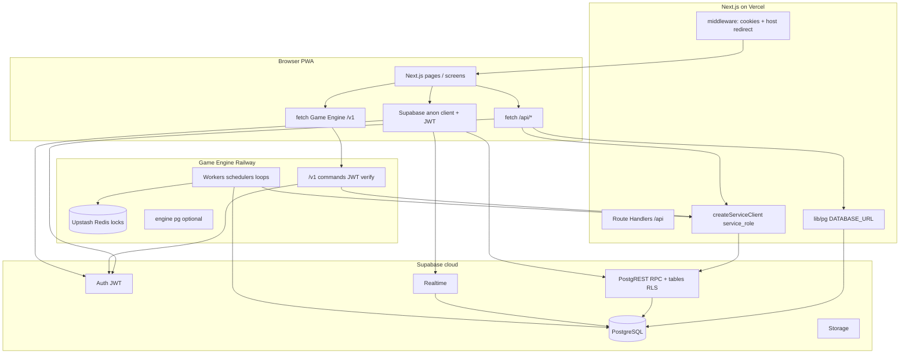

# Phase 1 — Architecture & Attack Surface Audit (Read-Only)

**Platform:** Ding Money gaming platform  
**Scope:** Repository `winway` + database definitions in `supabase/schema.sql`  
**Phase:** 1 — Architecture mapping and attack surface only (no fixes applied)  
**Date:** 2026-07-21  

> **Superseded notes (Wave 2A — 2026-07-31):** Root Next.js no longer depends on
> `@upstash/redis` / `ioredis` (engine package still does). Orphan routes
> `lobby-room-groups`, `lobby-online-count`, and `dashboard/commission-summary`
> were removed. Historical tables below may still mention them. Hybrid /
> `GAME_RUNTIME` rollback paths were **not** removed.

**Related audits:** [Phase 2 — Secrets & deployment](./PHASE2_SECRETS_INFRA_DEPLOYMENT.md) · [Phase 3 — Auth, RLS & authorization](./PHASE3_AUTH_RLS_AUTHORIZATION.md) · [Phase 4 — Wallet & financial](./PHASE4_WALLET_DING_FINANCIAL.md) · [Phase 5 — Game engine & concurrency](./PHASE5_GAME_ENGINE_REDIS_CONCURRENCY.md)

---

## Document status

This audit was performed **read-only**: no code, configuration, migrations, or packages were modified.

Sources verified from the repository:

- Next.js / PWA (`app/`, `lib/`, `services/`)
- Game Engine (`apps/game-engine/`)
- Supabase Auth, Realtime, PostgREST RPC surface (`schema.sql` in workspace `supabase`)

Assumed deployment (from code comments and env): **Vercel** (Next.js), **Railway** (game engine), **Supabase** (Auth + Postgres + Realtime), **Upstash Redis** (engine coordination).

---

## A. Architecture summary

### Components (verified in repo)

| Layer | Technology | Role |
|--------|------------|------|
| **Player / admin / agent / dev UI** | Next.js 14 App Router PWA (`app/`, `components/`, `src/screens/`) | Fixed ~390px mobile UI; cookie-backed Supabase Auth |
| **API gateway (app-owned)** | Next.js Route Handlers (`app/api/**/route.ts`, 39 routes) | Snapshots, admin ops, dev-panel; heavy use of `SUPABASE_SERVICE_ROLE_KEY` + direct `pg` |
| **Game engine** | Node package `apps/game-engine/` (Railway per code comments) | Background workers + optional HTTP command API |
| **Database** | Supabase-hosted PostgreSQL | Source of truth; business logic largely in `SECURITY DEFINER` RPCs |
| **Supabase product layer** | Auth, Realtime, PostgREST RPC, Storage | Browser uses anon key + JWT; engine/API use service role |
| **Redis** | Upstash (`@upstash/redis`, `ioredis` in app + engine) | Leader locks, room/engine coordination (engine); not used for wallet truth |
| **Direct PostgreSQL** | `lib/pg.ts` (`DATABASE_URL`), `apps/game-engine/src/db/pg.ts` | PG-first snapshots (gameroom, live-room, card pool) bypassing RLS |

### Game engine workers (in-process, not HTTP)

From `apps/game-engine/src/index.ts` and `apps/game-engine/src/config/env.ts`:

- **draw-processor** — pick/process draw jobs, marks, settlement hooks
- **room-scheduler** — waiting-room promotion, `fn_heartbeat_tick`
- **room-loop** — per-room actor / draw cycle
- **tournament-orchestrator** — `fn_tick_due_tournaments` / `fn_tick_tournament`
- **dev-player-scheduler / dev-player-processor** — synthetic players (dev panel)

Workers call Supabase **service role** RPCs (`rpc_pick_draw_jobs`, `fn_wallet_apply_delta`, etc.).

### HTTP surfaces

1. **Vercel (assumed)** — Next.js `npm run build` / `next start`; host split in `middleware.ts`: `dingmoney.org` vs `admin.dingmoney.org`.
2. **Railway game engine** — `GAME_ENGINE_HTTP_PORT` (default 8080): `/health`, `/ready`; when `GAME_ENGINE_API=true`: `/v1/*` (JWT).
3. **Supabase** — `NEXT_PUBLIC_SUPABASE_URL`: Auth, `/rest/v1/rpc/*`, Realtime, Storage (`avatars`, banner bucket in `services/profile.ts`, `services/entry-banner.ts`).
4. **Not in repo:** Supabase Edge Functions; Next.js `"use server"` actions; `vercel.json` cron.

### Auth model

- Username → synthetic email `@dingmoney.org` (`lib/auth-helpers.ts`).
- Middleware only refreshes Supabase cookies (`lib/supabase/middleware.ts`); **does not** protect `/api/*`.
- Most `/api/player/*` and `/api/me/*` require **`Authorization: Bearer`** (`getUserFromRequest`), not cookies alone.
- Admin/dev APIs require Bearer + role checks via `getAdminContextOrThrow` / `getDevPanelContextOrThrow`.
- Optional path: browser → Railway with JWT (`lib/gameEngineClient.ts`) when `NEXT_PUBLIC_USE_GAME_ENGINE=true`.
- Legacy path: browser → Supabase RPC directly (`fn_join_or_create_room`, tournament hold, admin tournament RPCs from admin pages).

### Feature flags / dual paths

- Join / lobby / gameroom / live-room: **Game Engine `/v1/*`** or **Next API** or **Supabase RPC** (`services/rooms.ts`, `lib/gameEngineClient.ts`).

---

## B. Trust boundary map

### Critical boundaries

1. **Browser ↔ Supabase PostgREST** — Any `GRANT EXECUTE` to `anon`/`authenticated` is callable with the public anon key (+ optional user JWT).
2. **Browser ↔ `/api/*`** — App-layer auth; many handlers then use **service role** (RLS bypass).
3. **Browser ↔ Game Engine** — JWT verified in `apps/game-engine/src/http/auth.ts`; CORS from `GAME_ENGINE_CORS_ORIGINS` (default `*`).
4. **Service role key** — Next server, game engine; must never ship to the browser (only `NEXT_PUBLIC_*` in client bundles).

---

## C. Entry-point inventory

### 1. Next.js API routes (39)

**Convention:** Admin = `getAdminContextOrThrow` (roles `admin` | `super` | `agent` unless route narrows). Player = Bearer JWT + often `createServiceClient()`.

| Path | Methods | Purpose | Auth | Authorization | Input | Data modified | Abuse risk |
|------|---------|---------|------|---------------|-------|---------------|------------|
| `/api/me/ding-balance` | GET | Ding balance | Bearer | Self via service read | — | Read | Low |
| `/api/me/ping-presence` | POST | Presence ping | Bearer | `fn_ping_presence` as user JWT | — | Presence | Low |
| `/api/player/lobby-snapshot` | GET | Lobby aggregate | Bearer | Read | query | Read | Low |
| `/api/player/gameroom` | GET | Game room view | Bearer | Service role read + PG | `roomId`/`templateId` | Read (+ debug RPCs) | Med–High |
| `/api/player/live-room` | GET | Live snapshot / cards | Bearer | Service role | `roomId`, `scope` | Read | Med |
| `/api/player/room-results` | GET | Winners + **room seed** | **Optional** Bearer | Service role | `roomId` | Read | **High** |
| `/api/player/my-active-rooms` | GET | Active rooms | Bearer | RPC `p_user_id` | — | Read | Low |
| `/api/player/cancel-waiting-room` | POST | Cancel waiting room | Bearer | RPC + `p_user` from JWT | `roomId` | Cancel/refund | Med |
| `/api/player/card-pool/definitions` | GET | Full card pool grids | Bearer | Any authed user | `poolId` | Read | **High** |
| `/api/player/runtime/global-registration-lock` | GET | Lock flag | Bearer | Read | — | Read | Low |
| `/api/player/tournament-entry-names` | GET | Names | Bearer | Read | `tournamentId` | Read | Med |
| `/api/player/tournament-active-tables` | GET | Tournament tables | **None** | Service role | `tournamentId` | Read | **High** |
| `/api/player/tournament-finished-tables` | GET | Finished tables | **None** | Service role | `tournamentId` | Read | **High** |
| `/api/admin/wallet/adjust` | POST | Manual wallet delta | Bearer admin context | admin/super/agent at API gate | `userIds`, `amount`, `action` | **Wallet** | **Critical** |
| `/api/admin/wallet/transfer` | POST | Panel transfer | Bearer | Hierarchy in DB RPC | `userIds`, `amount`, `action` | Wallet | High |
| `/api/admin/users/set-role` | POST | Role change | Bearer | Route + hierarchy | `user_id`, `new_role` | Users | High |
| `/api/admin/users/set-password` | POST | Password reset | Bearer | admin only | user id, password | Auth | High |
| `/api/admin/users/set-commission` | POST/GET | Commission | Bearer | Role-specific | user ids, % | Users | High |
| `/api/admin/users/toggle-suspension` | POST | Suspend | Bearer | Admin tree | user id | Users | High |
| `/api/admin/users/nicknames` | GET | Nicknames | Bearer | admin/super/agent | ids | Read | Med |
| `/api/admin/admins/*` | POST | Admin sub-role / status | Bearer | Manager checks | admin ids | Admins | High |
| `/api/admin/dashboard/snapshot` | GET | Dashboard | Bearer + panel gate | Admin panel only | — | Read | Med |
| `/api/admin/games/report` | GET | Games report | Bearer | admin/super/agent | date range | Read | Med |
| `/api/admin/tournaments/report` | GET | Tournament report | Bearer | Scoped by role | filters | Read | Med |
| `/api/admin/runtime/global-registration-lock` | GET/PATCH | Global lock | Bearer | admin only | lock flags | Runtime | High |
| `/api/admin/card-pool/*` | GET/POST | Pool admin | Bearer | Mostly admin on generate | counts, ids | Pools | High |
| `/api/dev-panel/settings` | GET/PATCH | Dev player automation | Bearer | dev_panel sub-role | scheduler | Dev tables | High |
| `/api/dev-panel/join-presets` | * | Join presets | dev_panel | — | presets | Dev config | High |
| `/api/dev-panel/users` | * | Dev users | dev_panel | — | — | Read | Med |
| `/api/dev-panel/dev-players/[userId]` | * | Dev player config | dev_panel | path `userId` | body | Dev players | High |
| `/api/dev-panel/dev-player-finance` | GET | Dev finance summary | dev_panel | — | — | Read | Med |

### 2. Game Engine HTTP (`apps/game-engine/src/http/server.ts`)

| Path | Auth | Purpose | Risk |
|------|------|---------|------|
| `GET /health` | None | Liveness + Redis | Info |
| `GET /ready` | None | Readiness | Info |
| `GET /v1/lobby` | Bearer JWT | Lobby | Low |
| `GET /v1/gameroom` | Bearer JWT | Room view | Med |
| `GET /v1/live-room` | Bearer JWT | Live snapshot | Med |
| `POST /v1/rooms/join` | Bearer JWT | Join (`fn_system_join_or_create_room` with verified id) | High |
| `GET /v1/rooms/:id/state` | Bearer JWT | `api_get_room_state` | Med |

### 3. Supabase (direct from browser)

| Entry | Purpose | Auth |
|-------|---------|------|
| Supabase Auth | login/signup/recovery | Email/password |
| `supabase.rpc(...)` | Join (legacy), tournament wallet hold/release, leaderboard, dashboard RPCs, admin tournament CRUD | User JWT |
| `supabase.from(...)` | Tournament entry upsert, reads | RLS + JWT |
| Realtime channels | rooms, tickets, draws, wallet, active games | JWT + publication/RLS |
| Storage | Avatars, entry banners | Bucket policies (phase 2) |

**Realtime channel examples (code):**

- `GameRoomScreen.tsx` — gameroom live probe, template rooms, room tickets/status
- `LiveRoomScreen.tsx` — `live-room-{roomId}`
- `useWalletBalances` / `useBalances` — wallet balance changes
- `useActiveGames` / `ActiveGamesOrchestrator` — my active rooms
- `GameEndResultsListener.tsx` — game end rooms/tickets
- Engine `wakeListener.ts` — draw-processor job wake (server-side)

### 4. Supabase PostgREST RPC surface (representative)

Callable when granted to `anon`/`authenticated` (independent of Next.js):

- **Financial / game control (high concern):** `public.fn_wallet_apply_delta`, `public.fn_generate_card_pool`, `public.fn_heartbeat_tick`, `game_core.rpc_pick_draw_jobs`, `public.fn_admin_games_report`, `public.fn_cancel_waiting_room` (3-arg), `game_core.fn_payout_room`, …
- **Player flows:** `fn_join_or_create_room`, `fn_tournament_wallet_hold`, `fn_my_active_rooms`, …
- **Admin (with in-function checks):** `fn_admin_*` tournament RPCs, `fn_dashboard_admin_*`, `fn_wallet_transfer_panel`
- **Engine-only (guarded):** `fn_system_join_or_create_room` requires `auth.role() = service_role`

### 5. Pages as entry points

- **Public/auth:** `(auth)/login`, `signup`, `recovery`, `(public)/auth`
- **Player:** `app/player/*`, `(game)/room/[roomId]`, wallet/ding/leaderboard
- **Admin:** `app/admin/*` (`requireAdminPanelAccess` on selected server paths)
- **Agent:** `app/agent/*`
- **Dev panel:** `app/dev-panel/*`
- **Test/debug (routed):** `test-bingo`, `test-connection`, `test-results`, etc.

### 6. Internal / non-HTTP

- Game engine workers
- `scripts/*` (e.g. load-test; not deployed as HTTP routes)

---

## D. Sensitive asset inventory

| Asset | Location / access |
|-------|-------------------|
| User identities, passwords | Supabase Auth + `public.users` |
| Sessions / JWT | Cookies + Bearer on API |
| Roles, `admin_sub_role`, hierarchy | `public.users`, admin/agent APIs |
| IRR wallets, locked amounts | `public.wallets`, `public.transactions` |
| Ding balances | `ding_balances`, `/api/me/ding-balance` |
| Tournament holds | `fn_tournament_wallet_hold`, entries |
| Room/game state | `rooms`, `tickets`, `marks`, `draws`, `draw_jobs` |
| RNG / fairness | `room_seed`, `room_seed_hash`, card pools, draw order |
| Settlement / commissions | `fn_finish_room_and_settle`, `commissions_log`, engine finance |
| Agent/super permissions | RPC + admin routes, `fn_wallet_transfer_panel` |
| Admin audit | `admin_audit_log` |
| Secrets | `SUPABASE_SERVICE_ROLE_KEY`, `DATABASE_URL`, Redis tokens (server only) |
| Redis | Leader locks, engine registry — coordination, not ledger |

---

## E. Client-controlled sensitive fields

| Field | Where supplied | Server must not trust blindly |
|-------|----------------|--------------------------------|
| `user_id` / `p_user_id` | Admin APIs, RPC args | Yes — especially 3-arg cancel RPC & service-role API paths |
| `userIds[]`, `amount`, `action`, `currency` | `/api/admin/wallet/*` | Amount, sign, target users |
| `templateId`, `cardCount`, `password` | Join (engine + RPC) | Card count, password, template |
| `roomId` | Live/gameroom/results/cancel | Authorization to view/cancel |
| `tournamentId`, `p_qty`, `p_currency` | Tournament UI + RPC | Qty/currency vs tournament rules |
| `new_role`, `admin_sub_role` | set-role API | Privilege escalation |
| `p_by_admin` | If exposed via RPC | Admin cancel path |
| `p_created_by` | Card pool generate RPC | Spoofing creator |
| Report date ranges | Admin reports | DoS via wide ranges |
| `global_registration_locked` | Admin runtime PATCH | Game-wide denial |

**Note:** Browser still invokes Supabase RPC directly for join (legacy), tournament wallet, and some admin tournament mutations — intended control is **`auth.uid()` inside RPC**, except functions that accept impersonation parameters without binding to `auth.uid()`.

---

## F. Initial security findings

Severity: **CRITICAL** | **HIGH** | **MEDIUM** | **LOW** | **INFORMATIONAL**

### CRITICAL

#### F-CRIT-1 — `public.fn_wallet_apply_delta` exposed to `anon` + `authenticated`, no caller check

- **File:** `supabase/schema.sql` (~6996–7010; grants ~15996–15998)
- **Function:** `public.fn_wallet_apply_delta` → `game_finance.fn_wallet_apply_delta`
- **Why dangerous:** `SECURITY DEFINER` wrapper forwards arbitrary `p_user_id` and delta; granted to `anon`. Callable via PostgREST with the public anon key.
- **Impact:** Arbitrary wallet credits/debits if production matches schema grants.

#### F-CRIT-2 — `/api/admin/wallet/adjust` uses service role + client-supplied `userIds`

- **File:** `app/api/admin/wallet/adjust/route.ts` (~98–114)
- **Function:** `POST` handler, `getAdminContextOrThrow`, `supabase.rpc("fn_wallet_apply_delta", { p_user_id: userId, ... })`
- **Why dangerous:** API gate allows `admin`, `super`, and `agent` (`lib/supabaseServer.ts` `getAdminSessionOrThrow`); DB path does not re-check actor like `transfer` does with `fn_wallet_transfer_panel`.
- **Impact:** Over-privileged panel roles may adjust any listed user balance.

#### F-CRIT-3 — `public.fn_generate_card_pool` — no auth, granted to `anon`

- **Files:** `schema.sql` ~5520–5529, grants ~15845–15847; `game_core.fn_generate_card_pool` ~772+
- **Why dangerous:** Anyone who can call RPC can create pools (DoS, disrupt active pool selection).
- **Impact:** Integrity and availability of card pool system.

#### F-CRIT-4 — `game_core.rpc_pick_draw_jobs` granted to `anon`/`authenticated`, no auth in function

- **File:** `schema.sql` ~2439–2490, grants ~15653–15655
- **Why dangerous:** Updates `draw_jobs` to `processing` without role check.
- **Impact:** Queue manipulation, griefing, engine desync.

#### F-CRIT-5 — `public.fn_heartbeat_tick` granted to `anon`/`authenticated`

- **File:** `schema.sql` ~5560–5570, grants ~15863–15865
- **Why dangerous:** Runs waiting-room and live management without caller authorization.
- **Impact:** Trigger scheduling side effects from the public internet (load, unintended state transitions).

---

### HIGH

#### F-HIGH-1 — Tournament table APIs without authentication

- **Files:** `app/api/player/tournament-active-tables/route.ts`, `app/api/player/tournament-finished-tables/route.ts`
- **Why dangerous:** `createServiceClient()` only; `tournamentId` from query string.
- **Impact:** Enumerate tournament structure, winners, player-linked metadata.

#### F-HIGH-2 — `GET /api/player/room-results` optional auth; exposes `room_seed`

- **File:** `app/api/player/room-results/route.ts` (~39–44, ~114–125)
- **Why dangerous:** Service role reads `rooms.room_seed`; comment states intentional bypass of reveal gating.
- **Impact:** Provably-fair seed leakage for guessable `roomId`.

#### F-HIGH-3 — Full card pool definitions for any authenticated user

- **File:** `app/api/player/card-pool/definitions/route.ts`
- **Impact:** Entire pool downloadable — strategic advantage, undermines pool secrecy.

#### F-HIGH-4 — `fn_cancel_waiting_room` 3-arg overload trusts `p_user`

- **Files:** `schema.sql` ~4908–4913, `game_core.fn_cancel_waiting_rooms` ~671–698
- **Why dangerous:** `v_actor := p_requester` without requiring `p_user = auth.uid()` for non-admin path.
- **Impact:** Impersonation on cancel path via direct PostgREST call (Next route passes correct JWT user).

#### F-HIGH-5 — `public.fn_admin_games_report` — no auth check; granted to `anon`

- **File:** `schema.sql` ~4646–4706, grants ~15763–15764
- **Impact:** Global game results / rewards metadata leak via Supabase API.

#### F-HIGH-6 — Debug RPCs on gameroom path

- **File:** `app/api/player/gameroom/route.ts` (~607–620): `debug_ticket_counts`, `debug_runtime_context`, `test_active_cards_bypass_rls`
- **Impact:** Information disclosure, attack surface, performance cost in production traffic.

#### F-HIGH-7 — Game Engine CORS default `*`

- **File:** `apps/game-engine/src/http/cors.ts`
- **Impact:** Any origin can invoke API from a browser context (still needs Bearer; relevant with XSS/token theft).

---

### MEDIUM

#### F-MED-1 — Service-role reads on player APIs after JWT only

Live-room returns all players’ cards; membership enforcement needs explicit verification (phase 2).

#### F-MED-2 — Inconsistent admin route role checks

`getAdminContextOrThrow` allows agent/super on routes that only require “panel login” (e.g. wallet adjust vs card-pool generate requiring `admin`).

#### F-MED-3 — Admin tournament mutations from browser RPC

Security and audit depend on DB functions; bypasses Next `logAdminAction` on some paths.

#### F-MED-4 — Client `tournament_entries` upsert after hold

**File:** `src/screens/TournamentRoomScreen.tsx` — integrity depends on RLS/triggers matching hold.

#### F-MED-5 — PostgreSQL TLS verification disabled

**File:** `lib/pg.ts` — `ssl: { rejectUnauthorized: false }` — MITM risk on `DATABASE_URL`.

#### F-MED-6 — Test/debug routes deployable

`app/test-*`, dev-panel on admin host (redirect on main host only).

---

### LOW

#### F-LOW-1 — Bearer-only player APIs

Cookie-only fetch without `Authorization` gets 401; reduces CSRF on APIs but requires token in JS.

#### F-LOW-2 — Host redirect is not API auth

`/admin` on main host redirects to admin host; APIs still need Bearer checks.

---

### INFORMATIONAL

#### F-INFO-1 — `fn_system_join_or_create_room` grant vs guard

Granted to `anon` but enforces `auth.role() = 'service_role'` inside — direct anon call fails safely.

#### F-INFO-2 — `fn_my_active_rooms` impersonation guard

Non–service-role callers cannot pass foreign `p_user_id`.

#### F-INFO-3 — No Edge Functions / no server actions in repo

Smaller Next surface; more weight on PostgREST RPC grants.

#### F-INFO-4 — `packages/game-contracts`

README only; no separate deployable service in repo.

---

## G. Areas requiring deeper investigation (Phase 2+)

1. **Full PostgREST grant audit** — All `GRANT EXECUTE ... TO anon/authenticated` on `public` and `game_core` vs live Supabase project.
2. **RLS policies** — `wallets`, `transactions`, `tickets`, `rooms`, `tournament_entries`, `results`, `draws`, Storage buckets.
3. **Live-room / gameroom authorization** — Non-participants reading other players’ cards and seeds via API + engine.
4. **`fn_wallet_apply_delta` / `game_finance.*`** — Internal guards on `source_kind`, role, or caller.
5. **Agent vs super vs admin matrix** — Every `/api/admin/*` route vs intended hierarchy (wallet, set-role, card-pool).
6. **Realtime publication filters** — Leakage without RLS on subscribed tables.
7. **Supabase Auth** — Signup policy, email confirm, rate limits, recovery abuse.
8. **Redis key layout** (`apps/game-engine/src/redis/keysV2.ts`) — Impact if Redis compromised.
9. **Engine multi-replica** — `COORDINATION_STRICT`, lock degradation (`redisLockDegraded`).
10. **Deployed configuration** — Vercel/Railway env: `GAME_ENGINE_API`, CORS, `DATABASE_URL` on Vercel.
11. **Client bundle** — No service role or `DATABASE_URL` in public env.
12. **Debug RPCs in production DB** — Existence and execute grants for `debug_*`, `test_active_cards_bypass_rls`.

---

## Appendix: Dangerous trust pattern (summary)

The stack often **authenticates at the edge** (JWT) then uses **`createServiceClient()`** for reads/writes, shifting authorization to **application code** or **RPC parameters**. Separately, **PostgREST exposes many RPCs to `anon`**, where **`SECURITY DEFINER` without strict `auth.uid()` / role checks** acts as a **second public API** beside Next.js and the Game Engine.

---

## Related documentation

- `docs/finance-sensitive-ops.md`
- `docs/admin-sensitive-operations.md`
- `docs/system-map/system-overview.md`
- `docs/system-map/game-engine-reality.md`
- `docs/migration/api-migration-plan.md`

---

*End of Phase 1 report.*
