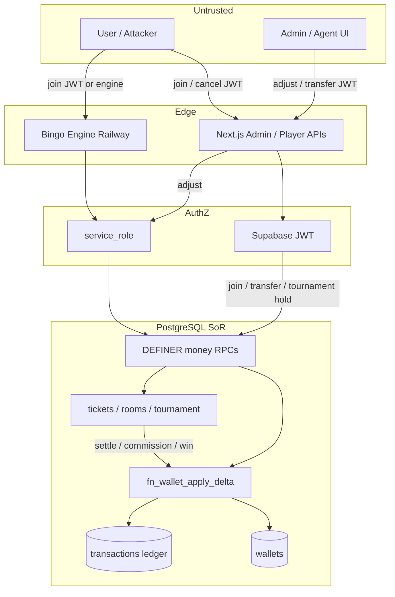
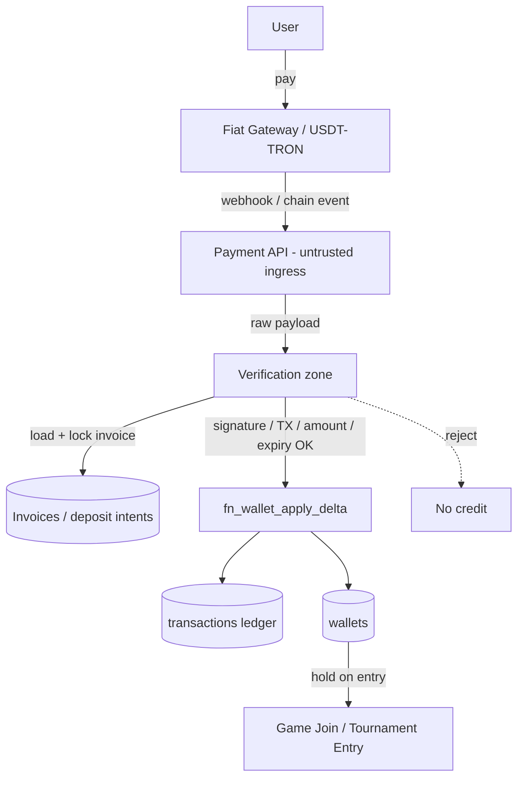
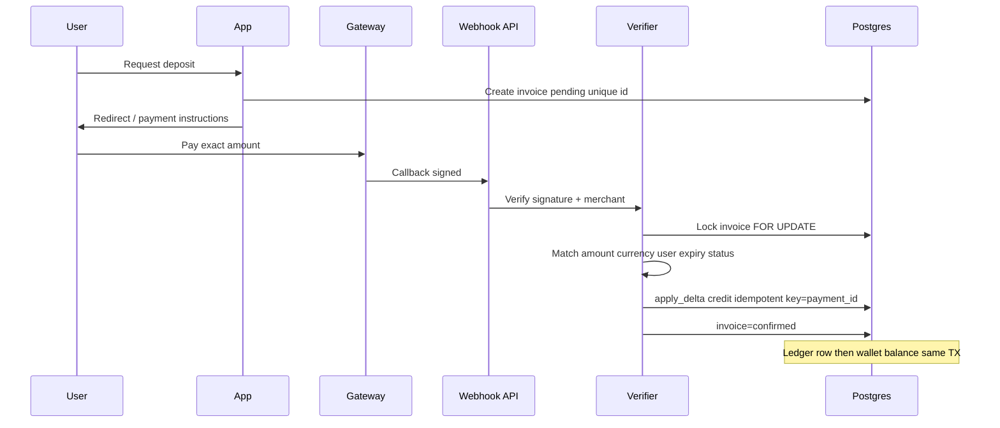
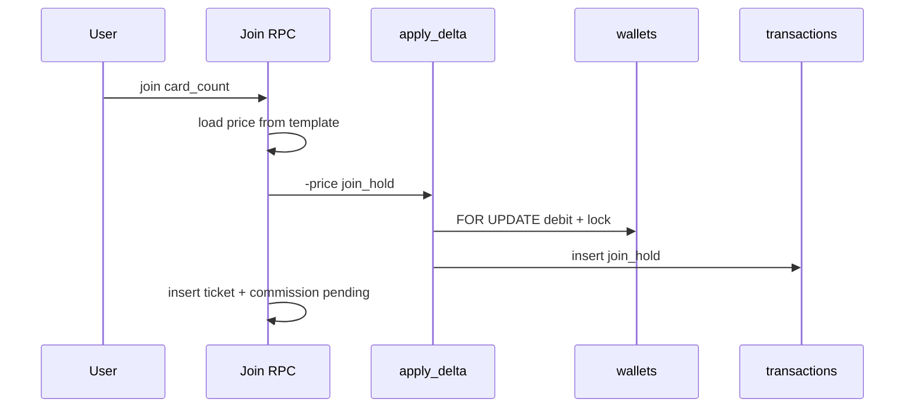

# P6.1 — Payment Data Flow

> **READ ONLY** · Current vs target (payment phase)  
> No implementation — diagrams only.

---

## 1. Current money data flow (live)



**Notes**

- No Gateway / Blockchain in the path today.
- “Deposit” today is **cashdesk credit** (Admin → API → apply_delta), not a paid invoice.
- Game join spends wallet → hold → later capture at settlement or release on cancel.

---

## 2. Target payment-phase data flow (required shape)



**Ordering rule (non-negotiable)**

```
User → Gateway/Chain → API → Verification → Ledger → Wallet → Game Join
```

Never: Wallet credit before Verification.  
Never: Join using unverified pending deposit as spendable (or clearly separate pending bucket).

---

## 3. Sequence — future fiat deposit (happy path)



---

## 4. Sequence — future USDT deposit (happy path)

```mermaid
sequenceDiagram
  participant U as User
  participant App as App
  participant CH as TRON/USDT
  participant W as Watcher
  participant V as Verifier
  participant DB as Postgres

  U->>App: Request USDT deposit
  App->>DB: Invoice + unique address/memo
  U->>CH: Transfer USDT
  CH->>W: Observe TX
  W->>V: Candidate TXID
  V->>CH: Confirm depth ≥ N, token, to, amount
  V->>DB: Lock invoice; credit once; mark confirmed
```

---

## 5. Sequence — join spend (current, still valid after deposits)



---

## 6. Abuse flows to block (illustrative)

| Abuse | Broken step |
|-------|-------------|
| Forged callback | Skip Verification signature |
| Replay callback | Skip idempotent payment_id unique |
| Wrong amount | Skip invoice amount bind |
| Credit expired invoice | Skip status/expiry check |
| Double cashdesk POST | Skip idempotency on adjust |
| Free join | Skip wallet hold / use client price |

---

P6_1_FINANCIAL_THREAT_MODEL_COMPLETE
